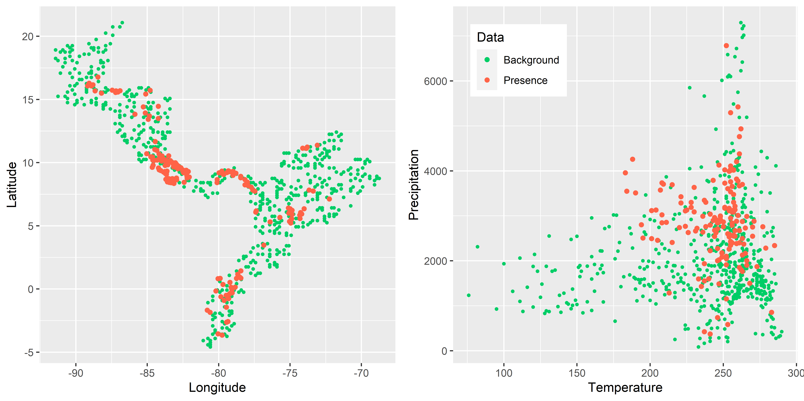

# Creating plots with the geographical and environmental space of a species in ggplot2

The function `GEspace` is a tool that can plot the geographical and environmental space of a species' presence in `ggplot2`. The output is a plot with a geographical map with occurrence points and a graph of the occurrence in relation to the environmental data, such as annual mean temperature or total annual precipitation, next to it. Depending on the data input, the function `GEspace` will create a plot with a polygon or random background points as a geographical space. 

```{r, eval=FALSE}
GEspace(bckgrnd, E.occ, add.poly = NULL, save.p = NULL)
```

The default option (no polygon added, no graph saved) will create a map of the study area based on the coordinates of random background points and the occurrence points of a species. If the user adds a polygon with `add.poly`, it will be used alongside a worldmap from the `rnaturalearth` packages for the mapping of the geographical space. The coordinate system used is WGS 84. If `save.p` is added to the function, then the graph will be saved, if not, a window with the graph will pop up.


### Parameters

For this function, two parameters are necessary and a two more can be added:

- `E.occ` = a matrix with occurrence and corresponding environmental data of a species

- `bckgrnd` = a matrix with random points from a specific geographic region and corresponding environmental data

- `add.poly` = a polygon of the study area (optional)

- `save.p` = saves the file to your set output folder (optional)


### Input and Output

The occurrence and background points with environmental information can be created by using the function `get.Ecoord` (see tutorial "Getting environmental values for the study sites"). vIt is important to note that both parameters, the matrices for `E.occ` and `bckgrnd`, need to have the same structure: the first two columns contain the coordinates, with longitude in the first column and latitude in the second. The following columns need to contain the environmental data of interest. Other than these matrices with occurrences and random background points, a polygon can be used to define the area of study.

The output is a plot with two graphs. On the left side is the geographical space and on the right side is the environmental space (with two environmental conditions) of a species' occurrence.
The output varies depending on how the function is applied. If a polygon is added, the background for the geographical space will be a clipped worldmap from the `rnaturalearth` packages overlayed with the polygon of the study area. If no polygon is added, the background will consist of random points of the study area.


### Dependencies
**Function:** `rgdal`, `raster`, `ggplot2`, `rnaturalearth`, `rnaturalearthdata`, `ggpubr`, `sf`, `rgeos`


## Worked Examples

### Read source code and libraries

```{r, message=FALSE}
source(".\\Functions\\GEspace.R")
```


```{r, message=FALSE}
library(rgdal)
library(raster)
library(ggplot2)
library(rnaturalearth)
library(rnaturalearthdata)
library(ggpubr)
# package "sf" needs to be installed, but not loaded
# package "rgeos" needs to be installed, but not loaded
```


###  *Catasticta nimbice*


**Input files**

- Catasticta_nimbice_occ_GE.csv

- Catasticta_nimbice_M_GE.csv

- Catasticta_nimbice.shp (and associated files)


In this example the number of background points is above 1000 and the point size is reduced in order to keep a clear display of points.
```{r}
# read table of a species occurrence with environmental data points and table 
#  with random background points that contain environmental data
species <- read.csv("./Generated_Data/Catasticta_nimbice_occ_GE.csv",header=T)
ranpoints <- read.csv("./Initial_Data/Catasticta_nimbice_M_GE.csv",header=T)

```

If a polygon of the distribution area is available, it can be added as a parameter.
```{r, results='hide', message=FALSE}
# read polygon
shp <- readOGR("./Initial_Data/shapefiles","Catasticta_nimbice")

```

If the graph is to be saved, the location and name can be set.
```{r}
saveM <- "./Generated_Data/Catasticta_nimbice"

```


**Apply `GEspace`** (but do not run every time):  

No polygon added (default), no save.p added (default): A graph will pop up & the geographical background will be made of random points.
```{r, eval=FALSE}
GEspace(bckgrnd=ranpoints, E.occ=species)
```


```{r, echo=FALSE, fig.cap=" Figure of the geographical space with random points as a background (left) and the environmental space (right) of *Catasticta nimbice* .", out.width = '80%',fig.align="center"}
options(knitr.duplicate.label = "allow")

```


No polygon added (default), save.p added: The graph will be saved & the geographical background will be made of random points.
```{r, eval=FALSE}
GEspace(bckgrnd=ranpoints, E.occ=species, save.p =  paste0(saveM, "_bckgrndmap.png"))
```


With polygon, no save.p added (default): A graph will pop up & the geographical background will be made of a polygon.
```{r, eval=FALSE, message= FALSE}
GEspace(bckgrnd=ranpoints, E.occ=species, add.poly=shp)
```

With polygon, save.p added: A graph will pop up & the geographical background will be made of a polygon.
```{r, eval=FALSE, message= FALSE}
GEspace(bckgrnd=ranpoints, E.occ=species, add.poly=shp, save.p =  paste0(saveM, "_polymap.png"))
```


```{r, echo=FALSE, fig.cap=" Figure of the geographical space with a polygon and clipped worldmap as a background (left) and the environmental space (right) of *Catasticta nimbice* .", out.width = '80%',fig.align="center"}
options(knitr.duplicate.label = "allow")

```


**Output files**

- Catasticta_nimbice_bckgrndmap.png

- Catasticta_nimbice_polymap.png


### *Threnetes ruckeri*


**Input files**

- Threnetes_ruckeri_M_GE.csv

- Threnetes_ruckeri_occ_GE.csv

- Threnetes_ruckeri.shp (and associated files)


In this example the number of background points is below 1000 and the point size is not reduced.
```{r, message=FALSE, results=FALSE, fig.show='hide'}
# read necessary files
ranpoints2 <- read.csv("./Generated_Data/Threnetes_ruckeri_M_GE.csv",header=T)
species2 <- read.csv("./Generated_Data/Threnetes_ruckeri_occ_GE.csv",header=T)
shp2 <- readOGR("./Initial_Data/shapefiles","Threnetes_ruckeri")

```

Apply the function with a polygon.
```{r, eval=FALSE}
GEspace(bckgrnd = ranpoints2, E.occ = species2, add.poly = shp2, save.p = "Threnetes_bckgrndmap.png")
GEspace(bckgrnd = ranpoints2, E.occ = species2, add.poly = shp2)
```


```{r, echo=FALSE, fig.cap=" Figure of the geographical space with random points as a background (left) and the environmental space (right) of *Threnetes ruckeri* .", out.width = '80%',fig.align="center"}
options(knitr.duplicate.label = "allow")

```

Apply the function without a polygon.
```{r, eval=FALSE}
GEspace(bckgrnd = ranpoints2, E.occ = species2, save.p = "Threnetes_polymap.png")
GEspace(bckgrnd = ranpoints2, E.occ = species2)
```

```{r, echo=FALSE, fig.cap=" Figure of the geographical space with a polygon and clipped worldmap as a background (left) and the environmental space (right) of *Threnetes ruckeri* .", out.width = '80%',fig.align="center"}
knitr::include_graphics("Images/Threnetes_ruckeri_poly.png")
```


**Output files**

- Threnetes_bckgrndmap.png

- Threnetes_polymap.png
