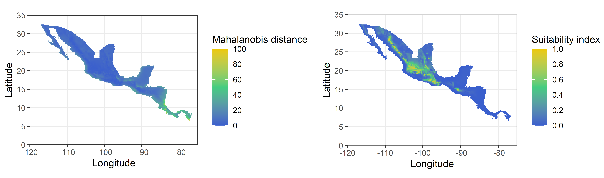

# Mahalanobis model: raw occurrence data only

<!-- description -->
\


### Input and Output

In order to calculate the Mahalanobis distance and Mahalanobis model, mu and Sigma (covariance) of variables are necessary. This could, for example be the environmental data that has been correlated to the geographic occurrence data of a species.

The output of mu and Sigma can be further processed into an ellipse or a suitability map.


### Dependencies

**Functions:** `dismo`, `raster`

**Examples:** `rgdal`, `tools`, `sp`


## Worked Examples

### Read Source Code and Libraries 

```{r, message = FALSE,warning = FALSE}
source(".\\Functions\\getEcoord.R")
source(".\\Functions\\nicheG.R")
```

```{r, message = FALSE,warning = FALSE}
library(dismo)
library(raster)
library(rgdal)
library(tools)
library(sp)
library(ggplot2)
#library(rnaturalearth)
#library(rnaturalearthdata)
library(ggpubr)
```


## *Threnetes ruckeri* - example with two environmental layers


**Input Data**

- Threnetes_ruckeri_occ_GE.csv


Read table with environmental data that are the basis for the calculation of the Mahalanobis distance.
```{r}
thr.occ_E <- read.csv("./Generated_Data/Threnetes_ruckeri_occ_GE.csv",header=T)[,-(1:2)]
```


The centroid is calculated by taking the means of the two columns (`mu`) in the matrix with two environmental layers. This parameter will set the values of the maximum likelihood estimate.
```{r}
(center <- colMeans(thr.occ_E))
```


Calculate the covariance of the environmental data (`Sigma`).
```{r}
(boundary <- cov(thr.occ_E))
```


Here, add example on how to plot the principal axis of the estimated ellipse (use this example: \url{https://multivariate-ecology.netlify.app/lab-5-transformations-eigenvectors-and-eigenvalues.html})


## *Catasticta nimbice*

### 1) Get environmental information from three raster layers


**Input Data**

- Catasticta_nimbice_occ_G.csv

- cn_bio1_cropped.tif

- cn_bio6_cropped.tif

- cn_bio12_cropped.tif


Read necessary files from the Generated_Data folder for *Catasticta nimbice*: a matrix with coordinates of species observations (latitude and longitude) and the three (cropped) raster layers for bio1, bio6, and bio12.  
```{r, results='hide'}
# read occurrence data
occ_G <- read.csv("./Initial_Data/Catasticta_nimbice_occ_G.csv",header=T)[,-1]

# read raster files
bio1cn <- raster("./Generated_Data/cn_bio1_cropped.tif")
bio6cn <- raster("./Generated_Data/cn_bio6_cropped.tif")
bio12cn <- raster("./Generated_Data/cn_bio12_cropped.tif")


```


Prepare the parameters: create a rasterstack of the cropped environmental layers and create a vector with the environmental layer names.
```{r}
# stack the layers
bios <- stack(bio1cn, bio6cn, bio12cn)
# create vector with names in same order as stack
E.names <- c("bio1", "bio6", "bio12")

```


Apply function
```{r}
cn.GE3 <- get.Ecoord(Estck = bios, Gcoord = occ_G, Enames = E.names)
head(cn.GE3, n=4)
```


Write as csv
```{r}
write.csv(cn.GE3,file=paste0("./Generated_Data/Catasticta_nimbice_occ_GE3.csv"),
          row.names = F)
```


**Output Data**

- Catasticta_nimbice_occ_GE3.csv


### 2) Estimate Mahalanobis Model Parameters


**Input Data**

- Catasticta_nimbice_occ_GE3.csv


Prepare parameters for the function `niche.G`. For this, a table with only the variables is necessary.
```{r}
occ_E <- cn.GE3[,-(1:2)]
```


The centroid is calculated by taking the means of the two columns in the matrix (`mu`). This parameter will set the values of the maximum likelhood estimate.
```{r}
center <- colMeans(occ_E)
```


Calculate the covariance of the environmental data (`Sigma`).
```{r}
boundary <- cov(occ_E)
```


### 3) Calculate Suitability Index


Apply function
```{r}
cn.maha <- niche.G(Estck = bios, mu = center, Sigma = boundary)
```


Save resulting raster. This file will be necessary for further calculations.
```{r, message = FALSE,warning = FALSE}
writeRaster(cn.maha, "./Generated_Data/cn_maha3_cropped.tif", overwrite= T) 
```


Plot.
```{r}
plot(cn.maha)
```


**Output Data**

- Catasticta_nimbice_maha3_cropped.tif


### 3) Comparing suitability index against Mahalanobis distance


The Mahalanobis distance and the suitability index calculated with the Mahalanobis model are slightly different. If applied to the raster cells, the patterns can turn out similar, they are however different. 


**Input Data**

- Catasticta_nimbice_maha3_cropped.tif


Calculate the Mahalanobis distance and apply it to the cells.
```{r}
maha.fun <- function(cell){
    X <- as.vector(cell, mode = "numeric")
    sui.ind <- mahalanobis(x= X, center= center, cov= boundary)
    return(sui.ind)
}

maha.map <- calc(bios,fun=maha.fun)
```


For easier comparison, the Mahalanobis distance and the Mahalanobis model rasters are plotted in ggplot. 
```{r, fig.show='hide'}

ext <- extent(-120, -75, 0, 35)

# Mahalanobis distance
# calculate raster to points for ggplot
mahamap.p <- rasterToPoints(maha.map)
mahamap.pd <- data.frame(mahamap.p)
colnames(mahamap.pd) <- c("Longitude","Latitude", "Maha")

p1 <- ggplot() +
        geom_tile(data = mahamap.pd,aes(x=Longitude, y=Latitude, fill=Maha)) +
        theme_bw() +
        coord_sf(xlim = c(ext[1], ext[2]),
           ylim = c(ext[3],ext[4]), expand = FALSE) +
        scale_fill_gradient2("Mahalanobis distance",limits=c(0,100), 
                             low = 'royalblue3', mid='seagreen3', high = 'gold2',
                             na.value = NA, midpoint = 50, n.breaks=6)

# Suitability index
# calculate raster to points for ggplot
mahasuit.p <- rasterToPoints(cn.maha)
mahasuit.pd <- data.frame(mahasuit.p)
colnames(mahasuit.pd) <- c("Longitude","Latitude", "Suitability")

p2 <- ggplot() +
        geom_tile(data = mahasuit.pd,aes(x=Longitude, y=Latitude, fill=Suitability)) +
        theme_bw() +
        coord_sf(xlim = c(ext[1], ext[2]),
           ylim = c(ext[3],ext[4]), expand = FALSE) +
        scale_fill_gradient2("Suitability index",limits=c(0, 1), 
                             low = 'royalblue3', mid='seagreen3', high = 'gold2',
                             na.value = NA, midpoint = 0.5, n.breaks=6)
# x11()
ggarrange(p1, p2, ncol = 2, nrow = 1, widths = c(1.5,1.38), heights = c(1.5,1.38))
```


This example clearly shows that both methods are using the Mahalanobis distance but produce different results. On the left side, the Mahalanobis distance, the lower values show the area of importance (close to 0), while on the right hand side, the suitability index calculated with the Mahalanobis model shows important areas in higher values (close to 1)

```{r, echo=FALSE, fig.cap=" Figure of the differently calculated rasters.", out.width = '100%',fig.align="center"}
options(knitr.duplicate.label = "allow")

```

