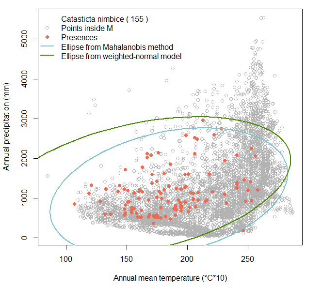
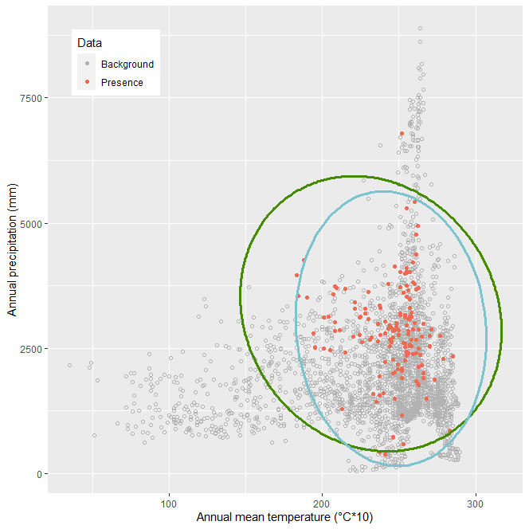

# Weighted-normal model: accounting for the uneven availability of environmental conditions

The estimation of the fundamental niche can be approached with the maximum likelihood estimation. It uses a weighted distribution where the weights represent the availability of environmental combinations inside M. To calculate the maximum likelihood estimation, three functions are necessary: `rs.inE`, `negloglike`, and `fitNiche`.


## How the functions work

The main function of this tutorial is `fitNiche`. It estimates the fundamental niche of a species with a weighted normal distribution. 
```{r, eval=FALSE}
fitNiche(E.occ, E.samM)
```

The `fitNiche` function makes use of another function, called `negloglike`, that calculates negative log-likelihood values. 
```{r, eval=FALSE}
negloglike(guess, sam1, sam2)
```


### Parameters

Only two parameters are needed, as the parameters for `negloglike` will be derived from those as well.

- `E.occ` = a matrix with occurrence and corresponding environmental data of a species

- `E.samM` = a matrix containing a random sample of environmental combinations which come from the area of study (M)


### Input and Output

In order to use `fitNiche`, a matrix of randomly sampled points within the study area (= result from the function `rs.inE`) and the occurrence data of a species that contains environmental data are needed.

The output is a list with four different objects: mu and sigma for the weigthed normal distribution, and mu and sigma for the distribution using Mahalanobis distance. These parameter estimates can be used to calculate and plot ellipses in the environmental space. They can also be used for raster calculations (see following tutorials).


### Dependencies

**Functions:** `rgeos`

**Examples:** `raster`, `rgdal`, `ggplot2`


## Worked examples

### Read sources and libraries

```{r, message = FALSE,warning = FALSE}
source(".\\Functions\\random_sampling_inE.R")
source(".\\Functions\\fit_wn_maha_model.R")
```

```{r, message = FALSE,warning = FALSE}
library(raster)
library(rgdal)
library(rgeos)
library(ggplot2)
```


### *Catasticta nimbice*

**Input Files**

- Catasticta_nimbice_occ_GE.csv

- Catasticta_nimbice.shp (and associated files)

- bio1.asc

- bio12.asc


Read the files necessary for the parameters of `rs.inE` and `fitNiche`.
```{r, results='hide'}
cn.shp <- readOGR("./Initial_Data/shapefiles","Catasticta_nimbice")

bio1 <- raster("./Initial_Data/bio1.asc")
bio12 <- raster("./Initial_Data/bio12.asc")

cn.occ <- read.csv("./Generated_Data/Catasticta_nimbice_occ_GE.csv",header=T)[,-(1:2)]
```


For the parameter `E.samM` the output of the function `rs.inE` is necessary.
Prepare parameters for `rs.inE`: create rasterstack.
```{r}
bios <- stack(bio1, bio12)
```


Apply the function `rs.inE`.
```{r}
cn.sample <- rs.inE(region = cn.shp,N = 10000,Estck = bios)
```


Apply the function with the parameters `E.occ` and `E.samM` (the sample `E.samM`` was calculated above and is named *sam.Mpnts*).
```{r, cache=TRUE}
ml <- fitNiche(E.occ = cn.occ, E.samM = cn.sample)
```


Create a new table with the output data and rename the columns. 
```{r}
ml.table <- cbind(ml$wn.mu, ml$wn.sigma, ml$maha.mu, ml$maha.sigma)
colnames(ml.table) <- c("wn.mu", "wn.sigma1", "wn.sigma2", "maha.mu", "maha.sigma1", "maha.sigma2")
```


Save the table as a csv-file.
```{r, eval=FALSE}
write.csv(ml.table,"./Generated_Data/cn_mu_sigma_estimates.csv",row.names = F)
```


Calculate the ellipses for the weighted distribution normal and the multivariate normal distribution.
```{r}
# get the ellipse defined by the ml estimators
el.wn <- ellipse::ellipse(x=ml[[2]], centre=ml[[1]], level=0.99)
# get the ellipse from a multivarite normal model / mahalanobis distance method
el.maha <- ellipse::ellipse(x=ml[[4]], centre=ml[[3]], level=0.99)
```


Plot the environmental space with the sampled points, the occurrence points, the ellipse for the weigthed distribution and the ellipse from the Mahalanobis method. The plot will be saved as a png.
```{r, results='hide', fig.show='hide'}
# set colorpalette
colpal <- c("grey70", "chartreuse4", "coral2", "cadetblue3")

# plot will be saved as .png
png(paste0("./Generated_Data/Catasticta_nimbice","_mle.png"),width = 2300, height = 2300, 
    res = 600, pointsize = 6)
# x11()
plot(cn.sample,col=colpal[1],pch=1, xlab="Annual mean temperature (°C*10)", 
     ylab="Annual precipitation (mm)")
# add presence points to the plot
points(cn.occ,col=colpal[3],pch=20,cex=1.5) # presences used in model
# ellipse maha
lines(el.maha,col=colpal[4],lwd=2)
# ellipse wn
lines(el.wn,col=colpal[2],lwd=2)
sp.leg <- paste("Catasticta nimbice","(",nrow(cn.occ),")")
legend("topleft",legend = c(sp.leg,"Points inside M","Presences",
                            "Ellipse from Mahalanobis method",
                            "Ellipse from weighted-normal model"),
       pch=c(NA,1,19,NA,NA),col = c("white", colpal[1], colpal[3], colpal[4], colpal[2]),
       lwd=c(NA,NA,NA,2,2),bty = "n")
# finish saving png
dev.off()
```


```{r, echo=FALSE, fig.cap=" Figure of the environmental space of *Catasticta nimbice*. It shows the occurrence points of a species with two possible niches delineated by the Mahalanobis method and the weighted normal method.", out.width = '70%',fig.align="center"}

```


**Output Files**

- cn_mu_sigma_estimates.csv

- Catasticta_nimbice_mle.png


### *Threnetes ruckeri*

**Input Files**

- Threnetes_ruckeri_occ_GE.csv

- Threnetes_ruckeri.shp (and associated files)

- bio1.asc

- bio12.asc


For this species the same steps are followed as above until the plot. Here, it will be plotted using `ggplot2`.

Read the matrix with occurrences combined with environmental data and the shape-file of the study area (the necessary rasterstack was already created in the example above).
```{r, results='hide'}
thr.occ <- read.csv("./Generated_Data/Threnetes_ruckeri_occ_GE.csv",header=T)[,-(1:2)]

thr.shp <- readOGR("./Initial_Data/shapefiles","Threnetes_ruckeri")
```


Sample random points from the area of interest using the `rs.inE` function with the parameters `region`, `N`, and `Estck`.
```{r}
thr.sample <- rs.inE(region = thr.shp, N = 5000, Estck = bios)
```


Apply function fit.Niche and change table.
```{r, cache=TRUE}
ml2 <- fitNiche(E.occ = thr.occ, E.samM = thr.sample)
# change function into proper table and rename column names
ml.table2 <- cbind(ml$wn.mu, ml$wn.sigma, ml$maha.mu, ml$maha.sigma)
colnames(ml.table2) <- c("wn.mu", "wn.sigma1", "wn.sigma2", "maha.mu", "maha.sigma1", "maha.sigma2")
```


Write results as a table.
```{r, eval=FALSE}
write.csv(ml.table2,"./Generated_Data/tr_mu_sigma_estimates.csv",row.names = F)
```


Calculate ellipses and change them into a dataframe.
```{r}
# get the ellipse defined by the ml estimators
el.wn2 <- ellipse::ellipse(x=ml2[[2]], centre=ml2[[1]], level=0.99, npoints = 500)
df.el2 <- as.data.frame(el.wn2)
colnames(df.el2) <- c("Temperature", "Precipitation")

# get the ellipse from a multivarite normal model / mahalanobis distance method
el.maha2 <- ellipse::ellipse(x=ml2[[4]], centre=ml2[[3]], level=0.99)
df.elmh2 <- as.data.frame(el.maha2)
colnames(df.elmh2) <- c("Temperature", "Precipitation")
```


Plot in ggplot.
```{r, fig.show='hide'}
# prepare data as a dataframe for ggplot
bckgrnd <- data.frame(Temperature = thr.sample[,1], Precipitation = thr.sample[,2])
species <- data.frame(Temperature = thr.occ[,1], Precipitation = thr.occ[,2])
data <- cbind(rbind(bckgrnd[,1:2], species[,1:2]), c(rep(1,nrow(bckgrnd)),rep(2,nrow(species))))
data2 <- data.frame(Temperature = data[, 1], Precipitation = data[, 2], 
                    Type = data[,3]) 

# plot the ellipses in E-Space
# x11()
ggplot(data2, aes(x = Temperature, y = Precipitation)) +
  geom_point(aes(color = factor(Type), shape = factor(Type))) +
  scale_shape_manual(values=c(1, 19), guide = FALSE) +
  scale_color_manual(name= "Data",
                     labels= c("Background", "Presence"),
                     values= c("1"=colpal[1], "2"= colpal[3])) +
  theme(legend.position = c(.05, .95), # for x, value of 0 puts it  to the 
        # left side, value of 1 to the right, for y, value of 0 puts it to 
        # the bottom, # value of 1 puts it to the top
        legend.justification = c("left", "top")) +
  scale_x_continuous("Annual mean temperature (°C*10)") +
  scale_y_continuous("Annual precipitation (mm)") +
  geom_path(data = df.el2, color = colpal[2], size = 1.2) +
  geom_path(data = df.elmh2, color = colpal[4], size = 1.2)
```


```{r, echo=FALSE, fig.cap=" Figure of the environmental space of *Threnetes ruckeri*. It shows the occurrence points of a species with two possible niches delineated by the Mahalanobis method (blue) and the weighted normal method (green).", out.width = '70%',fig.align="center"}

```


Save the plot if needed.
```{r, eval=FALSE}
ggsave("./Generated_Data/Threnetes_ruckeri_mle.png", width = 12, height = 12, units = "cm",
             dpi = 600, pointsize = 6)
```


**Output Files**

- tr_mu_sigma_estimates.csv

- Threnetes_ruckeri_mle.png

