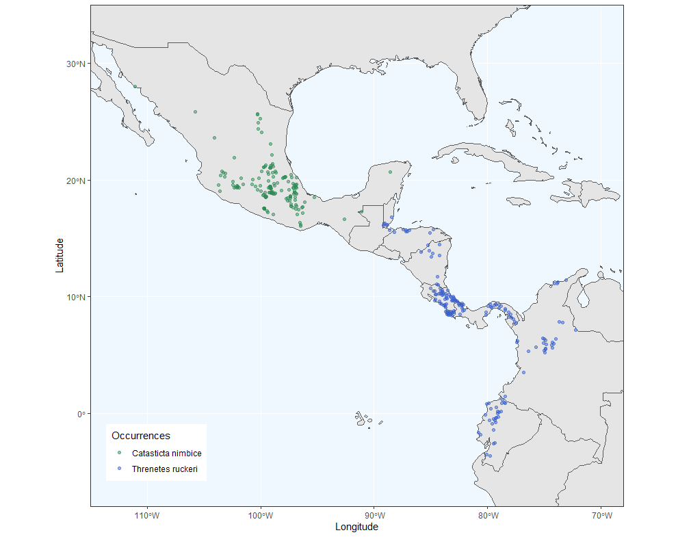
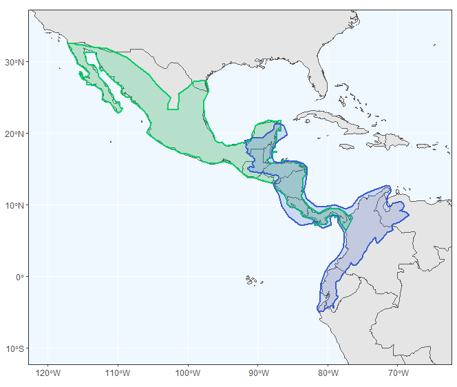
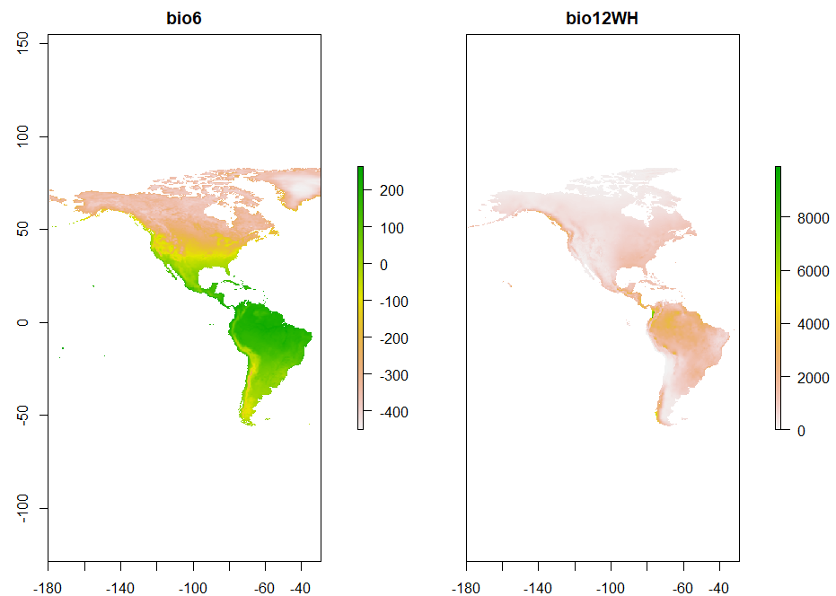
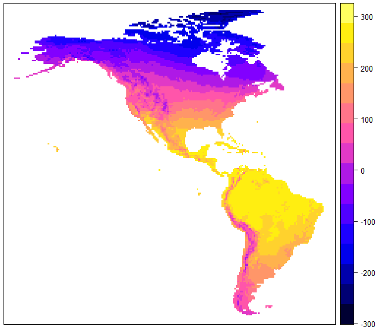
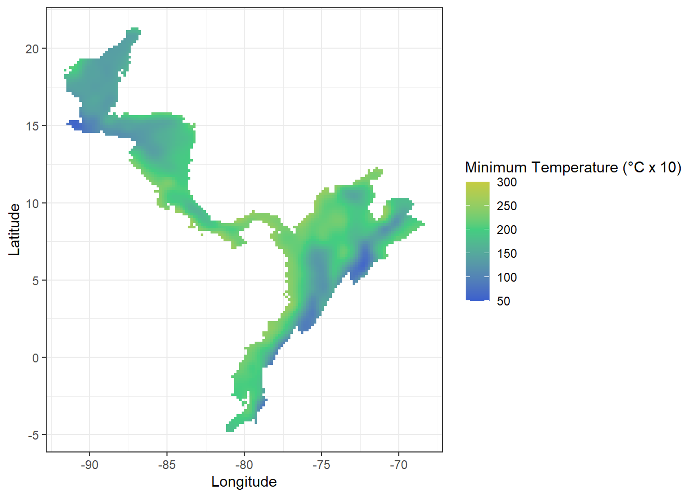

# Description of initial datasets

## Species under study and necessary files to start an analysis

We selected two species as our focus species for all the analysis and examples:

- *Threnetes rucheri*, the band-tailed barbthroat hummingbird, resident from Central America.

- *Catasticta nimbice*, the pine white or Mexican dartwhite butterfly, known to occur from Costa Rica north to Mexico.

Four types of files are needed to reproduce the ecological niche modeling exercises included in this tutorial:

- A csv file that contains the geographic coordinates of the sites where the species has been recorded as present,

- A shapefile containing a polygon which delimits the study region,

- Raster files with the environmental variables to be used in the analysis and an extent larger or equal to the extent of the shapefile,

- A csv file that contains tolerance limits of a species.


Below, we describe the files that we created for our two focus species so you can create similar files for the species of your interest.

### Occurrence data

The tables used for this package are matrices that contain the location information of a species observation. Only presence data is used as absence data plays no role for the models employed.

Occurrence data is available on various open databases. For all examples, data from [GBIF](https://www.gbif.org/) was used. However, the tables from GBIF need to be cleaned up before they can be used as the database is aggregated from various sources with different formats and can contain various errors. There are packages available that aid in the cleaning of the data (e.g. see [CoordinateCleaner]( https://ropensci.github.io/CoordinateCleaner/articles/Cleaning_GBIF_data_with_CoordinateCleaner.html)).

The tables for the examples have been cleaned and contain three columns: species name, longitude, latitude. These occurrence tables with three columns are called `G.occ`.


```r
# table with a species occurrence  
G.occ <- read.csv("./Initial_Data/Catasticta_nimbice_occ_G.csv",header=T)
head(G.occ, n=3)
```

```
##              species Longitude Latitude
## 1 Catasticta nimbice -96.50500 16.06139
## 2 Catasticta nimbice -96.50083 16.16944
## 3 Catasticta nimbice -96.57000 16.31722
```

```r
G.occ2 <- read.csv("./Initial_Data/Threnetes_ruckeri_occ_G.csv",header=T)
head(G.occ2, n=3)
```

```
##             species      long       lat
## 1 Threnetes_ruckeri -79.42474  9.225965
## 2 Threnetes_ruckeri -84.01280 10.428800
## 3 Threnetes_ruckeri -82.95325  9.867804
```

#### How to plot occurrence data using `ggplot`


```r
# Set the boundaries to which the worldmap is cut
ext <- extent(-115, -68, -8, 35)
# worldmap is added from the rnaturalearth packages
world <- ne_countries(scale = "medium", returnclass = "sf")
class(world)
# create dataframe for ggplot with both points
cn.occ <- data.frame(longitude = G.occ[, 2], latitude = G.occ[, 3])
thr.occ <- data.frame(longitude = G.occ2[, 2], latitude = G.occ2[, 3])
data <- cbind(rbind(cn.occ[,1:2],thr.occ[,1:2]),
              c(rep(1,nrow(cn.occ)),rep(2,nrow(thr.occ))))
data2 <- data.frame(Longitude = data[, 1], Latitude = data[, 2], 
                    Type = data[,3])
    
# create plot
ggplot(data = world) +
  geom_sf( ) +
  theme_bw() +
  coord_sf(xlim = c(ext[1], ext[2]),
           ylim = c(ext[3],ext[4]), expand = FALSE) +
  theme(panel.grid.major = element_line(color = "white"),
        panel.background = element_rect(fill = "aliceblue")) + 
  geom_point(data = data2, alpha=0.5, 
             aes(x = Longitude, y = Latitude, color=factor(Type), 
                 shape=factor(Type))) +
  scale_shape_manual(values= c(19, 19), guide = FALSE) +
  scale_color_manual(name = "Occurrences",
                     labels = c("Catasticta nimbice", "Threnetes ruckeri"),
                     values= c("1" = "seagreen4", "2" = "royalblue3")) +
  theme(legend.position = c(.03, .05),
        legend.justification = c("left", "bottom")) 
```
<div class="figure" style="text-align: center">

<p class="caption">(\#fig:unnamed-chunk-3) Figure of the of the two species *Catasticta nimbice* and *Threnetes ruckeri* .</p>
</div>


### Points inside the study area to plot Hutchinson's duality

There are two other tables that are used for the functions of this package. They contain random samples of locations of the study area. These points serve as background points for various graphs.

The first table is contains two columns with the longitude and latitude of sampled locations for the species *Threnetes ruckeri*.

```r
thrM <- read.csv("./Initial_Data/Threnetes_ruckeri_M_G.csv",header=T)
head(thrM, n=3)
```

```
##        long       lat
## 1 -71.58333  6.250003
## 2 -83.91666 11.916670
## 3 -69.74999  9.916670
```

```r
dim(thrM)
```

```
## [1] 599   2
```


The second table contains four columns. In addition to the longitude and latitude of random locations of the study are for the species *Catasticta nimbice* the correlating environmental data for mean annual temperature and total annual precipitation. This file can be created by extracting the environmental data from raster layers with the function `get.ecoord` (see tutorial).

```r
cnM.GE <- read.csv("./Initial_Data/Catasticta_nimbice_M_GE.csv",header=T)
head(cnM.GE, n=3)
```

```
##        long      lat bio1 bio12
## 1 -98.08333 20.41667  194  2307
## 2 -97.91667 20.25000  199  2587
## 3 -99.08333 21.41667  184  1781
```

```r
dim(cnM.GE)
```

```
## [1] 7486    4
```


### Table with species' tolerance limit

The table for a species' tolerance limit contains the lower and upper limits of an environmental condition. In the example provided, we estimated these limits for the species *Threnetes ruckeri*, which is necessary information for using the Bayesian model (see Tutorial "Bayesian model"). Please keep in mind that the provided example is not estimated with a scientific method and only meant to aid in using and understanding the tutorial. For scientific research, the tolerance limits of a species need to be tested within a controlled lab environment.

The matrix needs to have at two columns that provide the lower limit in the first column, and the upper limit in the second column. There should be as many rows as environmental conditions (usually two). The example contains the estimated tolerance limits for the mean annual temperature (MAT) and the total annual precipitation (AP).

```r
(limits <- read.csv("./Initial_Data/T_ruckeri_tolerances.csv"))
```

```
##   variable minimum maximum units
## 1      MAT     200     300  C*10
## 2       AP     500    5000    mm
```


<table class=" lightable-classic" style="font-family: Cambria; width: auto !important; ">
<caption>(\#tab:unnamed-chunk-7)Threnetes ruckeri tolerance limits</caption>
 <thead>
  <tr>
   <th style="text-align:left;"> variable </th>
   <th style="text-align:right;"> minimum </th>
   <th style="text-align:right;"> maximum </th>
   <th style="text-align:left;"> units </th>
  </tr>
 </thead>
<tbody>
  <tr>
   <td style="text-align:left;"> MAT </td>
   <td style="text-align:right;"> 200 </td>
   <td style="text-align:right;"> 300 </td>
   <td style="text-align:left;"> C*10 </td>
  </tr>
  <tr>
   <td style="text-align:left;"> AP </td>
   <td style="text-align:right;"> 500 </td>
   <td style="text-align:right;"> 5000 </td>
   <td style="text-align:left;"> mm </td>
  </tr>
</tbody>
</table>


### Polygons of the study area

The functions often use a polygon of the region of interest either to serve as a boundary in plots or to delimit rasters or sampled points to the specific region. The polygons used in the examples are shapefiles.


```r
cn.shp <- readOGR("./Initial_Data/shapefiles","Catasticta_nimbice")
thr.shp <- readOGR("./Initial_Data/shapefiles","Threnetes_ruckeri")
```


```r
# in order to plot the shapefiles, they need to be adjusted first
# transform polygon into WGS 84
cnM <- spTransform(cn.shp, CRS("+proj=longlat +datum=WGS84"))
# This function turns a map into a data frame that can more easily be 
# plotted with ggplot2.
cnM <- fortify(cnM)
# takes id that is a "character" and converts it to a number
cnM$id = as.numeric(cnM$id)

thrM <- spTransform(thr.shp, CRS("+proj=longlat +datum=WGS84"))
# This function turns a map into a data frame that can more easily be 
# plotted with ggplot2.
thrM <- fortify(thrM)
# takes id that is a "character" and converts it to a number
thrM$id = as.numeric(thrM$id)

# worldmap is added from the rnaturalearth packages
world <- ne_countries(scale = "medium", returnclass = "sf")
class(world)

# plot in ggplot
ggplot(data = world) +
  geom_sf( ) +
  theme_bw() +
  # alpha -> transparency of polygon, 0.1 = high, 0.5 = medium transparency
  geom_map(map=cnM, data=cnM, aes(map_id=id), color= "springgreen3", 
           fill = "springgreen3", size = 1, alpha = 0.2) +
  geom_map(map=thrM, data=thrM, aes(map_id=id), color= "royalblue3", 
           fill = "royalblue3", size = 1, alpha = 0.2) +
  coord_sf(xlim = c(-120, -65), 
           ylim = c(-10, 35), expand =TRUE) +
  theme(panel.grid.major = element_line(color = "white"),
        panel.background = element_rect(fill = "aliceblue"))
```

<div class="figure" style="text-align: center">

<p class="caption">(\#fig:unnamed-chunk-10) Figure of the shapefiles for the study area of *Catasticta nimbice* (green) and *Threnetes ruckeri* (blue).</p>
</div>


### Rasters with environmental information

The raster files for the functions of this package need to contain information on climatic values that are of interest for the user. The rasters used in the examples are from [WorldClim](https://worldclim.org/data/index.html) and have a resolution of "10 minutes". The files usually do not need further editing.

For our examples, we used the raster of the American continent. The environmental conditions of interest are the *mean annual temperature*, called `bio1` and the the *total mean precipitation*, called `bio12`.


```r
# raster for mean annual temperature (°C x 10)
bio1 <- raster("./Initial_Data/bio1.asc")
# raster for minimum temperature of the coldest month (°C x 10)
bio6 <- raster("./Initial_Data/bio6.tif")
# raster for mean total precipitation (mm)
bio12 <- raster("./Initial_Data/bio12.asc")
```

The raster can simply be plotted by using the `plot()` function:

```r
bios <- stack(bio6, bio12)
plot(bios)
```

<div class="figure" style="text-align: center">

<p class="caption">(\#fig:unnamed-chunk-13)Figure of the of the coldest month of the year (in °C x 10) and the total annual precipitation (in mm) for the American continent.</p>
</div>


Another option to plot the raster is the `spplot()` function of the `sp` package:

```r
spplot(bio1)
```

<div class="figure" style="text-align: center">

<p class="caption">(\#fig:unnamed-chunk-15) Figure of the of the mean annual temperature (in °C, multiplied by 10) for the American continent..</p>
</div>


#### How to crop raster layers

You need to run this examples and save the resulting raster layers because these will be used in the exercises.


```r
# cropped by the shapefile for Catasticta nimbice study area
bio1cn <- mask(crop(bio1, cn.shp), cn.shp)
bio6cn <- mask(crop(bio6, cn.shp), cn.shp)
bio12cn <- mask(crop(bio12, cn.shp), cn.shp)

# cropped by the shapefile for Threnetes ruckeri study area
bio1thr <- mask(crop(bio1, thr.shp), thr.shp)
bio6thr <- mask(crop(bio6, thr.shp), thr.shp)
bio12thr <- mask(crop(bio12, thr.shp), thr.shp)
```


Example plot for the cropped raster bio6 (in ggplot):

```r
# calculate raster to points for ggplot
bio6thr.p <- rasterToPoints(bio6thr)
bio6thr.pd <- data.frame(bio6thr.p)
colnames(bio6thr.pd) <- c("Longitude","Latitude", "MinTemp")


# x11()
ggplot() +
  geom_tile(data = bio6thr.pd,aes(x=Longitude, y=Latitude, fill=MinTemp)) +
  theme_bw() +
  scale_fill_gradient2("Minimum Temperature (°C x 10)",limits=c(50,300), low = 'royalblue3',
                       mid='seagreen3', high = 'gold2',na.value = NA,
                       midpoint = 200, n.breaks=6)
```




Save the rasters for later use

```r
writeRaster(bio1cn,"./Generated_Data/cn_bio1_cropped.tif", overwrite = T)
writeRaster(bio6cn,"./Generated_Data/cn_bio6_cropped.tif", overwrite = T)
writeRaster(bio12cn,"./Generated_Data/cn_bio12_cropped.tif", overwrite = T)

writeRaster(bio1thr,"./Generated_Data/tr_bio1_cropped.tif", overwrite = T)
writeRaster(bio6thr,"./Generated_Data/tr_bio6_cropped.tif", overwrite = T)
writeRaster(bio12thr,"./Generated_Data/tr_bio12_cropped.tif", overwrite = T)
```


Additionally, note that you can use this code to crop and mask any raster layer to the study area of each species. This is something you will need to do before doing some future examples. 
