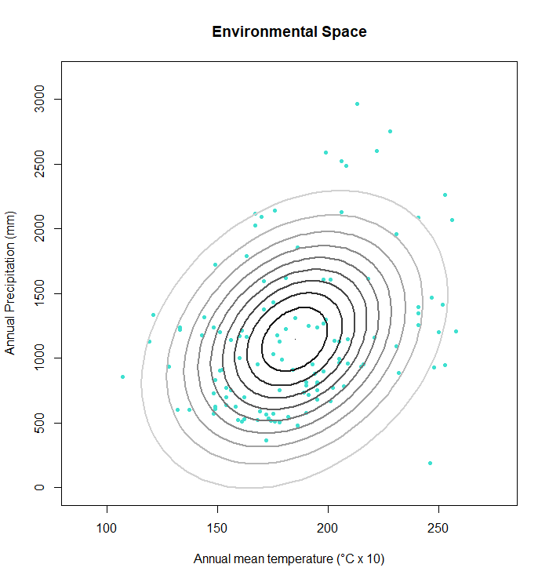
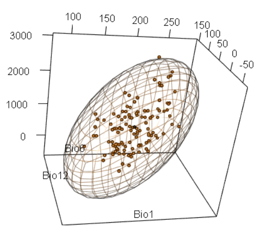

# Plotting an ellipsoid in E-space

The functions `E.ellipse2d` and `E.ellipse3d` create confidence regions that can function as suitable environment borders for a species. The ellipses are calculated with the Mahalanobis distance. Various alpha-levels can be chosen for the ellipses. The output is a plot with environmental datapoints of a species and as many ellipses as alpha levels have been chosen. 

There are two versions of this function: one for two environmental conditions and another one for three. 


E.ellipse with two dimensions. The function creates as many ellipses as alpha levels as are entered into the function. If no alpha levels are entered into the function, the default is 0.95.

```r
E.ellipse2d(Eoccs, mu, Sigma, alphas = 0.95, Enames)
```


E.ellipse with three dimensions. With three environmental variables, the plot can be displayed in 3D. The parameters stay the same.

```r
E.ellipse3d(Eoccs, mu, Sigma, alpha = 0.95, Enames)
```


## Parameters

For both functions, five parameters are necessary:


- `Eoccs` = a matrix that contains two or three environmental variables that are correlated with the geographical occurrences of a species

- `mu` = the mean of the columns that contain environmental data

- `Sigma` = the covariance of the environmental data

- `Enames` = names for the environmental variables in form of a character vector

- `alpha` = the chosen alpha level(s)


## Input and Output

For this function a matrix that contains the corresponding environmental data of a species' occurrence is necessary. The matrix can be created by using the `get.Ecoord` function (see tutorial “Getting environmental values for the study sites”).

The output is a two- or three-dimensional plot with the environmental space of a species and one or more ellipses that signify the borders of the suitable environment of a species. For the three dimensional plot only one ellipse is created to ensure clarity of the plot.


### Dependencies

**Example:** `rgl`

The package rgl and its functions are only for the display of three dimensional plots and have specific requirements that are not necessarily provided by an operating system. Here is a website that has instructions on how to run rgl in windows 10:
[link](https://medium.com/@bhargav.chippada/how-to-setup-opengl-on-mingw-w64-in-windows-10-64-bits-b77f350cea7e).


## Worked Examples


### Read source code and library


```r
source(".\\Functions\\Eellipse.R")
```


```r
library(rgl)
```


### Example with three ellipses (*Threnetes ruckeri*)


**Input Data**


- Threnetes_ruckeri_occ_GE.csv


Load a matrix with environmental data that is linked to the occurrence of a species (omit the geographic coordinates).

```r
# read table of occurrences, omit coordinates
thr.occE <- read.csv ("./Generated_Data/Threnetes_ruckeri_occ_GE.csv",header=T)[,-(1:2)]
```


Calculate the means of the columns with environmental data.

```r
mu1 <- colMeans(thr.occE)
```


Calculate the covariance of the environmental data.

```r
Sigma1 <- cov(thr.occE)
```


Set the names of the environmental types for the x and y axis of the plot.

```r
names1 <- c("Annual mean temperature (°C x 10)","Annual Precipitation (mm)") 
```


Define the confidence levels, here 75%, 90%, and 95%. Setting three alpha levels will create three ellipses for the confidence region.

```r
alpha1 <- c(0.75, 0.9, 0.95)
```


Apply `E.ellipse`.

```r
E.ellipse2d(Eoccs = thr.occE, mu = mu1, Sigma = Sigma1, 
            alphas = alpha1, Enames = names1)
```


<div class="figure" style="text-align: center">

<p class="caption">(\#fig:unnamed-chunk-11) Figure of the environmental space of *Threnetes ruckeri* bordered by three ellipses.</p>
</div>


### Example with several ellipses (*Catasticta nimbice*)


**Input Data**

- Catasticta_nimbice_occ_GE.csv


Read the matrix with environmental values and define labels for the plot. 

```r
# read table of occurrences, omit coordinates
cn.occE2 <- read.csv("./Generated_Data/Catasticta_nimbice_occ_GE.csv",header=T)[,-(1:2)]

# set the names for both environmental conditions that will become labels for the plot
names2 <- c("Annual mean temperature (°C x 10)","Annual Precipitation (mm)") 
```


The confidence level is defined by a sequence from zero to one with an increment of 0.1. This will create several ellipses.

```r
alpha2 <- seq(0,1,by = 0.1)
```


```r
E.ellipse2d(Eoccs = cn.occE2, mu = mu1, Sigma = Sigma1, 
            alpha = alpha2, Enames = names2)
```


<div class="figure" style="text-align: center">

<p class="caption">(\#fig:unnamed-chunk-15) Figure of the environmental space of *Threnetes ruckeri* bordered by three ellipses.</p>
</div>


### Example with three environmental variables (*Catasticta nimbice*)


**Input Data**


- Catasticta_nimbice_occ_GE3.csv


Read the occurrence table with three environmental conditions.

```r
cn.occE3 <- read.csv("./Generated_Data/Catasticta_nimbice_occ_GE3.csv",header=T)[,-(1:2)]
```


Calculate `mu`and `Sigma` with the occurrence table and set the names for the xyz axis.

```r
mu3D <- colMeans(cn.occE3)
Sigma3D <- cov(cn.occE3)
names3D <- c("Bio1","Bio6", "Bio12") 
```


Apply the function and create a 3D plot.

```r
# call the 3D plot
open3d()
# apply the function
E.ellipse3d(Eoccs = cn.occE3, mu = mu3D, Sigma = Sigma3D, 
            alpha = 0.99, Enames = names3D)
```


<div class="figure" style="text-align: center">

<p class="caption">(\#fig:unnamed-chunk-19) Figure of the three dimensional environmental space of *Catasticta nimbice* bordered by an ellipse shaped sphere.</p>
</div>

