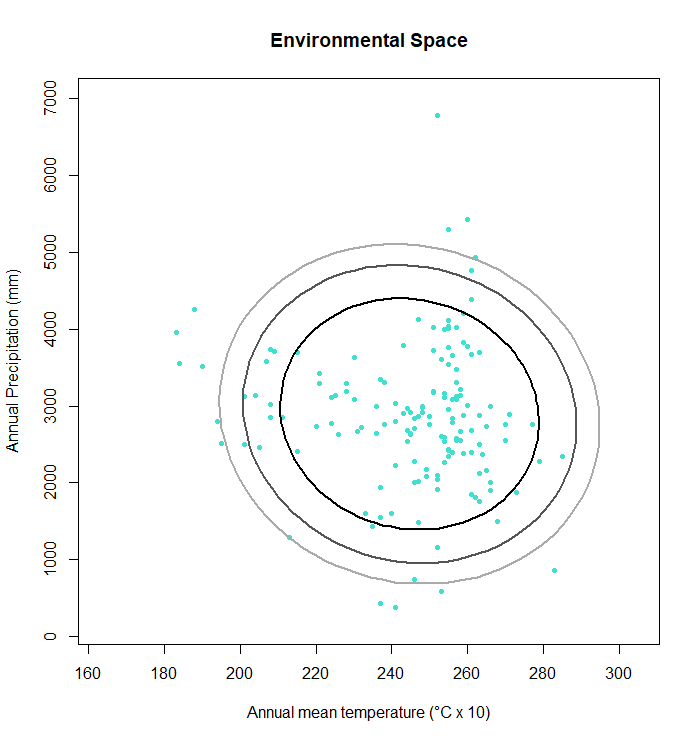
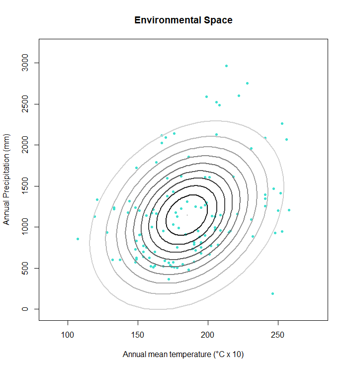

```{r setup, include=FALSE}
knitr::opts_chunk$set(echo = TRUE)

# the package rgl and its functions have specific requirements that are not
#   necessarily provided by an operating system. Here is a website that has
#   listed the steps to install OpenGL and mingw-w64 in windows 10:
#   https://medium.com/@bhargav.chippada/how-to-setup-opengl-on-mingw-w64-in-windows-10-64-bits-b77f350cea7e
library(rgl)

```
\
  
## Ploting ellipses that define the border of a suitable environment

The function `e.ellipse` creates confidence regions that can function as suitable environment borders for a species. The ellipses are calculated with the Mahalanobis distance. Various alpha-levels can be chosen for the ellipses. The output is a plot with environmental datapoints of a species and as many ellipses as alpha levels have been chosen. There are two versions of this function: one for two environmental conditions and one for three.
\

\

## Parameters

For this function, four parameters are necessary:
\

* `mu` = the mean of the columns that contain environmental data
\

* `Sigma` = the covariance of the environmental data
\

* `Enames` = names for the environmental variables in form of a character vector
\

* `alpha` = the chosen alpha level(s)
\

\

## Function's code

### How *e.ellipse* works
### Two dimensions

The function creates ellipses with a loop that loops as many alpha levels as are entered into the function. If no alpha levels are entered into the function, the default is 0.95. The ellipses are displayed in a plot that also shows the environmental datapoints of a species.
\

```{r}
E.ellipse2d <- function(Eoccs, mu, Sigma, alphas = 0.95, Enames) {
  # create a list to save different ellipses
  els <- list()
  # number of confidence levles
  la <- length(alphas)
  
  for(i in 1:la){
    # calculate the ellipses and save them into the 'els' list
    # each ellipse represents a different alpha level
    els[[i]] <- ellipse::ellipse(centre = mu, x= Sigma, level = alphas[i]) 
  }
  # create a scale of grays to color the ellipses
  pal <- gray(0:(la - 1)/la)
  
  # define values for xlim and ylim to adjust the margins of the plot
  s <- 4
  xs <- c(mu[1]-s*sqrt(Sigma[1,1]), mu[1]+s*sqrt(Sigma[1,1]))
  ys <- c(mu[2]-s*sqrt(Sigma[2,2]), mu[2]+s*sqrt(Sigma[2,2]))
  
  # create a plot that first shows the occurrences in the E-space 
  plot(Eoccs[,1], Eoccs[,2], pch=20, col= "turquoise", xlab=Enames[1],
       ylab=Enames[2], main="Environmental Space", xlim = xs, ylim = ys)
  
  # then, plot the ellipses using the different gray shades as colors
  for(i in 1:la){
    lines(els[[i]], col= pal[i], lwd = 2)
  }
  # add a legend
  legend("bottomleft",legend=c("Confidence level",alphas),lwd=2,
         col=c("white",pal),bty="n")
}

```
\

### Three dimensions

With three environmental variables, the plot can be displayed in 3D. The parameters stay the same, except that the parameters are calculated on environmental data from three conditions instead of one.

```{r}
E.ellipse3d <- function(Eoccs, mu, Sigma, alpha = 0.95, Enames){
  # define objects that contain the points on the surface of each ellipse
  elli <- ellipse3d(centre = mu, x= Sigma, level = alpha) 
  
  plot3d(x=Eoccs[,1], y=Eoccs[,2], z=Eoccs[,3], box = FALSE,
         xlab=Enames[1], ylab=Enames[2], zlab=Enames[3],
         type ="s", col = "darkorange4", size=1) 
  spheres3d(x=mu[1], y=mu[2], z=mu[3], radius=25)
  plot3d(elli, col = "darkorange4", alpha = 0.5, add = TRUE, type = "wire")
}
```
\

## Output

The output is a two- or three-dimensional plot with the environmental space of a species and one or more ellipses that signify the borders of the suitable environment of a species. For the three dimensional plot only one ellipse is created to ensure clarity of the plot.


\

## Worked Examples
\

### Input data

For this function a matrix that contains the corresponding environmental data of a species' occurrence is necessary. The matrix can be created by using the `get.Ecoord` function (see tutorial "Function *get.Ecoord*"). In this example, the environmental data are mean annual temperature and total annual precipitation.
\

### Threnetes ruckeri

In this example, the alpha level has three set values. This will create three ellipses for the confidence region.
\

Load a matrix with environmental data that is linked to the occurrence of a species.
```{r}
# read table of occurrences, omit coordinates
thr.occE <- read.csv ("./Generated_Data/Threnetes_ruckeri_occ_GE.csv",header=T)[,-(1:2)]
```
\

Calculate the means of the columns with environmental data.
```{r}
mu1 <- colMeans(thr.occE)
```
\

Calculate the covariance of the environmental data.
```{r}
Sigma1 <- cov(thr.occE)
```
\

Set the names of the environmental types for the x and y axis of the plot.
```{r}
names1 <- c("Annual mean temperature (°C x 10)","Annual Precipitation (mm)") 
```
\

Define the confidence levels, here 75%, 90%, and 95%.
```{r}
alpha1 <- c(0.75, 0.9, 0.95)
```
\

Apply `e.ellipse` with `mu`, `Sigma`, `Enames`, and `alpha`:
```{r, fig.show='hide'}
E.ellipse2d(Eoccs=thr.occE, mu= mu1, Sigma= Sigma1, alphas= alpha1, Enames = names1)

```
\

```{r, echo=FALSE, fig.cap=" Figure of the environmental space of *Threnetes ruckeri* bordered by three ellipses.", out.width = '70%',fig.align="center"}

```
\

\

###  Catasticta nimbice

In this example, more than three ellipses are created. The confidence levels are defined by a sequence instead of distinct numbers.

```{r, fig.show='hide'}
cn.occE2 <- read.csv("./Generated_Data/Catasticta_nimbice_occ_GE.csv",header=T)[,-(1:2)]
names2 <- c("Annual mean temperature (°C x 10)","Annual Precipitation (mm)") 

```
\

The confidence level is defined by a sequence from zero to one with an increment of 0.1.
```{r}
alpha2 <- seq(0,1,by = 0.1)
```

```{r, fig.show='hide'}
E.ellipse2d(Eoccs= cn.occE2, mu= mu1, Sigma= Sigma1, alpha = alpha2, Enames = names2)
```


```{r, echo=FALSE, fig.cap=" Figure of the environmental space of *Threnetes ruckeri* bordered by three ellipses.", out.width = '70%',fig.align="center"}

```
\

### *Catasticta nimbice* with three environmental variables

The 3D plot in R necessitates the package `rgl`. Make sure to have OpenGL or similar software and files that are necessary to run the functions in rgl (Here is a guide on how to setup OpenGL in Windows 10: https://medium.com/@bhargav.chippada/how-to-setup-opengl-on-mingw-w64-in-windows-10-64-bits-b77f350cea7e, last seen 2021-07-26).
\

Read the occurrence table with three environmental conditions (omit the geographic coordinates).
```{r}
cn.occE3 <- read.csv("./Generated_Data/Catasticta_nimbice_occ_GE3.csv",header=T)[,-(1:2)]
```
\

Calculate `mu`and `Sigma` with the occurrence table and set the names for the xyz axis.
```{r}
mu3D <- colMeans(cn.occE3)
Sigma3D <- cov(cn.occE3)
names3D <- c("Bio1","Bio6", "Bio12") # ask about the order
```
\

Apply the function and create a 3D plot.
```{r}
open3d()

E.ellipse3d(Eoccs=cn.occE3, mu = mu3D, Sigma = Sigma3D, alpha=0.99, Enames = names3D)
```
\

```{r, echo=FALSE, fig.cap=" Figure of the three dimensional environmental space of *Catasticta nimbice* bordered by an ellipse shaped sphere.", out.width = '70%',fig.align="center"}
knitr::include_graphics("Images/CN_ellipse3D.png")
```