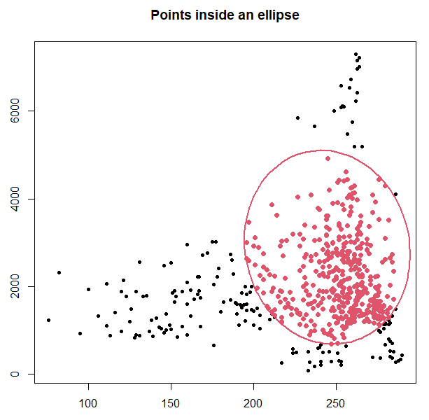

```{r setup, include=FALSE}
knitr::opts_chunk$set(echo = TRUE)
```
\
  
## Determine which datapoints are within an ellipse

The function `el.in` creates a matrix that determines how many points are within a confidence region bordered by an ellipse. The ellipse is calculated based on a species' environmental data and a confidence level. The points inside the ellipse are potential data points of the niche in which a species may thrive. 
\
\


## Parameters

Four parameters need to be defined for this function:
\

* `cloud` = a matrix with random points that contain environmental data
\

* `centroid` = mean of the columns of a matrix that contains environmental data linked with a species' occurrence
\

* `sigma` = the covariance of environmental data linked with a species' occurrence that defines the ellipse
\

* `alpha` = the confidence level to be used
\
\

## How *el.in* works
\

The function calculates the distance of all points within a cloud. The calculation is based on the Mahalanobis distance. An ellipse is created with the chosen confidence level and defines the confidence region. As a next step, the function checks whether a point lies within the ellipse or not. 
<!-- needs better explanation? -->

```{r}
el.in <- function(cloud,centroid,sigma,alpha){
  # step 1: calculate de Mahalanobis distance
  maha <- mahalanobis(x=cloud,center=centroid,cov=sigma)
  # step 2: a point is inside the confidence region (1-alpha=confidence%) if
  # the distance divided by the quantile of a Chi-square variable with k d.f. is less than 1
  chi.q <- qchisq(alpha,ncol(cloud))
  check <- (maha/chi.q) <= 1
  cloud <- cbind(rep(1,nrow(cloud))*check,cloud)
    return(as.matrix(cloud))
}
```
\


### Output

The output is a matrix that contains data on which points lie within an ellipse. This matrix can be visualized with a plot.
\

\

## Worked Examples
\

### Input data

For this function two matrices are necessary: one that uses random points to create a cloud of background points with environmental data and another one that contains the occurrence points of a species in correspondence with environmental data. Both matrices can be created by using the `get.ecoord` function (see tutorial "Function *get.ecoord*").
\
\

### *Threnetes ruckeri*
\

For the random background points in correspondence with environmental data the "M_bios.csv"-file that was created with `get.ecoord` is used.
```{r}
# read table, omit coordinates
cloud <- read.csv("./Generated_Data/Threnetes_ruckeri_M_GE.csv",header=T)[,-(1:2)]
```
```{r, echo=FALSE}
head(cloud, n=5)
```

\

For the species' occurrence points in correspondence with environmental data the "bios.csv"-file that was created with `get.ecoord` is used.
```{r}
# read table, omit coordinates
occ <- read.csv("./Generated_Data/Threnetes_ruckeri_occ_GE.csv",header=T)[,-(1:2)]

```
```{r, echo=FALSE}
head(occ, n=5)
```

\

The centroid is calculated by taking the means of the two columns in the matrix.
```{r}
mu <- colMeans(occ)
```
\

Sigma is calculated with covariance of the environmental data of the occurrence points. 
```{r}
Sigma <- cov(occ)
```
\


Apply `el.in` with the parameters `cloud`, `centroid`, `sigma`, and `alpha`. The value for alpha can be set directly in the function.
The Mahalanobis distance is calculated with environmental conditions that were linked to presence points of a species. The points within an ellipse reflect theoretical environmental conditions in which a species may thrive. This ellipse can serve as a border for suitable environments. 

Plot the matrix of clouds with an ellipse.
```{r, eval=FALSE}
# Use the function to determine which points from the matrix are inside the ellipse
check <- el.in(cloud,mu,Sigma,0.95)
```

```{r, eval=FALSE}
# plot
# x11()
plot(check[,2],check[,3],pch=20,xlab="",ylab="",main="Points inside an ellipse")     
el <- ellipse::ellipse(x=Sigma,centre = mu,level=0.95)
lines(el,col=2,lwd=2)
points(subset(check,check[,1]==1)[,2:3],pch=19,col=2)
```


<!-- Title of all the figure needs to be changed -->
```{r, echo=FALSE, fig.cap=" Figure of *Threnetes ruckeri* occurrences in the environmental space delineated by an ellipse.", out.width = '70%',fig.align="center"}

```
\


### *Catasticta nimbice*

```{r, fig.show='hide'}
occ2 <- read.csv ("./Generated_Data/Catasticta_nimbice_occ_GE.csv",header=T)[,-(1:2)]
mu2 <- colMeans(occ2)
Sigma2 <- cov(occ2)
cloud2 <- read.csv("./Initial_Data/Catasticta_nimbice_M_GE.csv",header=T)[,-(1:2)]

check2 <- el.in(cloud2, mu2, Sigma2, 0.95)

# x11()
plot(check2[,2], check2[,3], pch=".", xlab="", ylab="", 
     main="Points inside an ellipse")     
el <- ellipse::ellipse(x=Sigma2, centre = mu2, level=0.95)
lines(el, col=2, lwd=2)
points(subset(check2, check2[,1]==1)[,2:3], pch=20, col=2)
```

```{r, echo=FALSE, fig.cap=" Figure of *Catasticta nimbice* occurrences in the environmental space delineated by an ellipse.", out.width = '70%',fig.align="center"}
knitr::include_graphics("Images/Catasticta_inellipse.png")
```
\


### Theoretical Example

In this example, the data points for the cloud and the centroid are constructed.

```{r, fig.show='hide'}
mu <- c(0.86,1)
sigma <- matrix(c(0.021,-0.008,-0.008,0.061),ncol=2,byrow=T)
# Define the matrix of points
cloud <- cbind(runif(5000,0,2),runif(5000,0,2))
# Use the function to determine which points from the matrix are inside the ellipse
check <- el.in(cloud,mu,sigma,0.95)
# Plot the points, ellipse and use different colors for the points inside/outside the ellipse
# x11()
plot(check[,2],check[,3],pch=".",xlab="",ylab="",main="Points inside an ellipse")     
el <- ellipse::ellipse(x=sigma,centre = mu,level=0.95)
lines(el,col=2,lwd=2)
points(subset(check,check[,1]==1)[,2:3],pch=19,col=2)

```

```{r, echo=FALSE, fig.cap=" Figure of a cloud with random points and specific points that are within an ellipse", out.width = '70%',fig.align="center"}
knitr::include_graphics("Images/inellipse_ex.png")
```
