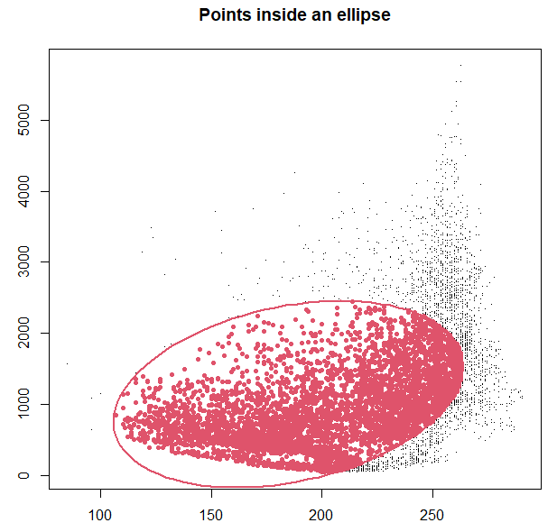

```{r setup, include=FALSE}
knitr::opts_chunk$set(echo = TRUE,
                      message = FALSE,
                      warning = FALSE)
```
\
  
## Determine which datapoints are within an ellipse

The function `in.el` creates a matrix that determines how many points are within a confidence region bordered by an ellipse. The ellipse is calculated based on a species' environmental data and a confidence level. The calculation is based on the Mahalanobis distance. The points inside the ellipse are potential data points of the niche in which a species may thrive. The function can be used for two and three dimensional plots.
```{r, eval=FALSE}
in.el(cloud, centroid, sigma, alpha)
```
\


### Parameters

- `cloud` = a matrix with random points that contain environmental data

- `centroid` = mean of the columns of a matrix that contains environmental data linked with a species' occurrence

- `sigma` = the covariance of environmental data linked with a species' occurrence that defines the ellipse

- `alpha` = the confidence level to be used
\
\

### Input and Output

For this function two matrices are necessary: one that uses random points to create a cloud of background points with environmental data and another one that contains the occurrence points of a species in correspondence with environmental data. Both matrices can be created by using the `get.ecoord` function (see tutorial “Getting environmental values for the study sites”). The matrix with background points can also be sampled with the function `rs.inE` (see tutorial "Random sampling in environmental data").

The output is a matrix that contains data on which points lie within an ellipse. This matrix can be visualized with a plot.
\

### Dependencies

**Examples:** `rgl`
\
\

## Worked Examples

### Read source code and library

```{r}
source(".\\Functions\\Tinside_ellipse.R")
```

```{r}
library(rgl)
```
\

### *Threnetes ruckeri*


**Input Files**
\

- Threnetes_ruckeri_M_GE.csv

- Threnetes_ruckeri_occ_GE.csv
\

\
Read table with random sampled points that contains correlated environmental information.
```{r}
# omit coordinates
cloud1 <- read.csv("./Generated_Data/Threnetes_ruckeri_M_GE.csv",header=T)[,-(1:2)]
```
\

Read table with a species occurrence that contains correlated environmental information.
```{r}
# omit coordinates
thr.occE <- read.csv("./Generated_Data/Threnetes_ruckeri_occ_GE.csv",header=T)[,-(1:2)]
```
\

The centroid is calculated by taking the means of the two columns in the matrix.
```{r}
mu1 <- colMeans(thr.occE)
```
\

Sigma is calculated with covariance of the environmental data of the occurrence points. 
```{r}
Sigma1 <- cov(thr.occE)
```
\


Apply `in.el` with the parameters `cloud`, `centroid`, `sigma`, and `alpha`. The value for alpha can be set directly in the function.
The Mahalanobis distance is calculated with environmental conditions that were linked to presence points of a species. The points within an ellipse reflect theoretical environmental conditions in which a species may thrive. This ellipse can serve as a border for suitable environments. 

Plot the matrix of clouds with an ellipse.
```{r, eval=FALSE}
# Use the function to determine which points from the matrix are inside the ellipse
check <- in.el(cloud = cloud1, mu = mu1, sigma = Sigma1, 0.95)
```

```{r, eval=FALSE}
# plot
# x11()
plot(check[,2],check[,3],pch=20,xlab="",ylab="",main="Points inside an ellipse")     
el <- ellipse::ellipse(x=Sigma1, centre = mu1, level=0.95)
lines(el,col=2,lwd=2)
points(subset(check,check[,1]==1)[,2:3],pch=19,col=2)
```


<!-- Title of all the figure needs to be changed -->
```{r, echo=FALSE, fig.cap=" Figure of *Threnetes ruckeri* occurrences in the environmental space delineated by an ellipse.", out.width = '60%',fig.align="center"}
knitr::include_graphics("Images/ThR_ESpace_inellipse.png")
```
\


### *Catasticta nimbice*
\

#### 1) 2D Version
\

**Input Files**
\

- Catasticta_nimbice_occ_GE.csv

- Catasticta_nimbice_M_GE.csv
\

\
Prepare the parameters  `centroid`, `sigma`, and `cloud` and plot.
```{r, fig.show='hide'}
cn.occE <- read.csv ("./Generated_Data/Catasticta_nimbice_occ_GE.csv",header=T)[,-(1:2)]
mu2 <- colMeans(cn.occE)
Sigma2 <- cov(cn.occE)
cloud2 <- read.csv("./Initial_Data/Catasticta_nimbice_M_GE.csv",header=T)[,-(1:2)]

check2 <- in.el(cloud2, mu2, Sigma2, 0.95)

# x11()
plot(check2[,2], check2[,3], pch=".", xlab="", ylab="", 
     main="Points inside an ellipse")     
el <- ellipse::ellipse(x=Sigma2, centre = mu2, level=0.95)
lines(el, col=2, lwd=2)
points(subset(check2, check2[,1]==1)[,2:3], pch=20, col=2)
```

```{r, echo=FALSE, fig.cap=" Figure of *Catasticta nimbice* occurrences in the environmental space delineated by an ellipse.", out.width = '60%',fig.align="center"}

```
\

#### 2) 3D version
\

**Input data:** 
\

- Catasticta_nimbice_occ_GE3.csv

- Catasticta_nimbice_M_GE3.csv
\

\
Prepare the parameters `centroid`, `sigma`, and `cloud`.
```{r}
# read occurrence points with three environmental variables
cn.occE3 <- read.csv ("./Generated_Data/Catasticta_nimbice_occ_GE3.csv",header=T)[,-(1:2)]

mu3 <- colMeans(cn.occE3)
Sigma3 <- cov(cn.occE3)

# Define the matrix of points with matrix of random points that have three 
#   environmental layers
cloud3 <- read.csv("./Generated_Data/Catasticta_nimbice_M_GE3.csv",header=T)[,-(1:2)]

```
\

Apply the function:
```{r}
check3 <- in.el(cloud = cloud3, centroid = mu3, sigma = Sigma3, alpha = 0.95)
```
\

Plot in 3D using the package `rgl`:
```{r, results='hide'}
# create the three dimensional ellipse
elli <- ellipse3d(centre = mu3, x= Sigma3, level = 0.95)

open3d()
plot3d(subset(check3,check3[,1]==1)[,2:4], box = FALSE, 
       xlab="bio1", ylab="bio6", zlab="bio12", type = "s", size= 0.6,
       col="orange")
points3d(subset(check3,check3[,1]==0)[,2:4], size= 4,
         col= "grey")
spheres3d(x=mu3[1], y=mu3[2], z=mu3[3], radius=25, col="darkblue")
plot3d(elli, col = "darkorange4", alpha = 0.5, add = TRUE, type = "wire")
```

```{r, echo=FALSE, fig.cap="Figure of *Catasticta nimbice* occurrences in the environmental space delineated by an ellipse with three dimensions.", out.width = '50%',fig.align="center"}

```
\


### Theoretical Example

In this example, the data points for the cloud and the centroid are constructed and no input files are needed.

Prepare the parameters.
```{r}
mu <- c(0.86,1)

sigma <- matrix(c(0.021, -0.008, -0.008, 0.061), ncol=2, byrow=T)

# Define the matrix of points
cloud <- cbind(runif(5000, 0, 2), runif(5000, 0, 2))
```
\

Apply the function and plot the results.
```{r, fig.show='hide'}
# Use the function to determine which points from the matrix are inside the ellipse
check <- in.el(cloud, mu, sigma, 0.95)

# Plot the points, ellipse and use different colors for the points inside/outside the ellipse
# x11()
plot(check[,2],check[,3],pch=".",xlab="",ylab="",main="Points inside an ellipse")     
el <- ellipse::ellipse(x=sigma,centre = mu,level=0.95)
lines(el,col=2,lwd=2)
points(subset(check,check[,1]==1)[,2:3],pch=19,col=2)
```


```{r, echo=FALSE, fig.cap=" Figure of a cloud with random points and specific points that are within an ellipse", out.width = '70%',fig.align="center"}

```
\
\

*End of tutorial*