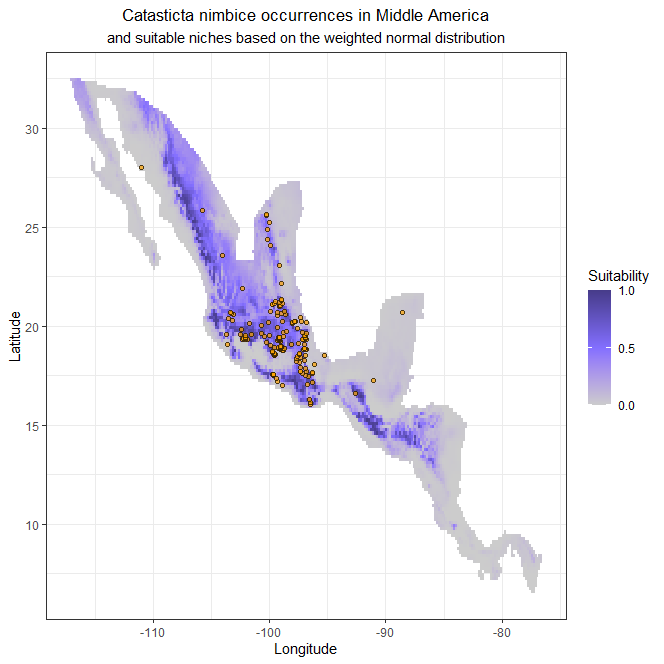

```{r setup, include=FALSE}
knitr::opts_chunk$set(echo = TRUE)

```
\
  
\

# Project resulting ellipses back into G-space

The function `niche.G` projects ellipses that define suitable environments for a species on a raster map. Those potential niches in the geographical space are colored by different degrees of suitability. The calculation is based on the Mahalanobis distance (for further explanation, see tutorial *04_Mahalanobis*).
\
\

## The Function *niche.G*


The function `niche.G` calculates suitability regions for a species based on environmental data and projects them onto a raster with geographical information. Each cell of the raster is weighed by an index of suitability. 

How to use the function:
```{r, eval=FALSE}
niche.G(Estck, mu, Sigma)
```
\

### Parameters

* `Estck` = a raster stack with more than two climatic layers
\

* `mu` = the mean of the columns that contain environmental data, such as temperature and precipitation 
\

* `Sigma` = the covariance of the environmental data linked with a species' occurrence
\

\


\


### Input and Output

The function needs raster files with environmental layers and a matrix with occurrence data of a species that correlates with environmental variables. The latter can be created by using the `get.Ecoord` function (see tutorial *02_Get_Ecoords*"). This matrix can be replaced by a matrix that contains already calculated values using the Mahalanobis distance and weigthed normal distribution. This matrix can be created by using the function `fitNiche` (see tutorial *08_Weigthed_normal*). In case the result is to be plotted in ggplot, other files might be necessary, such as a shapefile that describes the study area or cropped rasters.
\

The function will produce a raster of areas that have suitable environmental conditions for a species. Those potential ecological niche regions are colored by different degrees of suitability. The output can be plotted and saved as TIF or ASCI file. Be aware that some older GIS program versions might have an issue with properly displaying the tif-file.
\

#### Dependencies 
**Function:** `raster`
**Examples:** `sp`, `mvtnorm` (only needs to be installed),`ggplot2`, `ggpubr`, `rgdal`
\

## Worked Examples

<!-- Where should the library notice go? Is here okay? -->
### Read libraries and source code
```{r, message=FALSE}
source(".\\Functions\\TnicheG.R")
```
\

```{r, message=FALSE}
library(sp)
library(ggplot2)
library(ggpubr)
library(rgdal)
```
\

### *Catasticta nimbice*
\

**Input Files**

* bio1.asc

* bio12.asc

* Catasticta_nimbice_occ_GE.csv

* Catasticta_nimbice.shp (and associated files)
\

\

**Prepare Parameters**
\

Read the rasters with environmental data and combine them into a rasterstack with two (or more layers).
```{r}
## Read raster
bio1 <- raster("./Initial_Data/bio1.asc")
bio12 <- raster("./Initial_Data/bio12.asc")
# combine the rasters into a RasterStack
bios <- stack(bio1,bio12)
```
\

For the species' occurrence points in correspondence with environmental data the "occ_GE.csv"-file that was created with `get.Ecoord` is used.
```{r}
# read table and omit columns with coordinates
occ_E <- read.csv("./Generated_Data/Catasticta_nimbice_occ_GE.csv",header=T)[,-(1:2)]
```
\

#### Apply the function and automatically plot with basic plot
\

Apply the function `niche.G` with the parameters `Estck`, `mu`, and `Sigma`. The results are plotted in the basic plot function.
```{r, cache=TRUE, fig.show='hide'}
cn.result <- niche.G(Estck = bios, mu = colMeans(occ_E), Sigma = cov(occ_E))

```
\

Save the raster output as TIF or ASCI file.
```{r, eval=FALSE}
writeRaster(cn.result,"./Generated_Data/Catasticta_nimbice_maha_map.tif", overwrite = T)
# writeRaster(cn.result, "./Generated_Data/Catasticta_nimbice_maha_map.asc", overwrite = T)
```

```{r, echo=FALSE, fig.cap=" Figure of the geographical space with suitable niches for *Catasticta nimbice* .", out.width = '70%',fig.align="center"}
options(knitr.duplicate.label = "allow")

```
\

#### Apply the function and plot with ggplot
\

Another way to use the function `niche.G` is to use estimated values of `mu` and `Sigma` directly. The rasters with environmental data are cropped to the region of interest with a polygon before being stacked together in this version. They can also be cropped with coordinates (see the example for *Threnetes ruckeri* below).
```{r, results='hide'}
# read polygon of the study area
cn.shp <- readOGR("./Initial_Data/shapefiles","Catasticta_nimbice")

# crop and mask the rasters with environmental layers
bio1c <- mask(crop(bio1, cn.shp), cn.shp)
bio12c <- mask(crop(bio12, cn.shp), cn.shp)
biosc <- stack(bio1c, bio12c)
```
\

For this application, the values for `mu`and `Sigma` from the weighted normal distribution model are used directly.
```{r, cache=TRUE}
cn.wn <- niche.G(Estck = biosc, mu = c(166.1297518,1265.130825), 
                 Sigma = matrix(c(1427.054608, 7687.724366, 
                                  7687.724366, 332940.0973),ncol=2))
```
\

Write the raster of the model as file (additionally, the cropped environmental layers can be saved as well for later use). 
```{r, eval=FALSE}
writeRaster(cn.wn,"./Generated_Data/Catasticta_nimbice_wn_map.tif", overwrite = T)
# writeRaster(cn.wn, "./Generated_Data/Catasticta_nimbice_wn_map.asc", overwrite = T)
```
\

Plot the results in a ggplot.
```{r, fig.show='hide', results='hide'}

# calculate raster to points for ggplot
cn.wnp <- rasterToPoints(cn.wn)
cn.wnpd <- data.frame(cn.wnp)
colnames(cn.wnpd) <- c("Longitude","Latitude","Suitability")

# read species occurrence points
occ_GE <- read.csv("./Generated_Data/Catasticta_nimbice_occ_GE.csv",header=T)

# x11()
ggplot() +
  geom_tile(data = cn.wnpd,aes(x=Longitude, y=Latitude, fill=Suitability)) +
  theme_bw() +
  #borders("world", xlim = c(-179, 179), ylim = c(-60, 80)) +
  scale_fill_gradient2("Suitability",limits=c(0,1), low = 'grey80',
                       mid='slateblue1', high = 'slateblue4',na.value = NA,
                       midpoint = 0.5, n.breaks=4) +
  # coord_sf(xlim = emap[1:2], ylim = emap[3:4], expand = FALSE) +
  geom_point(data = occ_GE,aes(x=occ_GE[,1], y=occ_GE[,2]), 
             shape = 21, fill = "orange1", alpha = 0.7) +
  labs(title = "Catasticta nimbice occurrences in Middle America") +
  labs(subtitle = "and suitable niches based on the weighted normal distribution") +
  theme(plot.title = element_text(hjust = 0.5), 
        plot.subtitle = element_text(hjust = 0.5)) 
```
\

Save the ggplot as PNG.
```{r, eval=FALSE}
ggsave('./Generated_Data/Catasticta_nimbice_wn_map_ggplot.png',  width = 24, height = 24, 
       units = "cm", dpi = 600, pointsize = 6)
```

```{r, echo=FALSE, fig.cap=" Figure of the geographical space with suitable niches for *Catasticta nimbice* and presence points .", out.width = '70%',fig.align="center"}
options(knitr.duplicate.label = "allow")

```
\

**Output files**


* Catasticta_nimbice_maha_map.tif

* Catasticta_nimbice_maha_map.asc

* <span style="color: red;">cn_maha_cropped.tif</span>

* Catasticta_nimbice_wn_map.tif

* Catasticta_nimbice_wn_map.asc

* <span style="color: red;">tr_wn_cropped.tif</span>

* Catasticta_nimbice_wn_map_ggplot.png

\

\

### *Threnetes ruckeri*
\

**Input Files**

* bio1.asc

* bio12.asc

* tr_mu_sigma_estimates.csv

* Threnetes_ruckeri_occ_GE.csv


This example uses the Mahalanobis distance and the weighted normal distribution. The graphs are plotted in `ggplot2`. The raster files used here are the same as the ones used for the *Catasticta nimbice* examples.
```{r, eval=FALSE}
## Read raster files
# bio1 <- raster("./Initial_Data/bio1.asc")
# bio2 <- raster("./Initial_Data/bio12.asc")
bios <- stack(bio1,bio2)
```
\

Load the matrix results of the weighted normal distribution that was calculated with the functions `rs.inE`, `negloglike`, and `fitNiche`.
```{r}
thr.fitN <- read.csv("./Generated_Data/tr_mu_sigma_estimates.csv",header=T)[,-1]
```
\

Apply the function with `Estck`, `mu`, and `Sigma` for each, the weighted normal distribution and the Mahalanobis distance model.
```{r, eval=FALSE}
# weighted normal distribution
Thr.wn <- niche.G(Estck = bios, mu = thr.fitN$wn.mu, 
                  Sigma = cbind(thr.fitN$wn.sigma1, thr.fitN$wn.sigma2))
# Mahalanobis distance
Thr.maha <- niche.G(Estck = bios, mu = thr.fitN$maha.mu, 
                    Sigma = cbind(thr.fitN$maha.sigma1, thr.fitN$maha.sigma2))
```
\

Save the output as TIF or ASCI file.
```{r, eval=FALSE}
# weigthed normal distribution
writeRaster(Thr.wn,"./Generated_Data/Threnetes_ruckeri_wn_map.tif", overwrite = T)
# writeRaster(Thr.wn, "./Generated_Data/Threnetes_ruckeri_wn_map.asc", overwrite = T)

# Mahalanobis distance
writeRaster(Thr.maha,"./Generated_Data/Threnetes_ruckeri_maha_map.tif", overwrite = T)
# writeRaster(Thr.maha, "./Generated_Data/Threnetes_ruckeri_maha_map.asc", overwrite = T)
```
\

**Plot both models next to each other in a ggplot**
\

Load the previously created tif-file with the suitability levels for the Mahalanobis distance model and the weighted normal distribution model or directly apply the results.
```{r}
maha.map <- raster("./Generated_Data/Threnetes_ruckeri_maha_map.tif")

wn.map <- raster("./Generated_Data/Threnetes_ruckeri_wn_map.tif")
```
\

Convert the raster to points and create a data-frame for ggplot. Name the columns of the new data-frame.
```{r}
# for Mahalanobis model
maha.mappt <- rasterToPoints(maha.map)
outp.maha <- data.frame(maha.mappt)
colnames(outp.maha) <- c("Longitude","Latitude","Suitability")

# for weighted normal model
wn.mappt <- rasterToPoints(wn.map)
outp.wn <- data.frame(wn.mappt)
colnames(outp.wn) <- c("Longitude","Latitude","Suitability")
```
\

Plot in ggplot.
```{r, fig.show='hide'}
p1 <- ggplot() +
  geom_tile(data = outp.maha,aes(x=Longitude, y=Latitude, fill=Suitability)) +
  theme_bw() +
  scale_fill_gradient2("Suitability",limits=c(0,1), low = 'grey80',
                       mid='slateblue1', high = 'slateblue4',na.value = NA,
                       midpoint = 0.5, n.breaks=4) +
  labs (title = "Mahalanobis distance model") +
  theme(plot.title = element_text(hjust = 0.5))

p2 <- ggplot() +
  geom_tile(data = outp.wn,aes(x=Longitude, y=Latitude, fill=Suitability)) +
  theme_bw() +
  scale_fill_gradient2("Suitability",limits=c(0,1), low = 'grey80',
                       mid='slateblue1', high = 'slateblue4',na.value = NA,
                       midpoint = 0.5, n.breaks=4) +
  labs (title = "Weighted normal distribution model") +
  theme(plot.title = element_text(hjust = 0.5))

# x11()
ggarrange(p1, p2, ncol = 2, nrow = 1)
```


```{r, echo=FALSE, fig.cap=" Figure of the geographical space with suitable niches for *Threnetes ruckeri* using the Mahalanobis distance model and the weigthed normal distribution model in `ggplot2`.", out.width = '100%',fig.align="center"}
options(knitr.duplicate.label = "allow")
knitr::include_graphics("Images/Threnetes_ruckeri_nicheG_ggplot.png")
```
\

Plot a raster that has been cropped by coordinates in ggplot. This crop serves as a zoom to the region of interest.
```{r, fig.show='hide', results='hide'}
# read occurrence data of species
species <- read.csv("./Generated_Data/Threnetes_ruckeri_occ_GE.csv",header=T)

# define coordinates that describe the study area and crop model raster with it
emap <- extent(-100, -68, -8, 22)
area.maha <- crop(maha.map, emap)
area.wn <- crop(wn.map, emap)

# create points from the raster and give column names
maha.mappt <- rasterToPoints(area.maha)
outp.maha <- data.frame(maha.mappt)
colnames(outp.maha) <- c("Longitude","Latitude","Suitability")

wn.mappt <- rasterToPoints(area.wn)
outp.wn <- data.frame(wn.mappt)
colnames(outp.wn) <- c("Longitude","Latitude","Suitability")

# plot both maps into one graph
p1 <- ggplot() +
  geom_tile(data = outp.maha,aes(x=Longitude, y=Latitude, fill=Suitability)) +
  theme_bw() +
  scale_fill_gradient2("Suitability",limits=c(0,1), low = 'grey80',
                       mid='slateblue1', high = 'slateblue4',na.value = NA,
                       midpoint = 0.5, n.breaks=4) +
  geom_point(data = species,aes(x=species[,1], y=species[,2]), 
             shape = 21, fill = "orange1", alpha = 0.7) + 
  labs (title = "Mahalanobis distance model") +
  theme(plot.title = element_text(hjust = 0.5)) 

p2 <- ggplot() +
  geom_tile(data = outp.wn,aes(x=Longitude, y=Latitude, fill=Suitability)) +
  theme_bw() +
  scale_fill_gradient2("Suitability",limits=c(0,1), low = 'grey80',
                       mid='slateblue1', high = 'slateblue4',na.value = NA,
                       midpoint = 0.5, n.breaks=4) +
  geom_point(data = species,aes(x=species[,1], y=species[,2]), 
             shape = 21, fill = "orange1", alpha = 0.7) +
  labs (title = "Weighted normal distribution model") +
  theme(plot.title = element_text(hjust = 0.5)) 

# x11()
ggarrange(p1, p2, ncol = 2, nrow = 1)

```

```{r, echo=FALSE, fig.cap=" Figure of the geographical space with suitable niches for *Threnetes ruckeri* using the Mahalanobis distance model and the weigthed normal distribution model in `ggplot2`.", out.width = '100%',fig.align="center"}
options(knitr.duplicate.label = "allow")
knitr::include_graphics("Images/Threnetes_ruckeri_nicheG_ggplot2.png")
```
\

Save the plot as a PNG.
```{r, eval=FALSE}
ggsave('./Generated_Data/Threnetes_ruckeri_nicheG_ggplot.png',  width = 48, height = 24, units = "cm",
       dpi = 600, pointsize = 6)
```
\

**Output Files**

* Threnetes_ruckeri_wn_map.tif

* Threnetes_ruckeri_wn_map.asc

* <span style="color: red;">tr_wn_cropped.tif</span>

* Threnetes_ruckeri_maha_map.tif

* Threnetes_ruckeri_maha_map.asc

* <span style="color: red;">tr_bay_cropped.tif</span>

* Threnetes_ruckeri_nicheG_ggplot.png
\

*End of the Tutorial*