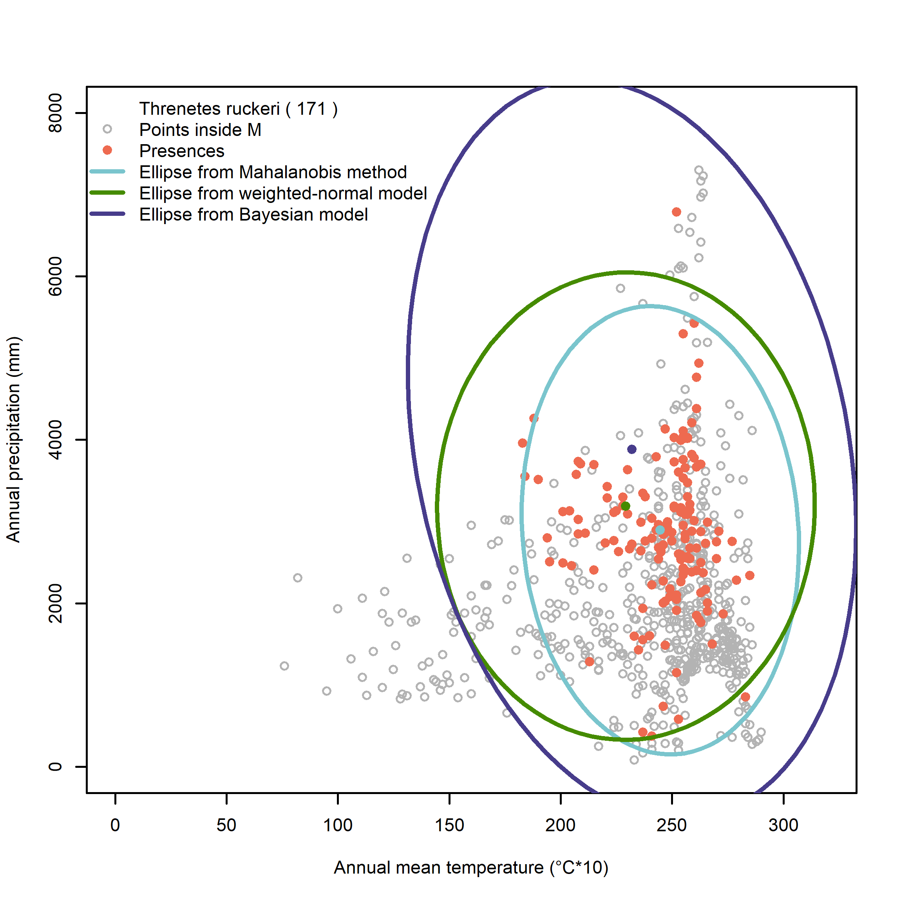

```{r setup, include=FALSE}
knitr::opts_chunk$set(echo = TRUE)
```
\

\

# Building accumulation curves from rasters and occurrences

In this tutorial, three functions are used to generate an accumulation curve and plot it. Those functions are `get.table`, `get.curve`, and `plot.aco`. The function `accum.occ` will make use of the same function to produce several graphs as well as a matrix output of the curve. The resulting curves can then be tested 
with the function `compare.aco`.
\

## Calculate the accumulation curve

In order to calculate the accumulation curve, three different sub-functions are needed for the main function `accum.occ`. First, `get.table`  will extract data from a raster that has information on suitable niches for a species and create a table with the extracted information. 
```{r, eval=FALSE}
get.table(G.occ, suit.Estck)
```
\

The second function `get.curve` classifies and accumulates cells for the study area and occurrences of a species based on the suitability that was previously calculated by using a specific model, such as Mahalanobis distance. The accumulated cells are then counted for the intervals of a curve. 
```{r, eval=FALSE}
get.curve(occ.suit, mod.suit)
```
\

The third function that serves as a subfunction is `plot.aco`. It plots the accumulation curve of occurrences given a confidence level and the output of the function `get.curve`.
```{r, eval=FALSE}
plot.aco(species, aco.curve, conlev, model)
```
\

With the output of these functions, the main function `accum.occ` will generate a table and/or graphs.
```{r, eval=FALSE}
accum.occ(names, G.occ, suit.Estck, null.mod, clev=0, flag=T)
```
\

### Parameters
\

* `G.occ` = a matrix with the coordinates of a species' occurrence
\

* `suit.Estck` = a rasterstack of a raster with a calculated suitability index and two or more rasters with environmental variables
\

* `names` = a vector with a species name, followed by names for the environmental variables
\

* `null.mod` = setting the method to hypergeom (default) or binomial
\

* `clev` = confidence level as a proportion
\

\

### Input and Output

The rasters that are used in this tutorial need to have cells with suitability values. These kind of rasters can be created by using the function `niche.G` (see tutorial "Projecting an estimated niche into G-space"). 

The output are information on the number of cells in study area, the number of occurrence points, and the probability of selecting an occurrence point. Additionally, three graphs are generated: the subregions and occurrences mapped in the geographical space, the subregions and occurrences mapped into the environmental space (as a 2D or 3D plot, depending on the number of environmental variables), and a graph of the accumulation curve.

EDIT EDIT EDIT The output of `get.table` is a matrix with geographical information, a suitability index, environmental information. The function `get.curve` produces a list that contains information on the calculated curve. The output of `plot.aco` is a plot of the accumulation curve. The function `accum.occ` produces plots and a matrix with information on the accumulation curve: EDIT EDIT EDIT
\

\

## Worked Examples
### Read libraries and source codes

```{r, message=FALSE}
source(".\\Functions\\Taccumulation_curve_test.R")
```
\

```{r, message=FALSE}
library(dismo)
library(maptools)
library(rgdal)
library(raster)
```
\


### *Catasticta nimbice* with three environmental layers

For this example, three environmental layers instead of the usual two are used.
\

**Input files**

* Catasticta_nimbice_occ_G.csv

* cn_maha3_cropped.tif

* cn_bio1_cropped.tif

* cn_bio6_cropped.tif

* cn_bio12_cropped.tif
\

\

**Prepare parameters**

Read the necessary input files. Besides the occurrence points of *Catasticta nimbice*, all the raster files have been created in previous tutorials (see tutorials for the *Mahalanobis distance* and *Initial Data*).
```{r}
# read matrix with information on three environmental variables
cn.occG <- read.csv("./Initial_Data/Catasticta_nimbice_occ_G.csv",header=T)[,-1]

# read raster with calculated suitability index of three environmental layers
cnmaha3 <- raster("./Generated_Data/cn_maha3_cropped.tif")

# read raster files
bio1cn <- raster("./Generated_Data/cn_bio1_cropped.tif")
bio6cn <- raster("./Generated_Data/cn_bio6_cropped.tif")
bio12cn <- raster("./Generated_Data/cn_bio12_cropped.tif")
```
\

**1) Using the functions `get.table`, `get.curve`, and `plot.aco`**
\

Create the necessary input for the parameters `names`, `G.occ`, `suit.Estck`, and `names`.
```{r}
# stack rasters and define names for stacked layers
maha.stack <- stack(cnmaha3, bio1cn, bio6cn, bio12cn)
names(maha.stack) <- c("suitability","Bio1","Bio6","Bio12")
```
\

Apply the function `get.table`.
```{r}
table.cn <- get.table(G.occ = cn.occG, suit.Estck = maha.stack)
```

```{r}
head(table.cn, n=4)
```
\

Apply the function `get.curve`.

```{r}
curve.cn <- get.curve(occ.suit = table.cn[table.cn$Type==1,][,3], mod.suit = table.cn[table.cn$Type==0,][,3])
```
\

The first output provides 1) the number of cells in study area, 2) the number of occurrences, and 3) the prevalence (number of occurrences / number of cells in G).
```{r}
round(curve.cn$out1,3)
```
\

The second output provides the number of accumulated number of cells in the subregions and the accumulated number of occurrences in the subregions. These are the values of the intervals between steps of a curve.
```{r}
head(curve.cn$out2, n=6)
```
\

Plot the curve with `plot.aco` with the species name for the parameter `species`, the results from `get.curve` as `aco.curve`, 95% confidence level and the `model` set to "hypergeom".
```{r}
x11()
plot.aco(species = "Catasticta nimbice", aco.curve = curve.cn, conlev = 0.95, model = "hypergeom")
```

To save the plot (as a PNG), the code for applying the function needs to be placed within the plot for saving a picture. 
```{r, eval=FALSE}
png(paste0("./Generated_Data/Catasticta_nimbice","_maha_curve.png"),width = 2300, height = 2300, 
    res = 600, pointsize = 6)
plot.aco(species = "Catasticta nimbice", aco.curve = curve.cn, conlev = 0.95, model = "hypergeom")
dev.off()
```


```{r, echo=FALSE, fig.cap=" Figure of the accumulation curve for *Catasticta nimbice*.", out.width = '80%',fig.align="center"}
options(knitr.duplicate.label = "allow")

```

\

\

**2) Using the function `accum.occ` directly**
\

Directly apply the accumulation curve that has the functions `get.table`, `get.curve`, and `plot.aco` integrated. For this, the parameters `names`, `G.occ`, and `suit.Estck` are necessary (the latter two have already been prepared).
```{r}
# set names for species and layers 
spname <- "Catasticta_nimbice"
bio1 <- "Annual mean temperature (°C*10)"
bio6 <- "Minimum temperature of the coldest month (°C*10)"
bio12 <- "Annual precipitation (mm)"
```


Apply the function. The model will be set to *hypergeom* (default) and the confidence level to 95%.
```{r, fig.show='hide'}
cnmaha.curve <- accum.occ(names = c(spname, bio1, bio6, bio12), G.occ = cn.occG,
                           suit.Estck = maha.stack, null.mod="hypergeom",clev=0.95)
```


```{r, echo=FALSE, fig.cap=" Figure of the geographical space with suitable niches for *Catasticta nimbice*.", out.width = '80%',fig.align="center"}
options(knitr.duplicate.label = "allow")
knitr::include_graphics("Images/CN_maha_acc_Gspace.png")
```


```{r, echo=FALSE, fig.cap=" Figure of the environmental space with suitable niches for *Catasticta nimbice*.", out.width = '80%',fig.align="center"}
options(knitr.duplicate.label = "allow")
knitr::include_graphics("Images/CN_maha_acc_Espace.png")
```


```{r, echo=FALSE, fig.cap=" Figure of the accumulation curve for *Catasticta nimbice*.", out.width = '80%',fig.align="center"}
options(knitr.duplicate.label = "allow")

```
\

\

### *Threnetes ruckeri* with two environmental layers
\

For this example, three different suitability models are applied: the weighted normal distribution, the Mahalanobis distance, and the bayesian model.
\

**Input files**

* Threnetes_ruckeri_occ_G.csv

* tr_wn_cropped.tif

* tr_maha_cropped.tif

* tr_bio1_cropped.tif

* tr_bio12_cropped.tif
\

\

**Prepare parameters**

```{r}
# read matrix with information on mapped occurrences of the species
thr.occG <- read.csv("./Initial_Data/Threnetes_ruckeri_occ_G.csv",header=T)[,-1]

# read raster with calculated suitability index of three environmental layers
thrwn <- raster("./Generated_Data/tr_wn_cropped.tif")
thrmaha <- raster("./Generated_Data/tr_maha_cropped.tif")
thrbay <- raster("./Generated_Data/tr_bay_cropped.tif")

# read raster files
bio1th <- raster("./Generated_Data/tr_bio1_cropped.tif")
bio12th <- raster("./Generated_Data/tr_bio12_cropped.tif")

# create rasterstacks
wn.stack <- stack(thrwn, bio1th, bio12th)
names(wn.stack) <- c("suitability","Bio1","Bio12")

maha.stack2 <- stack(thrmaha, bio1th, bio12th)
names(maha.stack2) <- c("suitability","Bio1","Bio12")

bay.stack <- stack(thrbay, bio1th, bio12th)
names(bay.stack) <- c("suitability","Bio1","Bio12")

# set names for species and layers 
spname2 <- "Threnetes_ruckeri"
bio1 <- "Annual mean temperature (°C*10)"
bio12 <- "Annual precipitation (mm)"

```
\

**Apply the function**

Apply the function for the Mahalanobis distance model. The flag is set to TRUE to give all graphs and a matrix as an output.
```{r}
thrmaha.curve <- accum.occ(names = c(spname2, bio1, bio12),G.occ = thr.occG,
                            suit.Estck = maha.stack2, null.mod="hypergeom",clev=0.95, flag=T)
```
\

```{r}
head(thrmaha.curve, n=5)
tail(thrmaha.curve, n=5)
```
\

```{r, echo=FALSE, fig.cap=" Figure of the geographical space with suitable niches for *Threnetes ruckeri*.", out.width = '80%',fig.align="center"}
options(knitr.duplicate.label = "allow")
knitr::include_graphics("Images/THR_maha_acc_Gspace.png")
```


```{r, echo=FALSE, fig.cap=" Figure of the environmental space with suitable niches for *Threnetes ruckeri*.", out.width = '80%',fig.align="center"}
options(knitr.duplicate.label = "allow")
knitr::include_graphics("Images/THR_maha_acc_Espace.png")
```


```{r, echo=FALSE, fig.cap=" Figure of the accumulation curve for *Threnetes ruckeri*.", out.width = '80%',fig.align="center"}
options(knitr.duplicate.label = "allow")
knitr::include_graphics("Images/THR_maha_acc_curve.png")
```
\

Apply the function for the weighted normal distribution model. In this version, the flag is set to false and only the matrix will be given as an output. 
```{r}
thrwn.curve <- accum.occ(names = c(spname2, bio1, bio12),G.occ = thr.occG,
                            suit.Estck = wn.stack,null.mod="hypergeom",clev=0.95, flag=F)
```
\

```{r}
head(thrwn.curve, n=4)
```
\

Apply the function for the bayesian model. 
```{r}
thrbay.curve <- accum.occ(names = c(spname2, bio1, bio12),G.occ = thr.occG,
                           suit.Estck = bay.stack, null.mod="hypergeom",clev=0.95, flag = F)
```
\

```{r}
head(thrbay.curve, n=4)
```
\

\

## Comparing the accumulation curves

The function `compare.aco` compares the occurrence-accumulation curves of different SDM/ENMs for a single species.
```{r, eval=FALSE}
compare.aco(mods, nocc, ncells, xrange=c(0,ncells), sp.name, mods.names, alpha)
```
\

### Parameters

* `mods` = list with as much elements as models to be compared, each element must be the resulting matrix of values from the function 'accum.occ' applied to the same occurrence data (first two columns only)
\

* `nocc` = number of occurrence points
\

* `ncells` = number of cells in M
\

* `sp.name` = character chain with the name of the species under study
\

* `mods.names` = character vector with the names of the SDMs to be compared, must have the same length as 'mods'
\

* `alpha` = values between 0 and 1 representing the probability of the CI for the null model 
\
\

### Input and Output

The necessary parameters for this function are the results of the accumulation curve. The output of this function is a plot that displays the accumulation curve of the models that are to be compared.
\
\

### Worked example: *Threnetes ruckeri*


First, create a list with all the matrices using only the first two columns of the matrix created by the accumulation curve.
```{r}
models2 <- list(thrmaha.curve[,1:2], thrwn.curve[,1:2], thrbay.curve[,1:2])
```
\

Next, apply the function that draws all the models in a single plot.
```{r}
compare.aco(mods=models2, nocc=171, ncells=4170,
            sp.name=spname2, mods.names=c("Mahalanobis","Weigthed-Normal", "Bayesian"),alpha=0.95)
```


```{r, echo=FALSE, fig.cap=" Figure of the comparison between the accumulation curve created by the Mahalanobis distance model, the weigthed normal model, and the Bayesian model for the species *Threnetes ruckeri*.", out.width = '80%',fig.align="center"}
options(knitr.duplicate.label = "allow")
knitr::include_graphics("Images/THR_compare_maha-wn-bay.png")
```
\

Plot of all three suitability ellipses in the environmental space:
```{r, fig.show='hide'}
# load environmental space of occurrence points and background points for the plot
thr.occE <- read.csv("./Generated_Data/Threnetes_ruckeri_occ_GE.csv",header=T)[,-(1:2)]
thr.ME <- read.csv("./Generated_Data/Threnetes_ruckeri_M_GE.csv",header=T)[,-(1:2)]

# load csv-files with estimated parameters for all three models for the ellipses
trpar1 <- read.csv("./Generated_Data/tr_mu_sigma_estimates.csv",header=T)[,-1]
trpar2 <- read.csv("./Generated_Data/tr_bay_mu_sigma_estimates.csv",header=T)

# define Sigma0
A0 <- cbind(trpar2$A0.1, trpar2$A0.2)
CholA0 <- chol(A0)
Sigma0 <- chol2inv(CholA0) 

# calculate ellipses
el.maha <- ellipse::ellipse(x=cbind(trpar1$maha.sigma1,trpar1$maha.sigma2), 
                            centre=trpar1$maha.mu, level=0.99)
el.wn <- ellipse::ellipse(x=cbind(trpar1$wn.sigma1, trpar1$wn.sigma2), 
                          centre=trpar1$wn.mu, level=0.99)
el.bay <- ellipse::ellipse(x=Sigma0, centre=trpar2$mu0, level=0.99)


## plot
# set colorpalette
colpal <- c("grey70", "chartreuse4", "coral2", "cadetblue3", "slateblue4")

# png(paste0("./Generated_Data/Thr","_threemodels.png"),width = 2300, height = 2300, 
#    res = 600, pointsize = 6)
#x11()
plot(thr.ME,col=colpal[1],pch=1, xlab="Annual mean temperature (°C*10)", 
     ylab="Annual precipitation (mm)", xlim= c(0, 320), ylim= c(0, 8000))
# add presence points to the plot
points(thr.occE,col=colpal[3],pch=20,cex=1.5) # presences used in model
# ellipse maha
lines(el.maha,col=colpal[4],lwd=2)
# ellipse wn
lines(el.wn,col=colpal[2],lwd=2)
# ellipse bayesian
lines(el.bay,col=colpal[5],lwd=2)
sp.leg <- paste("Threnetes ruckeri","(",nrow(thr.occE),")")
legend("topleft",legend = c(sp.leg,"Points inside M","Presences",
                            "Ellipse from Mahalanobis method",
                            "Ellipse from weighted-normal model",
                            "Ellipse from Bayesian model"),
       pch=c(NA,1,19,NA,NA, NA),col = c("white", colpal[1], colpal[3], 
                                        colpal[4], colpal[2], colpal[5]),
       lwd=c(NA,NA,NA,2,2,2),bty = "n")
# dev.off()
```

```{r, echo=FALSE, fig.cap=" Figure of the three models in Espace for the species *Threnetes ruckeri*.", out.width = '80%',fig.align="center"}
options(knitr.duplicate.label = "allow")

```
\


*End of Tutorial*
