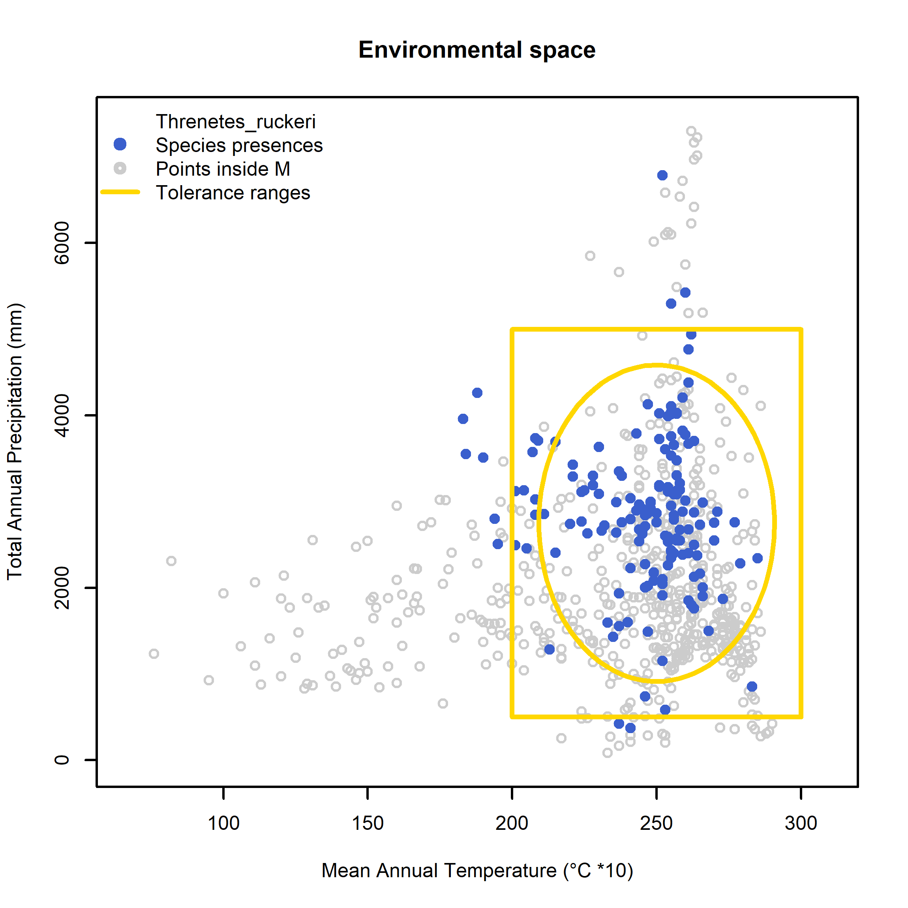
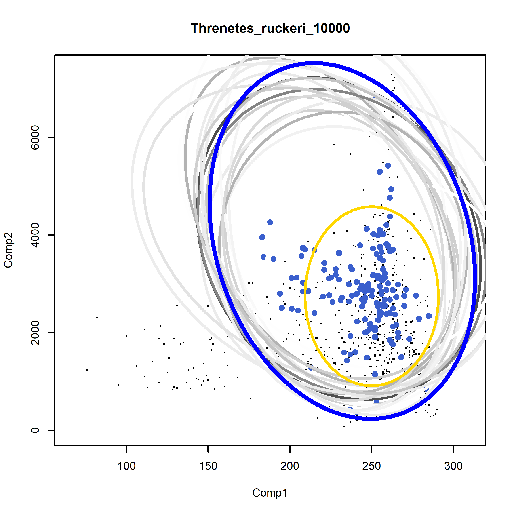

```{r setup, include=FALSE}
knitr::opts_chunk$set(
  message = FALSE,
  warning = FALSE,
  echo = TRUE)
```
\

# Bayesian model: adding tolerance limits

This tutorial shows how to use the Bayesian model with tolerance limits to create estimates for the fundamental niche of a species. Various functions are necessary for this process that are within the file **Nf_Model_functions.R**: `priorpar`, `DefineSp`, `Supp`, `Initth`, `PlotXYEnvVars`, `PlotIterations`, and `save.all`. Out of these, `Supp`, `Initth`, and `PlotXYEnvVars` are directly used within other functions. Other functions (`Energy` and `Run`) are used directly in the example as they need to be adjusted based on the example and estimation results.
<!--- Add more description --->
\
\

## How the main functions work

The function `DefineSp` fixes the values for species and environmental variables that are worked with. The fixed values are `Comp1` and `Comp2` (providing columns), `env.d` (a matrix with environmental information of randomly sampled locations of a study area), `env.sp` (a matrix with environmental information of the presence points of a species), `n` (number of occurrences), m (number of randomly sampled points), `N` (total amount of data points, including occurrences and sample), `Et` (a matrix with the combined environmental information of occurrences and samples).
```{r, eval=FALSE}
DefineSp(env, data.sp, Comp1, Comp2)
```
\

The function `priorpar` uses data of environmental tolerance limits (maximum and minimum) of a species to determine the values of the parameters that define the a priori distribution. 
```{r, eval=FALSE}
priorpar(tolran, nsd, alpha)
```
\

The functions `Supp` and `Initth` are essential for using the t-walk algorithm. Alongside `PlotXYEnvVars`, these functions are used later in the simulations.  <span style="color: red;"> ##### this needs a much better explanation #####</span>
\
\

The function `PlotIterations` is used after calculating MCMC. It will plot a selection (indices) of the MCMC iterations. 
```{r, eval=FALSE}
PlotIterations(info, from, thin, lev,...)
```
\

The function `save.all` saves all the values of mu and Sigma simulated from the posterior.
```{r, eval=FALSE}
save.all(info, from, thin, filename)
```
\

### Parameters

* `env` = random sample of points inside a study area that contain environmental information

* `data.sp` = a matrix that contains the occurrence points of a species and correlated environmental data

* `Comp1` = two numbers that define the column number which contains the first environmental condition of a matrix 

* `Comp2` = two numbers that define the column number which contains the second environmental condition of a matrix 

* `tolran` = a matrix that contains the minimum and maximum values of the tolerance limits of a species (two columns for min and max and as many rows as environmental variables are used)

* `nsd` = number of standard deviations covered by a tolerance range

* `alpha` = number of degrees of freedom in the a priori Wishart distribution

* `th` = a vector of five elements (first two are values of mu, 3,4, and 5 are values of A)

* `…` = with this parameter, further graphical parameters can be supplied as arguments to the plot

* `info` = a list of iterations calculated with the `Rtwalk` function (MCMC)

* `from` = gives the start iteration 

* `thin` = the separation between iterations
\
\

### Input and Output

The files that need to be prepared to run these functions are: a matrix that contains tolerance limits of environmental conditions that a species can survive in, a matrix that contains the occurrence points of a species and correlated environmental data, and a matrix that contains a random sample of points inside a study area that are correlated with environmental information. The information on the tolerance limits of a species needs to be obtained through lab experiments. The two other files can be created by using the function `get.Ecoord` (see tutorial "Getting environmental values for the study sites").

The output are several graphs that show the tolerance limits within the environmental space as well as the iterations from the MCMC algorithm. Furthermore, a matrix with the calculated iterations will be created.
\

### Dependencies
**Functions:** `Rtwalk`

**Example:** `rgdal`, `raster``
\
\

## Worked Example: *Threnetes ruckeri*
\

### Read source codes and libraries
```{r, message=FALSE}
source(".\\Functions\\TNf_Model_functions.R")
```

```{r, message=FALSE}
library(Rtwalk)
```
\

**Input files**

* Threnetes_ruckeri_occ_GE.csv

* Threnetes_ruckeri_M_GE.csv

* T_ruckeri_tolerances.csv
\
\

### Main code
\

**Read files and prepare the parameters**
\

```{r}
# Read random sampled points with GE information and occurrences with GE information
envall <- read.csv("./Generated_Data/Threnetes_ruckeri_M_GE.csv",header=T) 
data <- read.csv("./Generated_Data/Threnetes_ruckeri_occ_GE.csv",header=T)

# Read matrix with tolerance ranges for two environmental conditions of the species
limits <- read.csv("./Initial_Data/T_ruckeri_tolerances.csv")

# Specify species name
rotule <- "Threnetes_ruckeri"
# select species color for plots
spcol <- "royalblue3"
```
\

Fixing the species and environmental variables with the function `DefineSp`. The numbers in Comp1 and Comp2 are the numbers of the columns in the loaded matrices that contain the environmental information. After calling the function, the values Comp1, Comp2, env.d, env.sp, n, m, N, Et are fixed for further use.
```{r}
DefineSp( env = envall, data.sp = data, Comp1=c(3,3), Comp2=c(4,4))
```

```{r}
n # number of occurrences
head(env.sp, n=4) # environmental information of occurrence points
m # 
head(env.d, n=4) # environmental information of randomly sampled points
N # number of randomly sampled points
head(Et, n=4) # combined environmental information of occurrences and samples
tail(Et, n=4)
```
\

Define a valid interval for mu, depending on the range of the environmental variables. These limits are used for the plots as well as for the function `Supp`.
```{r}
b1 <- 10 
b2 <- 100
mu.lim <<- c(min(Et[,1],limits[1,2])-b1,max(Et[,1],limits[1,3])+b1,
             min(Et[,2],limits[2,2])-b2,max(Et[,2],limits[2,3])+b2)
```
\

Apply the function `priorpar` to calculate a priori parameters with the tolerance limits.
```{r}
# number of d.f. in the a priori Wishart distribution
alpha0 <<- 2

# Apply function
priorpar(limits[,2:3], nsd=6, alpha=alpha0)

# a priori mean
mu0
# precision matrix
(A0 <<- chol2inv(CholSigma0)) 
# scale matrix
(W0 <<- chol2inv(CholW)) 
# covariance matrix
(Sigma0 <<- t(CholSigma0) %*% CholSigma0)
```
\

Plot the the a priori parameters as an ellipse and the tolerance limits as a rectangle in the environmental space.
```{r, fig.show='hide'}
# create an ellipse with a 95% confidence region (=lev)
el <- ellipse::ellipse(x = Sigma0, centre = mu0,level = 0.95)

# png(paste0("./Images/Thr","_apriori.png"),width = 2300, height = 2300, 
#    res = 600, pointsize = 6)
# x11()
# Plot background points
plot(env.d, pch=1, col= "grey80", xlim=mu.lim[1:2], ylim=mu.lim[3:4],
     xlab="Mean Annual Temperature (°C *10)",
     ylab="Total Annual Precipitation (mm)",main="Environmental space")
# add occurrences
points(env.sp, pch=19, col=spcol)
# add tolerance limits
rect(xleft = limits[1,2], xright= limits[1,3], ybottom = limits[2,2],
     ytop = limits[2,3], border="gold", lwd=2)
# add ellipse corresponding to the selected confidence region
lines(el,col="gold",lwd=2)
legend("topleft",legend=c(rotule, "Species presences", "Points inside M", "Tolerance ranges"),pch=c(NA,19,1,NA),
       bty="n",lty=c(0,0,0,1),col=c("white", spcol, "grey80", "gold"),lwd=2)
#dev.off()
```


```{r, echo=FALSE, fig.cap=" Figure of the suitable niches constructed by a priori parameters in the environmental space for the species *Threnetes ruckeri* .", out.width = '80%',fig.align="center"}
options(knitr.duplicate.label = "allow")

```
\

The next step is to calculate the Markov Chain Monte Carlocreate for the Bayesian model with the function `Energy`. It creates a negative logarithm of the posterior function of the parameters of interest. 

This function needs to be adjusted based on the datasets and the resulting estimations. The previously defined variables are necessary for these calculations. Another variable that is needed is the number of environmental variables in the study. In this case we have two (bio1 and bio12).
```{r}
dd <- 2
```
\

Apply the function `Engery` and adjust accordingly.
```{r}
# This is called right after Supp: mu, A and detA are already defined, th is ignored
Energy <- function(th)
{ # This is called right after Supp: mu, A and detA are already defined, th is ignored
  ax1 <- (mu - mu0)
  ax2 <- apply( env.sp, 1, function(xi) { ax<-as.matrix(xi - mu); t(ax) %*% A %*% ax })
  # first two terms are generic in the posterior due to the normal model
  S <- 0.5*sum(ax2) + n*log(suma.Et)
  # these terms correspond to the priors:
  S <- S + 0.5*( t(ax1) %*% A0 %*% ax1 + sum(diag(A %*% W0)) - (alpha0-dd-1)*log(detA) )
  
  S # + 10**6 numerical artifact
}
```
\

The next step is to run the MCMC simulation of the posterior with the output of Energy. 1000 iterations would be quite fast but it is better to use at least 10000 or 20000. The resulting values in the beginning are quite large and not of interest. The main focus should be on smaller iterations.
```{r, fig.show='hide', message=FALSE, warning=FALSE}
# number of iterations
niter <- 10000
# draw the iterations in as many plots as dimensions where entered for Run (in this case: 5)
info <- Runtwalk( Tr=niter, dim=5, Obj=Energy, Supp=Supp, x0=Initth(), xp0=Initth())
```
\

```{r}
str(info)
```
\

Plot the results to check the MCMC convergence. The resulting values in the beginning are usually quite large and not of interest. Smaller iterations are of interest. Adjust the line depending on how the iterations turn out to catch the smaller iterations.
```{r}
# x11()
plot(1:(niter+1), -info$Ups, type = "l", xlab = "iteration", ylab = "LogPost",
     main = "dim=5")
abline(v=2000, col="red")
```
\

Save the results as a csv-file. `From` defines from which iteration the output is saved and `thin` defines the steps in between the iterations.
```{r}
fname <- paste0(paste(rotule,niter,"output",sep="_"),".csv")
save.all(info,from = 2000, thin = 400, paste0("./Generated_Data/",fname))
```
\

Since the MCMC calculation simulates values of a distribution, for each simulation an ellipse can be drawn. The blue ellipse is supposed to present the best estimation for the niche of a species. However, this might not always be true and is quite dependend on the amount of iterations used.
```{r, fig.show='hide'}
# Plot simulated ellipses
# x11()
png(paste0("./Images/Thr","_MCMC_ellipses.png"),width = 2300, height = 2300, 
    res = 600, pointsize = 6)
PlotIterations(info, from=2000, thin=400,col=spcol,
               main=paste(rotule, niter, sep="_"),
               xlim=mu.lim[1:2], ylim=mu.lim[3:4])
# a priori ellipse
lines(el,col="gold",lwd=2)
dev.off()
```

```{r, echo=FALSE, fig.cap=" Figure of the suitable niches constructed by the MCMC iterations in the environmental space for the species *Threnetes ruckeri* .", out.width = '80%',fig.align="center"}
options(knitr.duplicate.label = "allow")

```
\

Save the values mu and Sigma into a csv-file for further use.  Estimated parameters = MAPs

```{r}
# Define mu and Sigma
mu
chol2inv(chol(A))

# save the estimated parameters for further use as a matrix (csv)
mat <- cbind(mu, chol2inv(chol(A)))
colnames(mat) <- c("mu", "Sigma1", "Sigma2")

write.csv(mat,"./Generated_Data/tr_bay_mu_sigma_estimates.csv",row.names = F)

```
\

**Output files**

* Threnetes_ruckeri_10000_output.csv

* tr_bay_mu_sigma_estimates.csv
\


### Using the Bayesian model for the projection into G-Space
\

Read source and library.
```{r, message=FALSE}
source(".\\Functions\\TnicheG.R")

library(rgdal)
library(raster)
```
\

**Input files**

* bio1.asc

* bio12.asc

* Threnetes_ruckeri.shp (and associated files)
\
\

Read rasters with environmental information and stack them.
```{r}
bio1 <- raster(".\\Initial_Data\\bio1.asc")
bio2 <- raster(".\\Initial_Data\\bio12.asc")
bios <- stack(bio1,bio2)
```
\

Apply the function `Niche.G` to create a raster with a suitability index based on the Bayesian model.
```{r}
thr.bay <- niche.G(Estck = bios, mu = mu, Sigma = chol2inv(chol(A)))
```
\

The new raster can be either saved like this or be sized to the study area. For further application a cropped raster is necessary. Read a shapefile that defines the study area, crop the raster with it and save the result.
```{r, message=FALSE, results='hide'}
thr.shp <- readOGR("./Initial_Data/shapefiles","Threnetes_ruckeri")

thr.bayc <- mask(crop(thr.bay, thr.shp), thr.shp)
```
```{r}
writeRaster(thr.bayc,"./Generated_Data/tr_bay_cropped.tif", overwrite = T)
```
\

Plot of the suitability index of the Bayesian model.
```{r}
# library(raster)
# thr.bayc2 <- raster("./Generated_Data/tr_bay_cropped.tif")
plot(thr.bayc)
```


**Output files**

* tr_bay_cropped.tif
\
\

*End of tutorial*
