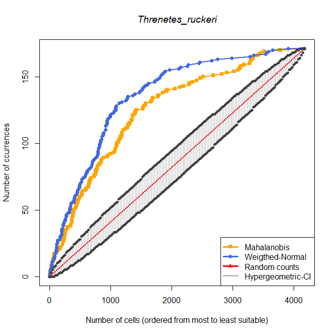

```{r setup, include=FALSE}
knitr::opts_chunk$set(echo = TRUE)
# Working directory and libraries -----------------------------
library(dismo)
library(maptools)
library(rgdal)
library(raster)
```

# Accumulation curve

<!-- description -->

### Parameters
\

* `G.occ` = a matrix with the coordinates of a species' occurrence
\

* `suit.Estck` = a rasterstack of a raster with a calculated suitability index and two or more rasters with environmental variables
\

* `names` = a vector with a species name, followed by names for the environmental variables
\

* `null.mod` = setting the method to hypergeom (default) or binomial
\

* `clev` = confidence level as a proportion

### Dependencies

* `dismo`
\

* `maptools`
\

* `rgdal`
\

* `raster`
\

* `sp`
\

## How the functions work

In order to calculate the accumulation curve, three different sub-functions are needed for the main function `accum.occ`. First, `get.table`  will extract data from a raster that has information on suitable niches for a species and create a table with the extracted information. 

```{r}
get.table <- function(G.occ,suit.Estck){
  # Convert to points so we have long,lat values in the first two columns
  mat1 <- rasterToPoints(suit.Estck)
  # order of index, ask order of rows order (range of indexes)
  iord <- order(mat1[,3], decreasing = T)
  # create new matrix with new order by suitability rows (high to low)
  mat2 <- mat1[iord,]
  
  # Now repeat the previous steps with the occurrence points
  occ1 <- extract(suit.Estck,G.occ)
  occ2 <- na.omit(cbind(G.occ,occ1))
  # sort the values of vector
  # order of index, ask order of rows order (range of indexes)
  iord2 <- order(occ2[,3], decreasing = T) 
  occ3 <- occ2[iord2,]
  colnames(occ3) <- colnames(mat2)
  mat3 <- rbind(occ3, mat2)
  mat4 <- cbind(mat3, Type=c(rep(1, nrow(occ3)), rep(0, nrow(mat2))))
  
  return(mat4)
}
```

The second function `get.curve` classifies and accumulates cells for the study area and occurrences of a species based on the suitability that was previously calculated by using a specific model, such as Mahalanobis distance. The accumulated cells are then counted for the intervals of a curve. 

```{r}
get.curve <- function(occ.suit,mod.suit){
  # Number of cells in study area
  nmod <- length(mod.suit)
  # Number of occurrences
  nocc <- length(occ.suit)
  # Prevalence = number of occurrences / number of cells in G
  preval <- nocc / (nmod + nocc)
  # Use vector of suitability values for the occurrences to classify all the cells
  # according to the partition of the interval (0,1) defined by that vector
  brks <- unique(occ.suit)
  if(brks[length(brks)] != 1){ # 1 is not included
    if(brks[1] != 0){ # 0 is not included
      mod.cls <- tabulate(cut(mod.suit,breaks=c(0,brks,1),labels=F,right=T))
    } else{ # 0 is included
      mod.cls <- tabulate(cut(mod.suit,breaks=c(brks,1),labels=F,right=T))
    }
  } else{ # 1 is included
    if(brks[1] != 0){ # 0 is not included
      mod.cls <- tabulate(cut(mod.suit,breaks=c(0,brks),labels=F,right=T))
    } else{ # 0 is included
      mod.cls <- tabulate(cut(mod.suit,breaks=brks,labels=F,right=T))
    }
  }
  # calculate the accumulated number of cells in the subregions
  mod.acc <- c(0,cumsum(rev(mod.cls)))
  # Count the number of occurrence points in each subregion
  counts <- vector(mode="numeric")
  dupl <- duplicated(occ.suit)*1 # ==1 if value is duplicated, ==0 otherwise
  for(i in 1:nocc){
    if(dupl[i]==0){ # a value can be replicated two or more times
      counts <- c(counts,1)
    } else {
      nn <- length(counts)
      counts[nn] <- counts[nn] + 1
    }
  }
  # calculate the accumulated number of occurrences in the subregions
  occ.acc <- c(0,cumsum(counts),rep(nocc,length(mod.acc)-length(counts)-1))
  # select values that contain important information
  last <- sum(occ.acc < nocc)
  if(mod.acc[last] == nmod){
    ntt <- 1:(last+1)
  } else{
    ntt <- 1:length(mod.acc)
  }
  
  return(list(out1=c(nmod,nocc,preval),out2=cbind(mod.acc[ntt],occ.acc[ntt])))
}
```


The third function that serves as a subfunction is `plot.aco`. It plots the accumulation curve of occurrences given a confidence level and the output of the function `get.curve`.

```{r}
plot.aco <- function(species,aco.curve,conlev,model){
  # Print the important values
  print(paste("Number of cells in study area:",aco.curve$out1[1]),quote=F)
  print(paste("Number of occurrence points:",aco.curve$out1[2]),quote=F)
  print(paste("Probability of selecting an occurrence point:",
              round(aco.curve$out1[3],4)),quote=F)
  
  # Calculate values of the confidence intervals around the random line using the null model
  if(conlev > 0){
    conlev1 <- (1 - conlev) / 2
    if(model == "binomial"){
      infs <- qbinom(conlev1,aco.curve$out2[,1],aco.curve$out1[3])
      sups <- qbinom(conlev1,aco.curve$out2[,1],aco.curve$out1[3],lower.tail = F)
    }
    if(model == "hypergeom") {
      infs <- qhyper(conlev1,m=aco.curve$out1[2],n=aco.curve$out1[1],
                     k=aco.curve$out2[,1])
      sups <- qhyper(conlev1,m=aco.curve$out1[2],n=aco.curve$out1[1],
                     k=aco.curve$out2[,1],lower.tail = F)
    }
  }
  nsub0 <- length(aco.curve$out2[,1])
  # Plot
  x11()
  plot(aco.curve$out2[,1],aco.curve$out2[,1]*aco.curve$out1[3],type="b",col="red",
       xlab="Number of cells (ordered from most to least suitable)",
       ylab="Number of ccurrences",
       main="Accumulation of curve",xlim=c(0,aco.curve$out2[,1][nsub0]),
       ylim=c(0,aco.curve$out1[2]),lwd=2)
  # confidence intervals from hypergeom/binomial distribution
  if(conlev > 0){
    segments(aco.curve$out2[,1],infs,aco.curve$out2[,1],sups,col = "gray")
    points(aco.curve$out2[,1],infs,pch=19,col="grey25")
    points(aco.curve$out2[,1],sups,pch=19,col="grey25")
    if(model == "binomial") legmod <- paste("Binomial CI, p =",conlev)
    if(model == "hypergeom") legmod <- paste("Hypergeometric CI, p =",conlev)
  }
  # under non-random selection hypothesis
  lines(aco.curve$out2[,1],aco.curve$out2[,2],type="o",col="blue",lwd=2)
  if(nsub0<=50){
    text(aco.curve$out2[,1],aco.curve$out2[,2],labels=aco.curve$out2[,2],pos=2)
  } else {
    rind <- seq(1,nsub0,by=20) #%#
    text(aco.curve$out2[,1][rind],aco.curve$out2[,2][rind],
         labels=aco.curve$out2[,2][rind],pos=2)
  }
  legend("bottomright",legend=c(species,"Random counts",legmod,"SDM counts"),
         lwd=2,col=c("white","red","gray","blue"),bty="n")
}
```

With the output of these functions, the main function `accum.occ` will generate a table and/or graphs.

```{r}
accum.occ <- function(names,G.occ,suit.Estck,null.mod="hypergeom",clev=0,flag=T){
  #
  table <- get.table(G.occ,suit.Estck)
  mod.ord <- table[table$Type==0,]
  occ.ord <- table[table$Type==1,]
  #
  curve <- get.curve(occ.suit=occ.ord[,3],mod.suit=mod.ord[,3])
  # Number of cells in study area
  nmod0 <- curve$out1[1]
  # Number of occurrences
  nocc0 <- curve$out1[2]
  # Prevalence = number of occurrences / number of cells in G
  preval0 <- curve$out1[3]
  # Accumulated number of cells in the subregions
  mod.acc0 <- curve$out2[,1]
  # Accumulated number of occurrences in the subregions
  occ.acc0 <- curve$out2[,2]

  # Now make all the plots
  if(flag==T){
    # before making the plots, we will use shades of gray to identify the different subareas
    nsub <- length(mod.acc0)
    cols <- gray((0:nsub/nsub)) #zero indicates black, and one indicates white
    ci <- vector("numeric")
    for (i in 1:nsub){
      # black indicates highly suitable, and white indicates highly unsuitable
      if(i==nsub){
        c <- rep(cols[nsub],nmod0-length(ci))
        ci <-c(ci,c)
      } else{
        c <- rep(cols[i],mod.acc0[i+1]-mod.acc0[i])
        ci <-c(ci,c)
      }
    }
    # we will use the world map from 'maptools'
    data("wrld_simpl", package="maptools")
    # but, before plotting we need to crop the world map using mod.Ecoords create the clipping polygon
    mod.ext <- bbox(SpatialPoints(mod.ord[,1:2]))
    ###
    # Plot 1: subregions in geographic space
    x11()
    plot(wrld_simpl,xlim=mod.ext[1,],ylim=mod.ext[2,],col="wheat1",axes=T,bg="azure2",
         main="Subregions in Geographical Space",xlab="Longitude",ylab="Latitude")
    # add points with corresponding gray shades
    points(mod.ord[,1:2],pch=15,col=ci,cex=0.5)
    # add occurrences
    points(occ.ord[,1:2],pch=19,col="red")
    ###
    # Plot 2: subregions in environmental space
    # NOTE: we plot first the points with low suitability (white/light grey) so they do not 
    # hide the points with high suitability (dark grey/black)
    cis <- c(rev(ci),rep(2,nocc0)) # grey shades for subregions + red for occurrence points
    if((ncol(table)-4)>2){
      nc <- 4:(ncol(table) - 1)
      # build a matrix with background and presence points, sorted for visualization
      plotm <- rbind(as.matrix(mod.ord[nmod0:1,nc]),as.matrix(occ.ord[,nc]))
      pch.occ <- ifelse(nocc0<=50,19,20)
      pcht <- c(rep(18,length(ci)),rep(pch.occ,nocc0))
      mypanel <- function(x,y,col=cis,pch=pcht,bgcolor="steelblue4"){
        # function used to color the background in the panels from function pairs
        ll <- par("usr")
        rect(ll[1], ll[3], ll[2], ll[4], col=bgcolor)
        points(x,y,col=col,pch=pch,bg=bgcolor)
      }
      x11()
      pairs(plotm,panel=mypanel,main="Subregions in Environmental Space")
    } else{
      if(length(names)==3){
        x11()
        plot(table[,4], table[,5], type="n", main="Subregions in Environmental Space", 
            xlab= names[2], ylab=names[3])
        u <- par("usr")
        rect(u[1], u[3], u[2], u[4], col = "steelblue4", border = "red")
        points(mod.ord[nmod0:1,4:5],pch=15,col=rev(ci),cex=0.5)
        # add occurrences
        points(occ.ord[,4:5],pch=19,col="red")
        legend("topleft",legend=c(names[1],"Occurence points","Suitability of points in M"),
               text.col="white",pch=c(19,19,15),col=c("steelblue4","red","grey"),bty="n")
      } else{
        print("The vector 'names' should have the species names and the names of the two environmental variables")
      }
    }
    ###
    # Plot 3: comparison among counts under random selection hypothesis
    plot.aco(names[1],curve,clev,null.mod)
  }
  
  # Return coordinates of accumulation curve and corresponding percentages
  resul <- cbind(occ.acc0,mod.acc0,round((occ.acc0/nocc0)*100,2),round((mod.acc0/nmod0)*100,2))
  colnames(resul) <- c("No.occurrences","No.cells","%Gained Occ","%Area")
  return(resul)
}
```
\

### Output

The output are information on the number of cells in study area, the number of occurrence points, and the probability of selecting an occurrence point. Additionally, three graphs are generated: the subregions and occurrences mapped in the geographical space, the subregions and occurrences mapped into the environmental space (as a 2D or 3D plot, depending on the number of environmental variables), and a graph of the accumulation curve.
\

\

## Worked Examples

### *Catasticta nimbice* with three environmental layers

For this example, three environmental layers instead of the usual two are used.
\

**Input files**

* Catasticta_nimbice_occ_G.csv

* Catasticta_nimbice_maha3_cropped.tif

* Catasticta_nimbice_bio1_cropped.tif

* Catasticta_nimbice_bio6_cropped.tif

* Catasticta_nimbice_bio12_cropped.tif
\

\

**Prepare parameters**

Read the necessary input files. Besides the occurrence points of *Catasticta nimbice*, all the raster files have been created in previous tutorials (see tutorials for the *Mahalanobis distance* and *Initial Data*).
```{r}
# read matrix with information on three environmental variables
cn.occG <- read.csv("./Initial_Data/Catasticta_nimbice_occ_G.csv",header=T)[,-1]

# read raster with calculated suitability index of three environmental layers
cnmaha3 <- raster("./Generated_Data/Catasticta_nimbice_maha3_cropped.tif")

# read raster files
bio1cn <- raster("./Generated_Data/Catasticta_nimbice_bio1_cropped.tif")
bio6cn <- raster("./Generated_Data/Catasticta_nimbice_bio6_cropped.tif")
bio12cn <- raster("./Generated_Data/Catasticta_nimbice_bio12_cropped.tif")
```
\

**1) Using the functions `get.table`, `get.curve`, and `plot.aco`**
\

Create the necessary input for the parameters `names`, `G.occ`, `suit.Estck`, and `names`.
```{r}
# stack rasters and define names for stacked layers
maha.stack <- stack(cnmaha3, bio1cn, bio6cn, bio12cn)
names(maha.stack) <- c("suitability","Bio1","Bio6","Bio12")
```
\

Apply the function `get.table`.
```{r}
table.cn <- get.table(G.occ = cn.occG, suit.Estck = maha.stack)
```

```{r}
head(table.cn, n=4)
```
\

Apply the function `get.curve`.

```{r}
curve.cn <- get.curve(occ.suit = table.cn[table.cn$Type==1,][,3], mod.suit = table.cn[table.cn$Type==0,][,3])
```
\

The first output provides 1) the number of cells in study area, 2) the number of occurrences, and 3) the prevalence (number of occurrences / number of cells in G).
```{r}
(curve.cn$out1)
```
\

The second output provides the number of accumulated number of cells in the subregions and the accumulated number of occurrences in the subregions. These are the values of the intervals between steps of a curve.
<!-- how to display? use head? -->
```{r}
head(curve.cn$out2, n=6)
```
\

Plot the curve with `plot.aco` with the species name for the parameter `species`, the results from `get.curve` as `aco.curve`, 95% confidence level and the `model` set to "hypergeom".
```{r}
x11()
plot.aco(species = "Catasticta nimbice", aco.curve = curve.cn, conlev = 0.95, model = "hypergeom")
```

To save the plot (as a PNG), the code for applying the function needs to be placed within the plot for saving a picture. 
```{r, eval=FALSE}
png(paste0("./Generated_Data/Catasticta_nimbice","_maha_curve.png"),width = 2300, height = 2300, 
    res = 600, pointsize = 6)
plot.aco(species = "Catasticta nimbice", aco.curve = curve.cn, conlev = 0.95, model = "hypergeom")
dev.off()
```


```{r, echo=FALSE, fig.cap=" Figure of the accumulation curve for *Catasticta nimbice*.", out.width = '80%',fig.align="center"}
options(knitr.duplicate.label = "allow")
knitr::include_graphics("Images/CN_maha_acc_curve.png")
```

\

\

**2) Using the function `accum.occ` directly**
\

Directly apply the accumulation curve that has the functions `get.table`, `get.curve`, and `plot.aco` integrated. For this, the parameters `names`, `G.occ`, and `suit.Estck` are necessary (the latter two have already been prepared).
```{r}
# set names for species and layers 
spname <- "Catasticta_nimbice"
bio1 <- "Annual mean temperature (°C*10)"
bio6 <- "Minimum temperature of the coldest month (°C*10)"
bio12 <- "Annual precipitation (mm)"
```


Apply the function. The model will be set to *hypergeom* (default) and the confidence level to 95%.
```{r, fig.show='hide'}
cnmaha.curve <- accum.occ(names = c(spname, bio1, bio6, bio12), G.occ = cn.occG,
                           suit.Estck = maha.stack, null.mod="hypergeom",clev=0.95)
```


```{r, echo=FALSE, fig.cap=" Figure of the geographical space with suitable niches for *Catasticta nimbice*.", out.width = '80%',fig.align="center"}
options(knitr.duplicate.label = "allow")
knitr::include_graphics("Images/CN_maha_acc_Gspace.png")
```


```{r, echo=FALSE, fig.cap=" Figure of the environmental space with suitable niches for *Catasticta nimbice*.", out.width = '80%',fig.align="center"}
options(knitr.duplicate.label = "allow")
knitr::include_graphics("Images/CN_maha_acc_Espace.png")
```


```{r, echo=FALSE, fig.cap=" Figure of the accumulation curve for *Catasticta nimbice*.", out.width = '80%',fig.align="center"}
options(knitr.duplicate.label = "allow")
knitr::include_graphics("Images/CN_maha_acc_curve.png")
```
\

\

### *Threnetes ruckeri* with two environmental layers
\

**Input files**

* Threnetes_ruckeri_occ_G.csv

* Threnetes_ruckeri_wn_cropped.tif

* Threnetes_ruckeri_bio1_cropped.tif

* Threnetes_ruckeri_bio12_cropped.tif
\

\

**Prepare parameters**

```{r}
# read matrix with information on three environmental variables
thr.occG <- read.csv("./Initial_Data/Threnetes_ruckeri_occ_G.csv",header=T)[,-1]

# read raster with calculated suitability index of three environmental layers
thrwn <- raster("./Generated_Data/Threnetes_ruckeri_wn_cropped.tif")
thrmaha <- raster("./Generated_Data/Threnetes_ruckeri_maha_cropped.tif")

# read raster files
bio1th <- raster("./Generated_Data/Threnetes_ruckeri_bio1_cropped.tif")
bio12th <- raster("./Generated_Data/Threnetes_ruckeri_bio12_cropped.tif")

# create rasterstacks
wn.stack <- stack(thrwn, bio1th, bio12th)
names(wn.stack) <- c("suitability","Bio1","Bio12")

maha.stack2 <- stack(thrmaha, bio1th, bio12th)
names(wn.stack) <- c("suitability","Bio1","Bio12")

# set names for species and layers 
spname2 <- "Threnetes_ruckeri"
bio1 <- "Annual mean temperature (°C*10)"
bio12 <- "Annual precipitation (mm)"

```
\

**Apply the function**

Apply the function for the Mahalanobis distance model. The flag is set to TRUE to give all graphs and a matrix as an output.
```{r}
thrmaha.curve <- accum.occ(names = c(spname2, bio1, bio12),G.occ = thr.occG,
                            suit.Estck = maha.stack2, null.mod="hypergeom",clev=0.95, flag=T)
```
\

```{r}
head(thrmaha.curve, n=4)
```
\

```{r, echo=FALSE, fig.cap=" Figure of the geographical space with suitable niches for *Threnetes ruckeri*.", out.width = '80%',fig.align="center"}
options(knitr.duplicate.label = "allow")
knitr::include_graphics("Images/THR_maha_acc_Gspace.png")
```


```{r, echo=FALSE, fig.cap=" Figure of the environmental space with suitable niches for *Threnetes ruckeri*.", out.width = '80%',fig.align="center"}
options(knitr.duplicate.label = "allow")
knitr::include_graphics("Images/THR_maha_acc_Espace.png")
```


```{r, echo=FALSE, fig.cap=" Figure of the accumulation curve for *Threnetes ruckeri*.", out.width = '80%',fig.align="center"}
options(knitr.duplicate.label = "allow")
knitr::include_graphics("Images/THR_maha_acc_curve.png")
```
\


Apply the function for the weighted normal distribution model. In this version, the flag is set to false and only the matrix will be given as an output. 
```{r}
thrwn.curve <- accum.occ(names = c(spname2, bio1, bio12),G.occ = thr.occG,
                            suit.Estck = wn.stack,null.mod="hypergeom",clev=0.95, flag=F)
```
\

```{r}
head(thrwn.curve, n=4)
```
\

\

# Comparing the accumulation curves

## Function *compare.aco*

The function `compare.aco` compares the occurrence-accumulation curves of different SDM/ENMs for a single species.
\

### Parameters

* `mods` = list with as much elements as models to be compared, each element must be the resulting matrix of values from the function 'accum.occ' applied to the same occurrence data (first two columns only)
\

* `nocc` = number of occurrence points
\

* `ncells` = number of cells in M
\

* `sp.name` = character chain with the name of the species under study
\

* `mods.names` = character vector with the names of the SDMs to be compared, must have the same length as 'mods'
\

* `alpha` = values between 0 and 1 representing the probability of the CI for the null model 
\

```{r}
compare.aco <- function(mods,nocc,ncells,xrange=c(0,ncells),sp.name,mods.names,alpha){
  # number of models to compare
  nmods <- length(mods)
  if(length(mods.names)==nmods){
    # calculate the prevalence of the species in M
    preval <- nocc / ncells
    # Plot the curves of the models to be compared
    x11()
    plot(0:nocc,0:nocc,type="n",xlim=xrange,ylim=c(0,nocc),
         main=substitute(expr = italic(tl),env = list(tl=sp.name)),
         xlab="Number of cells (ordered from most to least suitable)",
         ylab="Number of ccurrences")
    # add the curves for each model and calculate the max value in x-axis
    colmod <- colorRampPalette(c("orange","royalblue"))(nmods)
    pt <- 15:(15+nmods)
    for (i in 1:nmods) {
      lines(mods[[i]][,2],mods[[i]][,1],type="o",pch=pt[i],lwd=2,col=colmod[i])
    }
    # add the line of random classification and confidence bands
    pnts <- floor(seq(0,xrange[2],length=nocc)) #ifelse(xrange[2]==ncells,ncells,max(xmax[2:nmods]))
    a1 <- (1-alpha)/2
    infs <- qhyper(a1,m=nocc,n=ncells-nocc,k=pnts)
    sups <- qhyper(1-a1,m=nocc,n=ncells-nocc,k=pnts)
    lines(0:ncells,0:ncells*preval,col="red",lwd=2)
    for (j in 1:nocc) {
      segments(pnts[j],infs[j],pnts[j],sups[j],col = "gray")
      points(pnts[j],infs[j],pch=20,col="grey25")
      points(pnts[j],sups[j],pch=20,col="grey25")
    }
    # add a legend to identify the different lines
    legend("bottomright",legend=c(mods.names,"Random counts","Hypergeometric-CI"),
           pch=c(pt,NA,NA),col=c(colmod,"red","gray"),lwd=3)
  } else{
    print("Warning! 'mods' and 'mods.names' should have the same length")
  }
}
```
\

### Output

The output of this function is a plot that displays the accumulation curve of the models that are to be compared.
\

\

### Worked example: *Threnetes ruckeri*

First, create a list with all the matrices using only the first two columns of the matrix created by the accumulation curve.
```{r}
models2 <- list(thrmaha.curve[,1:2], thrwn.curve[,1:2])
```
\

Next, apply the function that draws all the models in a single plot.
```{r}
compare.aco(mods=models2, nocc=171, ncells=4170,
            sp.name=spname2, mods.names=c("Mahalanobis","Weigthed-Normal"),alpha=0.95)
```


```{r, echo=FALSE, fig.cap=" Figure of the comparison between the accumulation curve created by the Mahalanobis distance model and the weigthed normal model for the species *Threnetes ruckeri*.", out.width = '80%',fig.align="center"}
options(knitr.duplicate.label = "allow")

```
\
