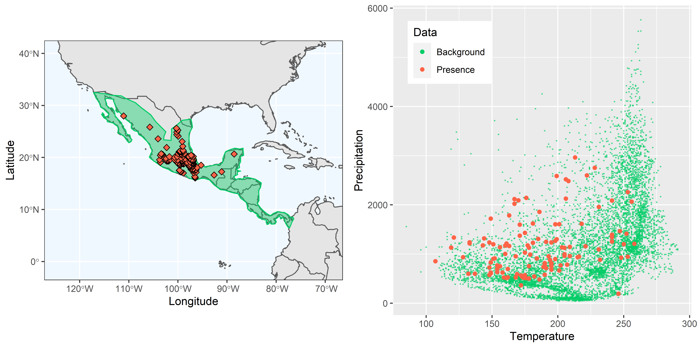
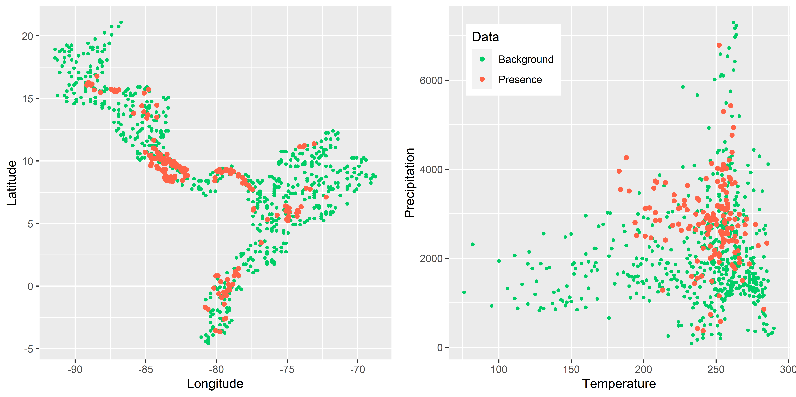

```{r setup, include=FALSE}
knitr::opts_chunk$set(echo = TRUE)

library(rgdal)
library(raster)
library(ggplot2)
library(rnaturalearth)
library(rnaturalearthdata)
library(ggpubr)
# package "sf" needs to be installed
# package "rgeos" needs to be installed
```
\
  
# Creating plots with the geographical and environmental space of a species in ggplot2

The function `GEspace` is a tool that can plot the geographical and environmental space of a species' presence in `ggplot2`. The output is a plot with a geographical map with occurrence points and a graph of the occurrence in relation to the environmental data, such as annual mean temperature or total annual precipitation, next to it.
\

### Parameters

For this function, two parameters are necessary and a two more can be added:

* `E.occ` = a matrix with occurrence and corresponding environmental data of a species
\

* `bckgrnd` = a matrix with random points from a specific geographic region and corresponding environmental data
\
  
* `add.poly` = a polygon of the study area (optional)
\
  
* `save.p` = saves the file to your set output folder (optional)
\
\

### Dependencies

* `rgdal`
\

* `raster`
\

* `ggplot2`
\

* `rnaturalearth`
\

* `rnaturalearthdata`
\

* `ggpubr`
\

* `sf`
\

* `rgeos`
\

\

## Function's code

### How *GEspace* works
  
Depending on the data input, the function `GEspace` will create a plot with a polygon or random background points as a geographical space.  
The default option (no polygon added, no graph saved) will create a map of the study area based on the coordinates of random background points and the occurrence points of a species. As a first step, the function will create a new matrix that combines the coordinates of the random background points and the occurrence points into two columns and adds a third column with a type (1 for background points and 2 for occurrence points). The background points and occurrence points are plotted as a geographical map to the left side. To the right side, the environmental space will be plotted. For this plot a data-frame is created (in the same manner as the previous data-frame) for the environmental data of the background and occurrence points. Those points are plotted in a Cartesian coordinate system. 
If the background points exceed 1000 objects, the point size in the graphs is reduced.  
  
If the user adds a polygon with `add.poly`, it will be used alongside a worldmap from the `rnaturalearth` packages for the mapping of the geographical space. The polygon is first transformed to the WGS 84 coordinate system. It serves as a mask on which the worldmap is clipped. Both, the polygon and clipped worldmap are used as a background map onto which the occurrence points of the species are plotted. The environmental space is plotted as above. 
  
If `save.p` is added to the function, then the graph will be saved, if not, a window with the graph will pop up.
\
  

```{r}
GEspace <- function(bckgrnd, E.occ, add.poly = NULL, save.p = NULL) {
  
  # rgb is color; alpha is a factor of transparency
  # Mcol <- rgb(0.35,0,0.2,alpha = 0.6)
  pal <- c("springgreen3", "tomato")
  
  # if there are too many background points the size of the points is reduced
  if(nrow(bckgrnd)<1000)
    pch.shape = 20
  else
    pch.shape = 42
  
  ## if no polygon is added, the map is created with random background points
  if(is.null(add.poly)) {   
    
    ## Geographic Space:
    
    # create new data-frame with combined coordinates of random background points
    # and occurrence. 
    bckgrnd1 <- data.frame(longitude = bckgrnd[, 1], latitude = bckgrnd[, 2])
    occ1 <- data.frame(longitude = occ[, 1], latitude = occ[, 2])
    data <- cbind(rbind(bckgrnd1[,1:2],occ1[,1:2]),
                  # an extra column is added to differentiate bckgrnd and E.occ 
                  # (1 for bckgrnd, 2 for E.occ)
                  c(rep(1,nrow(bckgrnd1)),rep(2,nrow(occ1))))
    # rename columns
    data2 <- data.frame(Longitude = data[, 1], Latitude = data[, 2], 
                        Type = data[,3])
    
    # create plot for G-Space
    p1 <- ggplot(data2, aes(x = Longitude, y = Latitude, color = factor(Type), 
                            shape = factor(Type))) +
      geom_point() +
      scale_shape_manual(values=c(pch.shape,19), guide = FALSE) +
      scale_color_manual(values= c("1"=pal[1], "2"= pal[2]), guide = FALSE)
    
    
    ## Environmental Space:
    
    # create new data-frame with combined environmental data of random background 
    # points and occurrence.
    bckgrnd3 <- data.frame(Temperature = bckgrnd[, 3], Precipitation = bckgrnd[, 4])
    occ3 <- data.frame(Temperature = occ[, 3], Precipitation = occ [, 4])
    data3 <- cbind(rbind(bckgrnd3[,1:2],occ3[,1:2]),
                   # an extra column is added to differentiate bckgrnd and E.occ 
                   # (1 for bckgrnd, 2 for E.occ)
                   c(rep(1,nrow(bckgrnd3)),rep(2,nrow(occ3))))
    # rename columns
    data4 <- data.frame(Temperature = data3[, 1], Precipitation = data3[, 2], 
                        Type = data3[,3])
    
    # create plot for E-Space
    p2 <- ggplot(data4, aes(x = Temperature, y = Precipitation, 
                            color = factor(Type), shape = factor(Type))) +
      geom_point() +
      scale_shape_manual(values=c(pch.shape,19), guide = FALSE) +
      scale_color_manual(name= "Data",
                         labels= c("Background", "Presence"),
                         values= c("1"=pal[1], "2"= pal[2])) +
      theme(legend.position = c(.05, .95), # for x, value of 0 puts it  to the 
            # left side, value of 1 to the right, for y, value of 0 puts it to 
            # the bottom, # value of 1 puts it to the top
            legend.justification = c("left", "top"))
    
    # save as plots as a file if save.p is added to the function
    if(!is.null(save.p)) {
      ggarrange(p1, p2, ncol = 2, nrow = 1)
      ggsave(save.p,  width = 24, height = 12, units = "cm",
             dpi = 600, pointsize = 6)
      
    }
    # open plots in R if save.p is not added to the function, no file is saved
    else{
      x11()
      ggarrange(p1, p2, ncol = 2, nrow = 1)
    }
  }
 
  ## if a polygon is added, create a map with the polygon
  else { 

    
    ## Geographical space:
    
    # create new data-frame with the coordinates of the species' occurrence
    occ5 <- data.frame(Longitude = occ[, 1], Latitude = occ [, 2])
    # transform polygon into WGS 84
    M <- spTransform(add.poly, CRS("+proj=longlat +datum=WGS84"))
    # This function turns a map into a data frame that can more easily be 
    # plotted with ggplot2.
    M <- fortify(M)
    # takes id that is a "character" and converts it to a number
    M$id = as.numeric(M$id)
    
    ## Extent of map
    # Sets the boundaries to which the worldmap is cut
    Mext <- extent(add.poly)
    # worldmap is added from the rnaturalearth packages
    world <- ne_countries(scale = "medium", returnclass = "sf")
    class(world)
    
    # create plot for G-Space
    p3 <- ggplot(data = world) +
      geom_sf( ) +
      theme_bw() +
      # alpha -> transparency of polygon, 0.1 = high, 0.5 = medium transparency
      geom_map(map=M, data=M, aes(map_id=id), color= pal[1], fill = pal[1], 
               alpha = 0.4) +
      geom_point(data = occ5, aes(x = Longitude, y = Latitude), size = 2, 
                 shape = 23, fill = pal[2]) +
      #  annotation_scale(location = "br", width_hint = 0.2) +
      #  annotation_north_arrow(location = "br", which_north = "true", 
      #                         pad_x = unit(0.75, "in"), 
      #                         pad_y = unit(0.5, "in"),
      #                         style = north_arrow_fancy_orienteering) +
      coord_sf(xlim = c(Mext[1] - 10 ,Mext[2] + 10), 
               ylim = c(Mext[3] - 10,Mext[4] + 10), expand = FALSE) +
      theme(panel.grid.major = element_line(color = "white"),
            panel.background = element_rect(fill = "aliceblue"))
    
    
    ## Environmental Space:
    # same code as the environmental space above
    bckgrnd3 <- data.frame(Temperature = bckgrnd[, 3], Precipitation = bckgrnd[, 4])
    occ3 <- data.frame(Temperature = occ[, 3], Precipitation = occ [, 4])
    data3 <- cbind(rbind(bckgrnd3[,1:2],occ3[,1:2]),
                   c(rep(1,nrow(bckgrnd3)),rep(2,nrow(occ3))))
    data4 <- data.frame(Temperature = data3[, 1], Precipitation = data3[, 2], 
                        Type = data3[,3])
    
    p4 <- ggplot(data4, aes(x = Temperature, y = Precipitation, 
                            color = factor(Type), shape = factor(Type))) +
      geom_point() +
      scale_shape_manual(values=c(pch.shape,19), guide = FALSE) +
      scale_color_manual(name= "Data",
                         labels= c("Background", "Presence"),
                         values= c("1"=pal[1], "2"= pal[2])) +
      theme(legend.position = c(.05, .95), # for x, value of 0 puts it  to the 
            # left side, value of 1 to the right, for y, value of 0 puts it to 
            # the bottom, # value of 1 puts it to the top
            legend.justification = c("left", "top"))
    
    # save as plots as a file if save.p is added to the function
    if(!is.null(save.p)) {
      ggarrange(p3, p4, ncol = 2, nrow = 1)
      ggsave(save.p,  width = 24, height = 12, units = "cm",
             dpi = 600, pointsize = 6)
    }
    
    # open plots in R if save.p is not added to the function, no file is saved
    else{
      x11()
      ggarrange(p3, p4, ncol = 2, nrow = 1)
    }
    
  }
  
}


```
\
  
### Output

The output is a plot with two graphs. On the left side is the geographical space and on the right side is the environmental space (with two environmental conditions) of a species' occurrence.
The output varies depending on how the function is applied. If a polygon is added, the background for the geographical space will be a clipped worldmap from the `rnaturalearth` packages overlayed with the polygon of the study area. If no polygon is added, the background will consist of random points of the study areay
\
  
\
  
## Worked Examples

<!-- Where should the library notice go? Is here okay? -->
### Open libraries

```{r, eval=FALSE}
library(rgdal)
library(raster)
library(ggplot2)
library(rnaturalearth)
library(rnaturalearthdata)
library(ggpubr)
# package "sf" needs to be installed, but not loaded
# package "rgeos" needs to be installed, but not loaded
```
\

### Input data
Two files are necessary to plot the graphs: a matrix with random geographical and environmental data of the study area that provides background points and a matrix that contains the coordinates of a species' occurrence and various environmental variables. Both can be created by using the `get.Ecoord` function (see tutorial "Function *get.Ecoord*").

It is important to note that both parameters, the matrices for `E.occ` and `bckgrnd`, need to have the same structure: the first two columns contain the coordinates, with longitude in the first column and latitude in the second. The following columns need to contain the environmental data of interest.
\
\

###  *Catasticta nimbice*
\

Distribution of the species *Catasticta nimbice* and its environmental space. In this example the number of background points is above 1000 and the point size is reduced in order to keep a clear display of points.

For the species' occurrence points in correspondence with environmental data the "occ_GE.csv"-file that was created with `get.Ecoord` is used.
```{r}
# read table of a species occurrence with environmental data points
species <- read.csv("./Generated_Data/Catasticta_nimbice_occ_GE.csv",header=T)


```
```{r, echo=FALSE}
head(species, n=5)
```

\

For the random background points in correspondence with environmental data the "M_GE.csv"-file that was created with `get.Ecoord` is used.  
```{r}
# read table with random background points
ranpoints <- read.csv("./Initial_Data/Catasticta_nimbice_M_GE.csv",header=T)

```
```{r, echo=FALSE}
head(ranpoints, n=5)
```

\

If a polygon of the distribution area is available, it can be added as a parameter.
```{r, results='hide', message=FALSE}
# read polygon
shp <- readOGR("./Initial_Data/shapefiles","nimbice3")

```
\

If the graph is to be saved, the location and name can be set.
```{r}
saveM <- "./Generated_Data/Catasticta_nimbice"

```
\

**Apply `GEspace`** (but do not run every time):  

No polygon added (default), no save.p added (default): A graph will pop up & the geographical background will be made of random points.
```{r, eval=FALSE}
GEspace(bckgrnd=ranpoints, E.occ=species)
```
\

```{r, echo=FALSE, fig.cap=" Figure of the geographical space with random points as a background (left) and the environmental space (right) of *Catasticta nimbice* .", out.width = '70%',fig.align="center"}
options(knitr.duplicate.label = "allow")
knitr::include_graphics("Images/Catasticta_nimbice_points.png")
```
\


No polygon added (default), save.p added: The graph will be saved & the geographical background will be made of random points.
```{r, eval=FALSE}
GEspace(bckgrnd=ranpoints, E.occ=species, save.p =  paste0(saveM, "_bckgrndmap.png"))
```


With polygon, no save.p added (default): A graph will pop up & the geographical background will be made of a polygon.
```{r, eval=FALSE, message= FALSE}
GEspace(bckgrnd=ranpoints, E.occ=species, add.poly=shp)
```

With polygon, save.p added: A graph will pop up & the geographical background will be made of a polygon.
```{r, eval=FALSE, message= FALSE}
GEspace(bckgrnd=ranpoints, E.occ=species, add.poly=shp, save.p =  paste0(saveM, "_polymap.png"))
```
\

```{r, echo=FALSE, fig.cap=" Figure of the geographical space with a polygon and clipped worldmap as a background (left) and the environmental space (right) of *Catasticta nimbice* .", out.width = '70%',fig.align="center"}
options(knitr.duplicate.label = "allow")

```
\


### *Threnetes ruckeri*
\

Distribution of the species *Threnetes ruckeri* and its environmental space. In this example the number of background points is below 1000 and the point size is not reduced.

```{r, message=FALSE, results=FALSE, fig.show='hide'}
ranpoints2 <- read.csv("./Generated_Data/Threnetes_ruckeri_M_GE.csv",header=T)
species2 <- read.csv("./Generated_Data/Threnetes_ruckeri_occ_GE.csv",header=T)
shp2 <- readOGR("./Initial_Data/shapefiles","Threnetes_ruckeri")

```

```{r, eval=FALSE}
GEspace(bckgrnd = ranpoints2, E.occ = species2, add.poly = shp2, save.p = "Threnetes_bckgrndmap.png")
GEspace(bckgrnd = ranpoints2, E.occ = species2, add.poly = shp2)
```


```{r, echo=FALSE, fig.cap=" Figure of the geographical space with random points as a background (left) and the environmental space (right) of *Threnetes ruckeri* .", out.width = '70%',fig.align="center"}
options(knitr.duplicate.label = "allow")

```
\

```{r, eval=FALSE}
GEspace(bckgrnd = ranpoints2, E.occ = species2, save.p = "Threnetes_polymap.png")
GEspace(bckgrnd = ranpoints2, E.occ = species2)
```

```{r, echo=FALSE, fig.cap=" Figure of the geographical space with a polygon and clipped worldmap as a background (left) and the environmental space (right) of *Threnetes ruckeri* .", out.width = '70%',fig.align="center"}
knitr::include_graphics("Images/Threnetes_ruckeri_poly.png")
```
