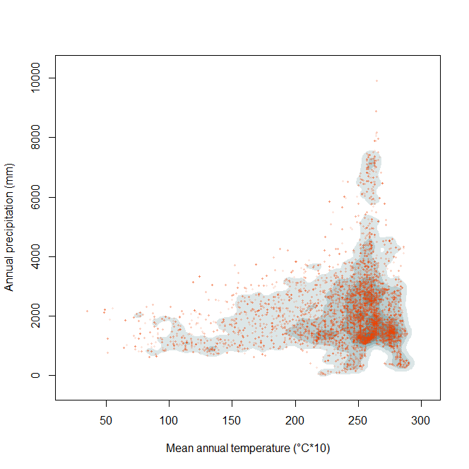

```{r setup, include=FALSE}
knitr::opts_chunk$set(echo = TRUE)

library(raster)
library(rgdal)
library(rgeos)
library(tools)
library(scales)
library(ggplot2)
```
\

The estimation of the fundamental niche can be approached with the maximum likelihood estimation. It uses a weighted distribution where the weigths represent the availability of environmental combinations inside M. To calculate the maximum likelihood estimation, three functions are necessary: `sam.polyM`, `negloglike`, and `like.max`.
\

# Function *sam.polyM*

## Sampling random points from an area of interest

The function `sam.polyM` takes a random sample of environmental combinations inside the study area. For this, the environmental data from a rasterstack is clipped by a shapefile that delimits the area before the sample is taken.
\

\

### Parameters

* `M.shp` = a shapefile of the study area (polygon)
\

* `N` = the sample size
\

* `bios` = a rasterstack that contains at least two layers with environmental data
\

\

### Dependencies

* `raster`
\

* `rgdal`
\

* `rgeos`
\

* `tools`
\

* `scales`
\

\

## Function's code


### How *sam.polyM* works

The function `sam.polyM`uses a shapefile of the area of interest as a mask to clip the rasterstack in order to reduce the information of the rasterstack to the same geographical area. As a next step, cells with an NA value will be deleted from the clipped rasterstack. As a next step, a random sample of indices is generated. With these indices a sample of the clipped rasterstack is taken. The sample size is dictated by N.

```{r}
# Get a random sample of points inside the polygon that delimits M (= )
# and extract their environmental values
sam.polyM <- function(M.shp,N,bios){
  # crop and mask the environmental layers with the M polygon
  clip.M <- mask(crop(bios,M.shp),M.shp)
  # get rid of cells with NA values = indices
  ind <- which(!is.na(clip.M[[1]][]))
  # get a random sample of indices
  sam <- sample(ind,N,replace = T)
  # choose the points corresponding to the selected indices
  Mpnts <- clip.M[][sam,]
  return(Mpnts)
}
```
\

### Output

The output of the function is a matrix of random points with as many columns as layers the rasterstack has.
\

\

## Worked Examples

### Input Data

The raster files need to contain information on climatic values that are of interest for the user. The rasters used in the examples below are from [WorldClim](https://worldclim.org/data/index.html) and have a resolution of "10 minutes". The files usually do not need further editing.

A polygon that marks the borders of a species' occurrence or the study area is necessary. This polygon should be a shapefile.
\

### *Catasticta nimbice*

First, the rasterstack for the parameter `bios` is prepared. For this example two rasters with the environmental data "annual mean temperature" and "total annual precipitation" are used. The rasterstack will therefore have two layers.

```{r}
# Read environmental layers
bio1 <- raster("./Input_Data/bio1WH.asc")
bio12 <- raster("./Input_Data/bio12WH.asc")

# Create a single raster with as many layers as environmental variables
stck_bios <- stack(bio1, bio12)
```
\

Read the parameter for `M.shp`.

```{r, results='hide', message=FALSE}
M.shp <- readOGR("./Input_Data/shapefiles","nimbice3")
```
\

Apply the function with `bios`, `M.shp`, and `N`. Here, `N` will be 10,000. The generated matrix will therefore have two columns with environmental data from the study area and 10,000 rows.

```{r}
sam.Mpnts <- sam.polyM(M.shp = M.shp,N = 10000,bios = stck_bios)
```
\

If needed, save the output as a csv-file (do not run every time)

```{r, eval=FALSE}
write.csv(sam.Mpnts,file=paste0("./Output_Data/Catasticta_nimbice","_M_bios.csv"),
          row.names = F)
```
\

Create a simple plot of the environmental space (E-Space) with a species' occurrence.

```{r, fig.show='hide'}
# read occurrence data
occ <- read.csv("./Input_Data/Catasticta_nimbice_bios.csv",header=T) 
# set colors
pal <- c("grey50", "turquoise")

# plot
x11()
#   use random points with environmental data for the plot
plot(sam.Mpnts[,1], sam.Mpnts[,2], pch=".", col=pal[1], 
     xlab="Mean Annual Temperature (°C*10)", ylab="Annual precipitation (mm)", 
     main="Environmental Space") 
# add points of species environmental data
points(occ$bio1, occ$bio12, pch=19, col=pal[2])
# add legend
legend(x= "topleft",
       legend = c("Study Area", "Occurences"),
       pch = c(20, 19),
       col = c(pal[1], pal[2]),
       bty = "n")
```
\
```{r, echo=FALSE, fig.cap=" Figure of the environmental space, where the occurrence points of *Catasticta nimbice* are plotted over a bunch of background points that were sampled from the rasterstack and polygon.", out.width = '70%',fig.align="center"}
options(knitr.duplicate.label = "allow")
knitr::include_graphics("Images/SampleM_Espace.png")
```
\


### *Threnetes ruckeri*

The rasterstack is the same as the previous example. In this example, a different graph will be plotted using the sampled points.

```{r, results='hide', message=FALSE}
# Read M polygon
M.shp <- readOGR("./Input_Data/shapefiles","Threnetes_ruckeri")

```
\

Apply the function with `M.shp`, `bios`, and a sample size with `N`.
```{r}
## Get a random sample of points in M and extract its corresponding environmental values
sam.Mpnts <- sam.polyM(M.shp = M.shp,N = 10000,bios = stck_bios)

```
\

The output is used to plot a graph showing concentrations of sample points marked by a shade. The layers of shades are created by kernel smoothing. The kernel is drawn using the points inside M. There are currently five levels of shades selected (5, 25, 50, 75, and 95). 
<!-- what does "probability of selecting a point" here mean? --> 

```{r, fig.show='hide'}
# Calculate and draw the kernel using the points inside M (define M carefully)
# kernel for contour plot
fhat.M <- ks::kde(x=cbind(sam.Mpnts[,1], sam.Mpnts[,2]))

## Probability of selecting a point, given the fundamental niche
# plot estimated kernel of M with points inside M
lvls1 <- c(5,25,50,75,95)
# library(scales)
col.M2 <- alpha("orangered2",0.1)
M.cols <- colorRampPalette(c(alpha("white",0.1),alpha("cadetblue4",0.9)))

# plot
plot(fhat.M,display="filled.contour",cont=lvls1,main="",xlab="Mean annual temperature (°C*10)",
     ylab="Annual precipitation (mm)",col=M.cols(length(lvls1)+1))
# add points used for kernel estimation
points(sam.Mpnts[,1], sam.Mpnts[,2],col=col.M2,pch=20,cex=0.6)

```


```{r, echo=FALSE, fig.cap=" Figure of the environmental space showing layers with various density of the sampled points from the rasterstack and polygon.", out.width = '70%',fig.align="center"}
options(knitr.duplicate.label = "allow")

```

<!-- end of function samplingM --> 
\

 ~ End of function `sam.polyM` ~ 
\

\

# Function *negloglike*

## Calculate the negative log-likelihood for theta

<!-- needs description --> 
The function `negloglike` is an important step for calculating the maximum likelihood distribution. 
\

### Parameters
* `guess` =  vector of length 5 when d=2, it contains the mu and A values as elements
\

* `sam1` = a matrix containing the original sample of environmental combinations that correspond to presences
\

* `sam2`= a matrix containing a random sample of environmental combinations which come from the area of study (M)
\

\

### Dependencies

None.
\

\

## Function's code


### How *negloglike* works

<!-- needs description --> 
Negative log-likelihood function for theta=(mu,A)

```{r}
negloglike <- function(guess, sam1, sam2){
  # define the parameters of interest from the guess parameter
  mu <- guess[1:2]
  A <- matrix(c(guess[3], guess[4], guess[4], guess[5]), nrow=2, ncol=2)
  # original sample size: number of presence points in the sample
  n <- nrow(sam1)
  # function that calculates quadratic terms, use inverse of matrix
  quad <- function(xi) { ax<-as.matrix(xi - mu); t(ax) %*% A %*% ax }
  q1 <- apply(sam1, 1, quad) # quadratic terms of presence points
  q2 <- apply(sam2, 1, quad) # quadratic terms of M points
  # negative log-likelihood value
  S <- 0.5*sum(q1) + n*log(sum(exp(-0.5*q2)))
  return(S)
}

```
\

### Output

<!-- needs description --> 

<!-- examples?? --> 
\

\


~ End of function `negloglike` ~
\

\

# Function *maxi.like*

## Calculate the maximum likelihood for the fundamental niche
<!-- description-->


### Parameters

* `occ` = a matrix with occurrence and corresponding environmental data of a species
\

* `sam2` = a matrix containing a random sample of environmental combinations which come from the area of study (M)
\

\

### Dependencies

* `ggplot2`
\

* `ellipse`
\

\

## Functions Code

### How *maxi.like* works

The function `maxi.like` calculates the maximum likelihood estimation with a matrix of randomly sampled points within the study area (= result from the function `sam.polyM`) and the occurrence data of a species that contains environmental data. At first, the mu and sigma of the occurrence data is calculated. Then, the sigma values are inverted. ###  <!-- description-->

```{r}
maxi.like <- function(occ, randpntsM) {
  # calculate mu
  mu.ini <- colMeans(occ)
  # calculate A (covariance)
  Sig.ini <- cov(occ)
  # invert matrix sig.ini
  A.ini <- chol2inv(chol(Sig.ini))
  # whole vector of inicial values
  vals.ini <- c(mu.ini, A.ini[1,1], A.ini[1,2], A.ini[2,2])#c(mu.ini,A.ini[1,1],A.ini[1,2],A.ini[2,2])
  # fix the values of the samples used to evaluate the neg-log-likelihood
  like.fn <- function(theta){ negloglike(theta, sam1=occ, sam2=randpntsM) } 
  find.mle <- optim(par=vals.ini, fn=like.fn, method="Nelder-Mead")
  mle <- find.mle$par
  mle.mu <- mle[1:2]
  mle.A <- matrix(c(mle[3:4],mle[4:5]),nrow=2,ncol=2)
  mle.Sig <- tryCatch(expr={chol2inv(chol(mle.A))}, error= function(e){NULL})
  
  # change column names for mle.Sig
  if(!is.null(mle.Sig)){
  colnames(mle.Sig) <- colnames(Sig.ini)
  rownames(mle.Sig) <- rownames(Sig.ini)
  }
    
  # wn = weighted normal distribution
  return(list(wn.mu = mle.mu, wn.sigma = mle.Sig, maha.mu = mu.ini, maha.sigma = Sig.ini))
}

```
\

### Output

The output is a list with four different objects: mu and sigma for the weigthed normal distribution, and mu and sigma for the distribution using Mahalanobis distance. This output can be used to calculate and plot ellipses in the environmental space.
\

\

## Worked examples

### Input Data

If the random sample has already been calculated (see above, function `sam.polyM`), only the occurrence points of the species of interest are necessary as input data. These occurrence points do not need to contain geographical data but the environmental data. This matrix can be created by using the `get.ecoord` function (see tutorial "Function *get.ecoord*"). 
\

### *Catasticta nimbice*

Read the matrix with environmental data of a species' occurrence.
```{r}
sp.occ <- read.csv("./Input_Data/Catasticta_nimbice_bios.csv",header=T)[,-(1:2)]
```
\

Apply the function with the parameters `occ` and `randpntsM` (the sample `randpntsM`` was calculated above and is named *sam.Mpnts*).
```{r, cache=TRUE}
ml <- maxi.like(occ = sp.occ, randpntsM = sam.Mpnts)
```
\

Create a new table with the output data and rename the columns. 
```{r}
ml.table <- cbind(ml$wn.mu, ml$wn.sigma, ml$maha.mu, ml$maha.sigma)
colnames(ml.table) <- c("wn.mu", "wn.sigma1", "wn.sigma2", "maha.mu", "maha.sigma1", "maha.sigma2")
```
\

Save the table as a csv-file.
```{r, eval=FALSE}
write.csv(ml.table,"./Output_Data/Catasticta_nimbice_Estimated_parameters.csv",row.names = F)
```
\

Calculate the ellipses for the weighted distribution normal and the multivariate normal distribution.
```{r}
# get the ellipse defined by the ml estimators
el <- ellipse::ellipse(x=ml[[2]], centre=ml[[1]], level=0.99)
# get the ellipse from a multivarite normal model / mahalanobis distance method
el.ml <- ellipse::ellipse(x=ml[[4]], centre=ml[[3]], level=0.99)
```
\

Plot the environmental space with the sampled points, the occurrence points, the ellipse for the weigthed distribution and the ellipse from the Mahalanobis method. The plot will be saved as a png.
```{r, fig.show='hide'}
# set colorpalette
colpal <- c("grey70", "chartreuse4", "coral2", "cadetblue3")

# plot will be saved as .png
png(paste0("./Output_Data/Catasticta_nimbice","_mle.png"),width = 2300, height = 2300, 
    res = 600, pointsize = 6)
x11()
plot(sam.Mpnts,col=colpal[1],pch=1, xlab="Annual mean temperature (°C*10)", 
     ylab="Annual precipitation (mm)")
# add presence points to the plot
points(sp.occ,col=colpal[3],pch=20,cex=1.5) # presences used in model
# ellipse maha
lines(el,col=colpal[2],lwd=2)
# ellipse mle
lines(el.ml,col=colpal[4],lwd=2)
sp.leg <- paste("Catasticta nimbice","(",nrow(sp.occ),")")
legend("topleft",legend = c(sp.leg,"Points inside M","Presences",
                            "Ellipse from Mahalanobis method",
                            "Ellipse from weighted-normal model"),
       pch=c(NA,1,19,NA,NA),col = c("white", colpal[1], colpal[3], colpal[2], colpal[4]),
       lwd=c(NA,NA,NA,2,2),bty = "n")
# finish saving png
dev.off()
```
\

```{r, echo=FALSE, fig.cap=" Figure of the environmental space of *Catasticta nimbice*. It shows the occurrence points of a species with two possible niches delineated by the Mahalanobis method and the weighted normal method.", out.width = '70%',fig.align="center"}
knitr::include_graphics("Images/Catasticta_nimbice_mle.png")
```
\

\

### *Threnetes ruckeri*

For this species the same steps are followed as above until the plot. Here, it will be plotted using `ggplot2`.
\

Read the matrix with occurrences combined with environmental data and the shape-file of the study area (the necessary rasterstack was already created in the example above).
```{r}
sp.occ2 <- read.csv("./Input_Data/Threnetes_ruckeri_occ_bios.csv",header=T)[,-(1:2)]

M.shp2 <- readOGR("./Input_Data/shapefiles","Threnetes_ruckeri")
```
\

Sample random points from the area of interest using the `sam.polyM` function with the parameters `M.shp`, `N`, and `bios`.
```{r}
sam.Mpnts2 <- sam.polyM(M.shp = M.shp2, N = 5000, bios = stck_bios)
```
\


~ End ~
