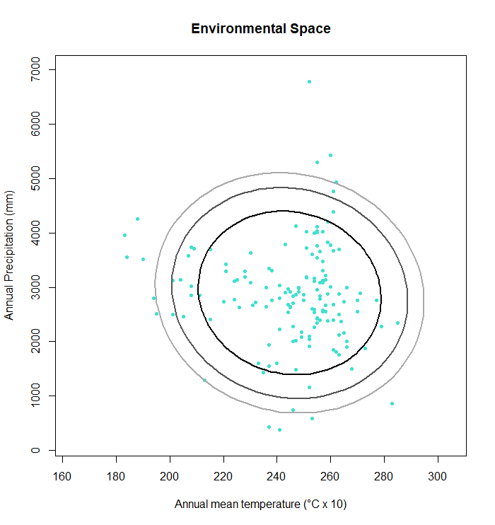

```{r setup, include=FALSE}
knitr::opts_chunk$set(echo = TRUE)

```
\
  
## Introduction

The function `e.ellipse` creates confidence regions that can function as suitable environment borders for a species. The ellipses are calculated with the Mahalanobis distance. Various alpha-levels can be chosen for the ellipses. The output is a plot with environmental datapoints of a species and as many ellipses as alpha levels have been chosen.
\

### Input data

For this function a matrix that contains the corresponding environmental data of a species occurrence, such as mean annual temperature and total annual precipitation, is necessary. The matrix can be created by using the `get.ecoord` function (see tutorial "How to export environmental data from raster files (with *get.ecoord*)").
\
\

## Parameters

For this function, four parameters are necessary: (two of these parameters are derived from the occurrence table with environmental data):
\
```{r}
# read table of occurrences, omit coordinates
occ <- read.csv ("./Input_Data/Threnetes_ruckeri_occ_bios.csv",header=T)[,-(1:2)]
```
\

**1) The mean of the columns that contain environmental data, called `mu`**

```{r}
mu1 <- colMeans(occ)
```
\
  
**2) The covariance of the environmental data, called `Sigma`**
```{r}
Sigma1 <- cov(occ)
```
\

**3) Names for the environmental variables in form of a character vector, called `enames` **
```{r}
names1 <- c("Annual mean temperature (°C x 10)","Annual Precipitation (mm)") 
```
\

**4) The alpha level(s), called `alpha`**
```{r}
alpha1 <- c(0.75, 0.9, 0.95)
```
\
\

## How *e.ellipse* works

The function creates ellipses with a loop that loops as many alpha levels as are entered into the function (up to three). If no alpha levels are entered into the function, the default is 0.95. The ellipses are displayed in a plot that also shows the environmental datapoints of a species. In this example, the environmental data are mean annual temperature and total annual precipitation.


\
\

Function:
```{r}
e.ellipse <- function(mu, Sigma, alpha = 0.95, enames) {
  # create a list
  els <- list()
  
  la <- length(alpha)
  
  for(i in 1:la){
    # create a loop that inputs the ellipses into the empty list based on the 
    # chosen alpha levels (loop repeats for as many alpha levels are put in)
    els[[i]] <- ellipse::ellipse(centre = mu, x= Sigma, level = alpha[i])
  }
  # create a scale of grays for the ellipses
  pal <- gray(0:(la - 1)/la)
  
  # define values for xlim and ylim to adjust the margins
  xs <- c(min(occ[,1]) -20, max(occ[,1]) +20)
  ys <- c(min(occ[,2]) -200, max(occ[,2]) +200)
  
  # create a plot that shows the occurences in the environmental space 
  plot(occ[,1], occ[,2], pch=20, col= "turquoise", xlab=enames[1],
       ylab=enames[2], main="Environmental Space", xlim = xs, ylim = ys)
  
  # create a loop to write ellipse-lines with different gray colors
  for(i in 1:la){
    lines(els[[i]], col= pal[i], lwd = 2)
  }
  
}
```
\
\

## Output

The output is a plot with the environmental space of a species with one to three ellipses that signify the borders of the suitable environment of a species. 

Apply `e.ellipse` with `mu`, `Sigma`, `enames`, and `alpha`:
```{r, fig.show='hide'}
f <- e.ellipse(mu = mu1, Sigma = Sigma1, alpha = alpha1, enames = names1)

```
\

## Examples
\

#### Threnetes ruckeri

```{r, fig.show='hide'}
# read table with occurrences, omit coordinates
occ <- read.csv ("./Input_Data/Threnetes_ruckeri_occ_bios.csv",header=T)[,-(1:2)]

# choose alpha level
alpha1 <- c(0.75, 0.9, 0.95)
# calculate mu from occ
mu1 <- colMeans(occ)
# calculate Sigma from occ
Sigma1 <- cov(occ)
# Define names for the environmental type
names1 <- c("Annual mean temperature (°C x 10)","Annual Precipitation (mm)") 

# apply function  
f <- e.ellipse(mu = mu1, Sigma = Sigma1, alpha = alpha1, enames = names1)

```
\

####  Catasticta nimbice

```{r, fig.show='hide'}
occ <- read.csv("./Input_Data/Catasticta_nimbice_bios.csv",header=T)[,-(1:2)]

# alpha-level as a sequence from 0 to 1, every 0.1 steps
alpha2 <- seq(0,1,by = 0.1)

mu2 <- colMeans(occ)
Sigma2 <- cov(occ)
names2 <- c("Annual mean temperature (°C x 10)","Annual Precipitation (mm)") 

f <- e.ellipse(mu = mu2, Sigma = Sigma2, alpha = alpha2, enames = names2)
```


