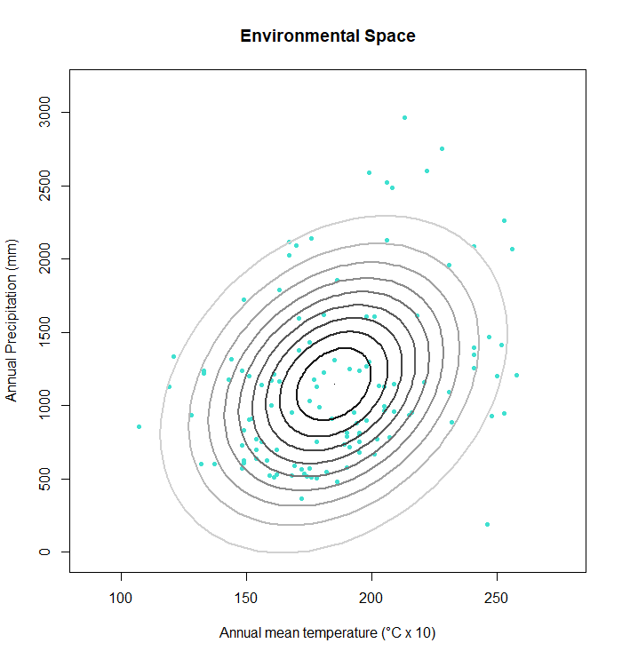

```{r setup, include=FALSE}
knitr::opts_chunk$set(echo = TRUE)

```
\
  
## Ploting ellipses that define the border of a suitable environment

The function `e.ellipse` creates confidence regions that can function as suitable environment borders for a species. The ellipses are calculated with the Mahalanobis distance. Various alpha-levels can be chosen for the ellipses. The output is a plot with environmental datapoints of a species and as many ellipses as alpha levels have been chosen.
\

\

## Parameters

For this function, four parameters are necessary:
\

* `mu` = the mean of the columns that contain environmental data
\

* `Sigma` = the covariance of the environmental data
\

* `Enames` = names for the environmental variables in form of a character vector
\

* `alpha` = the chosen alpha level(s)
\

\

## Function's code

### How *e.ellipse* works

The function creates ellipses with a loop that loops as many alpha levels as are entered into the function. If no alpha levels are entered into the function, the default is 0.95. The ellipses are displayed in a plot that also shows the environmental datapoints of a species.
\

```{r}
e.ellipse <- function(occ, alpha = 0.95, Enames) {
  # calculate mu
  mu1 <- colMeans(occ)
  
  # calculate Sigma
  Sigma1 <- cov(occ)
  
  # create a list
  els <- list()
  
  la <- length(alpha)
  
  for(i in 1:la){
    # create a loop that inputs the ellipses into the empty list based on the 
    # chosen alpha levels (loop repeats for as many alpha levels are put in)
    els[[i]] <- ellipse::ellipse(centre = mu1, x= Sigma1, level = alpha[i])
  }
  # create a scale of grays for the ellipses
  pal <- gray(0:(la - 1)/la)
  
  # define values for xlim and ylim to adjust the margins
  xs <- c(min(occ[,1]) -20, max(occ[,1]) +20)
  ys <- c(min(occ[,2]) -200, max(occ[,2]) +200)
  
  # create a plot that shows the occurences in the environmental space 
  plot(occ[,1], occ[,2], pch=20, col= "turquoise", xlab=Enames[1],
       ylab=Enames[2], main="Environmental Space", xlim = xs, ylim = ys)
  
  # create a loop to write ellipse-lines with different gray colors
  for(i in 1:la){
    lines(els[[i]], col= pal[i], lwd = 2)
  }
  
}
```
\
\

## Output

The output is a plot with the environmental space of a species with one or more ellipses that signify the borders of the suitable environment of a species. 


\

## Worked Examples
\

### Input data

For this function a matrix that contains the corresponding environmental data of a species' occurrence is necessary. The matrix can be created by using the `get.Ecoord` function (see tutorial "Function *get.Ecoord*"). In this example, the environmental data are mean annual temperature and total annual precipitation.
\

### Threnetes ruckeri

In this example, the alpha level has three set values. This will create three ellipses for the confidence region.
\

Load a matrix with environmental data that is linked to the occurrence of a species.
```{r}
# read table of occurrences, omit coordinates
species <- read.csv ("./Generated_Data/Threnetes_ruckeri_occ_GE.csv",header=T)[,-(1:2)]
```
\

Calculate the means of the columns with environmental data.
```{r}
# mu1 <- colMeans(occ)
```
\

Calculate the covariance of the environmental data.
```{r}
# Sigma1 <- cov(occ)
```
\

Set the names of the environmental types for the x and y axis of the plot.
```{r}
names1 <- c("Annual mean temperature (°C x 10)","Annual Precipitation (mm)") 
```
\

Define the confidence levels, here 75%, 90%, and 95%.
```{r}
alpha1 <- c(0.75, 0.9, 0.95)
```
\

Apply `e.ellipse` with `mu`, `Sigma`, `Enames`, and `alpha`:
```{r, fig.show='hide'}
f <- e.ellipse(occ = species, alpha = alpha1, Enames = names1)

```
\

```{r, echo=FALSE, fig.cap=" Figure of the environmental space of *Threnetes ruckeri* bordered by three ellipses.", out.width = '70%',fig.align="center"}
knitr::include_graphics("Images/Threnetes_ESpace_ellipses.png")
```
\

\

###  Catasticta nimbice

In this example, more than three ellipses are created. The confidence levels are defined by a sequence instead of distinct numbers.

```{r, fig.show='hide'}
species2 <- read.csv("./Generated_Data/Catasticta_nimbice_occ_GE.csv",header=T)[,-(1:2)]
names2 <- c("Annual mean temperature (°C x 10)","Annual Precipitation (mm)") 

```
\

The confidence level is defined by a sequence from zero to one with an increment of 0.1.
```{r}
alpha2 <- seq(0,1,by = 0.1)
```

```{r, fig.show='hide'}
f2 <- e.ellipse(occ = species2 , alpha = alpha2, Enames = names2)
```


```{r, echo=FALSE, fig.cap=" Figure of the environmental space of *Threnetes ruckeri* bordered by three ellipses.", out.width = '70%',fig.align="center"}

```
\


