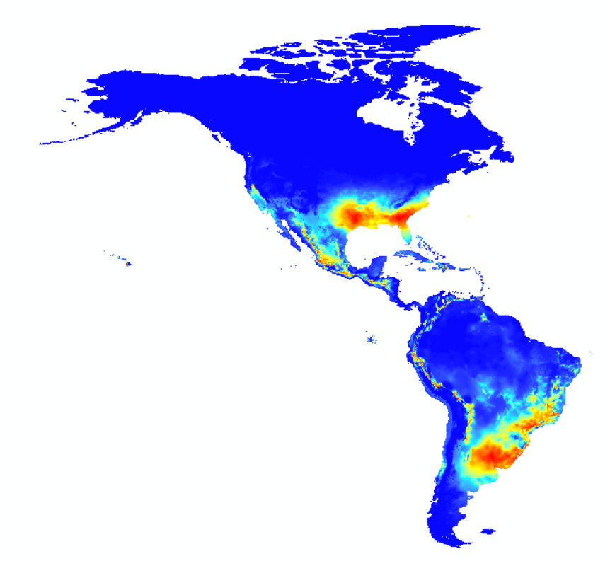
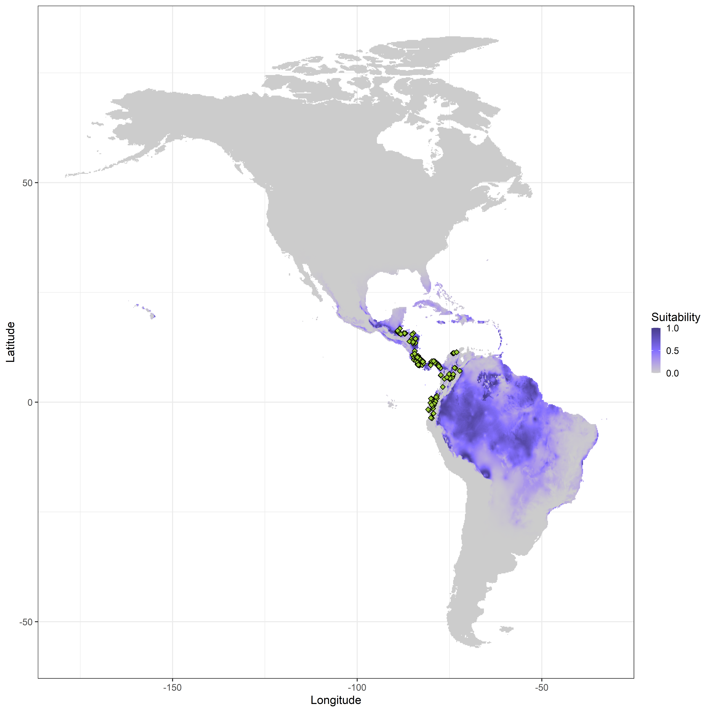

```{r setup, include=FALSE}
knitr::opts_chunk$set(echo = TRUE)

library(raster)
library(sp)
library(ggplot2)
# needs package mvtnorm to be installed
```
\
  
\

# Project resulting ellipses back into G-space

The function niche.G projects ellipses that define suitable environments for a species on a raster map. Those potential niches in the geographical space are colored by different degrees of suitability.
\
\

### Parameters

* `mu` = the mean of the columns that contain environmental data, such as temperature and precipitation 
\

* `Sigma` = the covariance of the environmental data linked with a species' occurrence
\

* `save.map` = set the location and name for saving the map
\

\

### Dependencies

* `raster`
\

* `sp`
\

* `ggplot2`
\

* `mvtnorm`
\

\


## Function's code

### How *niche.G* works

The function `niche.G` calculates suitability regions for a species based on environmental data and projects them onto a raster with geographical information. Each cell of the raster is weighed by an index of suitability.

```{r}
niche.G <- function(mu, Sigma, save.map) {
  
  # Calculate suitabilities in each cell
  max.val <- mvtnorm::dmvnorm(x=mu,mean = mu, sigma = Sigma)
  # function that calculates the log(suitability)
  sui.fun <- function(cell){log(mvtnorm::dmvnorm(x=c(cell[1],cell[2]),mean = mu, 
                                                 sigma = Sigma))-log(max.val)}
  # apply this function to the whole raster layer
  suit.rast <- calc(bios,fun=sui.fun)
  # take exponential to go back to the original scale
  # save as ASCII
  suit.rast1 <- calc(suit.rast,fun = exp,
                     filename= paste0(save.map, ".asc"), overwrite=T)
  # save as TIFF
  writeRaster(suit.rast1, paste0(save.map, ".tif"), overwrite = T)
  
  return(suit.rast1)
}
```
\
\

### Output

The function will produce a geographical map that represents areas that have suitable environmental conditions for a species. Those potential ecological niche regions are colored by different degrees of suitability. The map will automatically be saved as a TIFF and as a ASCII file. It should be noted that the calculation of each cell in the raster might take a bit longer. 
\
\

## Worked Examples

<!-- Where should the library notice go? Is here okay? -->
### Upload libraries

```{r, eval=FALSE}
library(raster)
library(sp)
library(ggplot2)
# needs package mvtnorm to be installed
```
\

### Input Data

The raster files need to contain information on climatic values that are of interest for the user. The rasters used in the examples below are from [WorldClim](https://worldclim.org/data/index.html) and have a resolution of "10 minutes".

Furthermore, a matrix that contains the corresponding environmental data of a species' occurrence is necessary. The matrix can be created by using the `get.ecoord` function (see tutorial "Function *get.ecoord*"). In this example, the environmental data are mean annual temperature and total annual precipitation.
\
\

### *Catasticta nimbice*

In this example, the basic plot function is used.

Read the rasters with environmental data and combine them into a rasterstack with two (or more layers).
```{r}
## Read raster
bio1 <- raster("./Input_Data/bio1WH.asc")
bio2 <- raster("./Input_Data/bio12WH.asc")
# combine the rasters into a RasterStack
bios <- stack(bio1,bio2)
```
\

For the species' occurrence points in correspondence with environmental data the "bios.csv"-file that was created with `get.ecoord` is used.
```{r}
# read table and omit columns with coordinates
occ <- read.csv("./Input_Data/Catasticta_nimbice_bios.csv",header=T)[,-(1:2)]
```
\

The centroid is calculated by taking the means of the two columns in the matrix (`mu`). This parameter will set the values of the maximum likelhood estimate.
```{r}
center <- colMeans(occ)
```
\

Calculate the covariance of the environmental data (`Sigma`).
```{r}
boundary <- cov(occ)
```
\

Set the path and name under which the rasters will be saved (= `save.map`).
```{r}
saveM <- "./Output_Data/Catasticta_nimbice_map"
```
\

Apply the function `niche.G` with the parameters `mu`, `Sigma`, and `save.map` and plot it.

```{r, eval=FALSE}
result1 <- niche.G(mu = center, Sigma = boundary, save.map = saveM)

x11()
plot(result1)
```


```{r, echo=FALSE, fig.cap=" Figure of the geographical space with suitable niches for *Catasticta nimbice* .", out.width = '70%',fig.align="center"}
options(knitr.duplicate.label = "allow")

```
\

\

### Threnetes ruckeri

This example works similar to the previous example, except that it is plotted in `ggplot2`. The raster files are the same as above.

```{r, eval=FALSE}
## Read raster files
bio1 <- raster("./Input_Data/bio1WH.asc")
bio2 <- raster("./Input_Data/bio12WH.asc")
bios <- stack(bio1,bio2)
```
\

Load the species' occurrence data that is linked with the environmental data and calculate the parameters.
```{r}

occ2 <- read.csv("./Input_Data/Threnetes_ruckeri_occ_bios.csv",header=T)[,-(1:2)]

center2 <- colMeans(occ2)
boundary2 <- cov(occ2)
saveM2 <- "./Output_Data/Threnetes_ruckeri_map"

```
\

Apply the function with `mu`, `Sigma`, and `save.map`.
```{r, eval=FALSE}
result2 <- niche.G(mu = center2, Sigma = boundary2, save.map = saveM2)
```
\

**Create a ggplot**

Load the previously created tif-file with the suitability levels. Optionally, the raster can be cropped be different regions of interest.
```{r}
# Read raster with output from weighted model
outp <- raster("./Input_Data/Threnetes_ruckeri_map.tif")
# emap <- extent(-170, 179, -60, 80) # whole world
# emap <- extent(-140, -110, 30, 65) # USA-CAN
# emap <- extent(70, 150, 10, 55) # Asia
# emap <- extent(-15, 30, 35, 60) # Europe
```
\

Convert the raster to points and create a data-frame for ggplot. Name the columns of the new data-frame.
```{r}
# outp1 <- crop(outp, emap)
outpp <- rasterToPoints(outp)
outppd <- data.frame(outpp)
colnames(outppd) <- c("Longitude","Latitude","Suitability")
```
\

Read the species' occurrence data points that are linked with the environmental data (without omitting the coordinates)
```{r}
occ3 <- read.csv("./Input_Data/Threnetes_ruckeri_occ_bios.csv",header=T)
```
\

Plot in ggplot.
```{r, fig.show='hide'}
x11()
ggplot() +
  geom_tile(data = outppd,aes(x=Longitude, y=Latitude, fill=Suitability)) +
  theme_bw() +
  #borders("world", xlim = c(-179, 179), ylim = c(-60, 80)) +
  scale_fill_gradient2("Suitability",limits=c(0,1), low = 'grey80',
                       mid='slateblue1', high = 'slateblue4',na.value = NA,
                       midpoint = 0.5, n.breaks=4) +
  # coord_sf(xlim = emap[1:2], ylim = emap[3:4], expand = FALSE) +
  geom_point(data = occ3,aes(x=occ3[,1], y=occ3[,2]), shape = 23, fill = "yellowgreen")
```


```{r, echo=FALSE, fig.cap=" Figure of the geographical space with suitable niches for *Threnetes ruckeri* in `ggplot2`.", out.width = '70%',fig.align="center"}
options(knitr.duplicate.label = "allow")

```
\

Save the plot as a PNG.
```{r, eval=FALSE}
ggsave('./Output_Data/Threnetes_ruckeri_ggplot.png',  width = 24, height = 24, units = "cm",
       dpi = 600, pointsize = 6)
```
\


