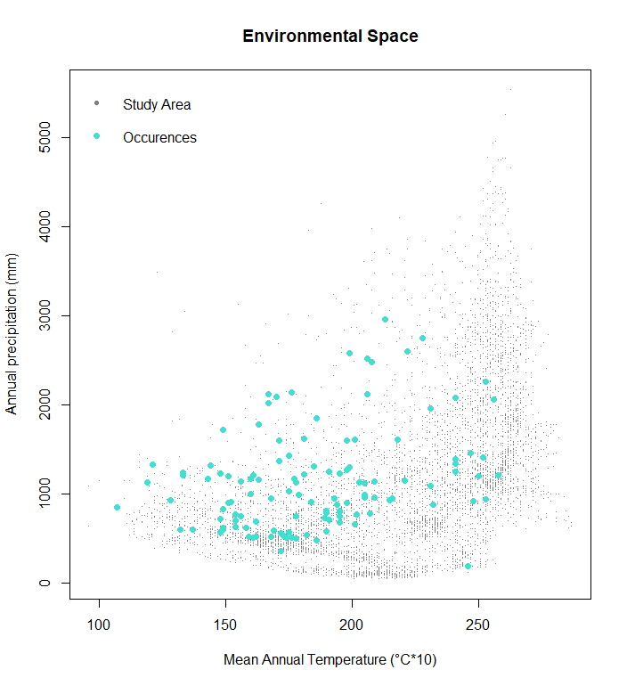
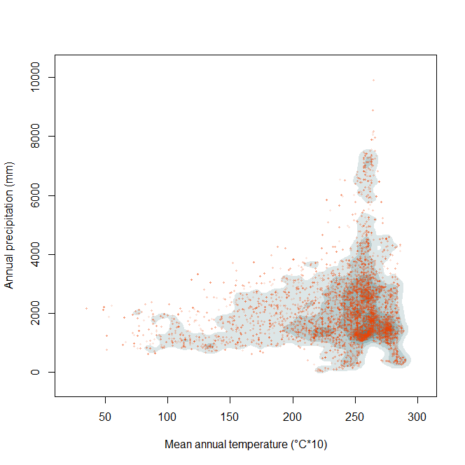

```{r setup, include=FALSE}
knitr::opts_chunk$set(echo = TRUE)

library(raster)
library(rgdal)
library(rgeos)
library(tools)
library(scales)
```
\

## Sampling random points from an area of interest

The function `sam.polyM` takes a random sample of environmental combinations inside the study area. For this, the environmental data from a rasterstack is clipped by a shapefile that delimits the area before the sample is taken.
\

\

### Parameters

* `M.shp` = a shapefile of the study area (polygon)
\

* `N` = the sample size
\

* `bios` = a rasterstack that contains at least two layers with environmental data
\

\

### Dependencies

* `raster`
\

* `rgdal`
\

* `rgeos`
\

* `tools`
\

* `scales`
\

\

## Function's code


### How *sam.polyM* works

The function `sam.polyM`uses a shapefile of the area of interest as a mask to clip the rasterstack in order to reduce the information of the rasterstack to the same geographical area. As a next step, cells with an NA value will be deleted from the clipped rasterstack. As a next step, a random sample of indices is generated. With these indices a sample of the clipped rasterstack is taken. The sample size is dictated by N.

```{r}
# Get a random sample of points inside the polygon that delimits M (= )
# and extract their environmental values
sam.polyM <- function(M.shp,N,bios){
  # crop and mask the environmental layers with the M polygon
  clip.M <- mask(crop(bios,M.shp),M.shp)
  # get rid of cells with NA values = indices
  ind <- which(!is.na(clip.M[[1]][]))
  # get a random sample of indices
  sam <- sample(ind,N,replace = T)
  # choose the points corresponding to the selected indices
  Mpnts <- clip.M[][sam,]
  return(Mpnts)
}
```
\

### Output

The output of the function is a matrix of random points with as many columns as layers the rasterstack has.
\

\

## Worked Examples

### Input Data

The raster files need to contain information on climatic values that are of interest for the user. The rasters used in the examples below are from [WorldClim](https://worldclim.org/data/index.html) and have a resolution of "10 minutes". The files usually do not need further editing.

A polygon that marks the borders of a species' occurrence or the study area is necessary. This polygon should be a shapefile.
\

### *Catasticta nimbice*

First, the rasterstack for the parameter `bios` is prepared. For this example two rasters with the environmental data "annual mean temperature" and "total annual precipitation" are used. The rasterstack will therefore have two layers.

```{r}
# Read environmental layers
bio1 <- raster("./Input_Data/bio1WH.asc")
bio12 <- raster("./Input_Data/bio12WH.asc")

# Create a single raster with as many layers as environmental variables
stck_bios <- stack(bio1, bio12)
```
\

Read the parameter for `M.shp`.

```{r, results='hide', message=FALSE}
M.shp <- readOGR("./Input_Data/shapefiles","nimbice3")
```
\

Apply the function with `bios`, `M.shp`, and `N`. Here, `N` will be 10,000. The generated matrix will therefore have two columns with environmental data from the study area and 10,000 rows.

```{r}
sam.Mpnts <- sam.polyM(M.shp = M.shp,N = 10000,bios = stck_bios)
```
\

If needed, save the output as a csv-file (do not run every time)

```{r, eval=FALSE}
write.csv(sam.Mpnts,file=paste0("./Output_Data/Catasticta_nimbice","_M_bios.csv"),
          row.names = F)
```
\

Create a simple plot of the environmental space (E-Space) with a species' occurrence.

```{r, fig.show='hide'}
# read occurrence data
occ <- read.csv("./Input_Data/Catasticta_nimbice_bios.csv",header=T) 
# set colors
pal <- c("grey50", "turquoise")

# plot
x11()
#   use random points with environmental data for the plot
plot(sam.Mpnts[,1], sam.Mpnts[,2], pch=".", col=pal[1], 
     xlab="Mean Annual Temperature (°C*10)", ylab="Annual precipitation (mm)", 
     main="Environmental Space") 
# add points of species environmental data
points(occ$bio1, occ$bio12, pch=19, col=pal[2])
# add legend
legend(x= "topleft",
       legend = c("Study Area", "Occurences"),
       pch = c(20, 19),
       col = c(pal[1], pal[2]),
       bty = "n")
```
\
```{r, echo=FALSE, fig.cap=" Figure of the environmental space, where the occurrence points of *Catasticta nimbice* are plotted over a bunch of background points that were sampled from the rasterstack and polygon.", out.width = '70%',fig.align="center"}
options(knitr.duplicate.label = "allow")

```
\


### *Threnetes ruckeri*

The rasterstack is the same as the previous example. In this example, a different graph will be plotted using the sampled points.

```{r, results='hide', message=FALSE}
# Read M polygon
M.shp <- readOGR("./Input_Data/shapefiles","Threnetes_ruckeri")

```
\

Apply the function with `M.shp`, `bios`, and a sample size with `N`.
```{r}
## Get a random sample of points in M and extract its corresponding environmental values
sam.Mpnts <- sam.polyM(M.shp = M.shp,N = 10000,bios = stck_bios)

```
\

The output is used to plot a graph showing concentrations of sample points marked by a shade. The layers of shades are created by kernel smoothing. The kernel is drawn using the points inside M. There are currently five levels of shades selected (5, 25, 50, 75, and 95). 
<!-- what does "probability of selecting a point" here mean? --> 

```{r, fig.show='hide'}
# Calculate and draw the kernel using the points inside M (define M carefully)
# kernel for contour plot
fhat.M <- ks::kde(x=cbind(sam.Mpnts[,1], sam.Mpnts[,2]))

## Probability of selecting a point, given the fundamental niche
# plot estimated kernel of M with points inside M
lvls1 <- c(5,25,50,75,95)
# library(scales)
col.M2 <- alpha("orangered2",0.1)
M.cols <- colorRampPalette(c(alpha("white",0.1),alpha("cadetblue4",0.9)))

# plot
x11()
plot(fhat.M,display="filled.contour",cont=lvls1,main="",xlab="Mean annual temperature (°C*10)",
     ylab="Annual precipitation (mm)",col=M.cols(length(lvls1)+1))
# add points used for kernel estimation
points(sam.Mpnts[,1], sam.Mpnts[,2],col=col.M2,pch=20,cex=0.6)

```


```{r, echo=FALSE, fig.cap=" Figure of the environmental space showing layers with various density of the sampled points from the rasterstack and polygon.", out.width = '70%',fig.align="center"}
options(knitr.duplicate.label = "allow")

```

<!-- end of function samplingM --> 

